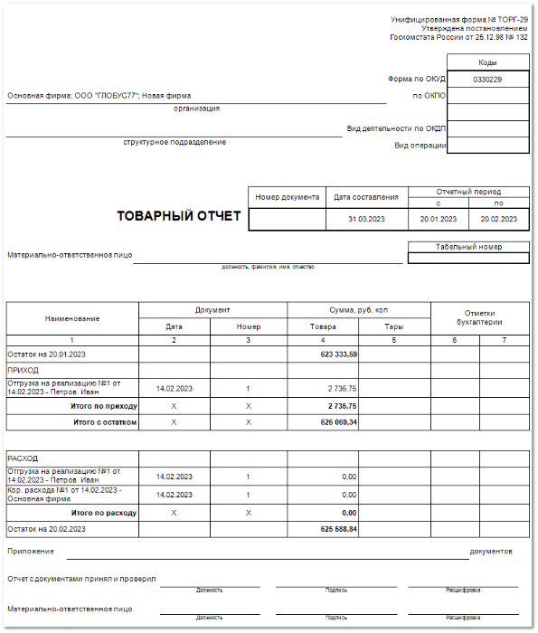

Товарный отчет применяется для учета товарных документов в организациях торговли за отчетный период, который утверждается руководителем организации. Отчет строится за определенный промежуток времени, указывая остатки товара на складе на начало периода в ценах выбранной категории и оборот товара по складу, в ценах выбранной категории.

В отчете содержится:

- Название предприятия и структурное подразделение, по которому формируют ТОРГ-29.

- **Реквизиты документа** — номер, дата, отчетный период, значения периода формируются в соответствии с выбранными в параметрах.

Материально ответственный сотрудник: его ФИО, должность и табельный номер

- **Табличная часть**, которая включает в себя следующую информацию:

    - **Наименование** – наименование товарных документов по приходу и расходу (**Приход**, **Кор.Прихода**, **Возврат от клиента**, **Расход**, **Перемещение**, **Списание товаров**);

    - **Документ**:

        - **дата** – дата документа;

        - **номер** – порядковый номер документа;

    - **Сумма**:

        - **товара** – значение закупочной стоимости товара для приходных документов, значение цены продажи для расходных документов;

        - **тары** – значение закупочной стоимости/ стоимости продажи тары (значение вносится вручную);

    - **Отметки бухгалтера** – пустые столбцы для проставления метки бухгалтером;

    ::: note Замечание

    Табличная часть отчета состоит из двух частей:

    - сведений об остатках и сведений о расходах: сведения об остатках содержат в себе сведения об остатках на момент составления документа. В эту таблицу строго с соблюдением хронологии, вносятся данные о поступлении товара из всех учетных документов по отдельности. 

    - сведения о расходах содержат информацию о расходе товара. Они заполняется идентично первой части, по соответствующим документам.

    :::

    - **Итого по приходу** – сумма товара по приходу за заданный период;

    - **Итого с остатком** – сумма значений **Остатка на начальную дату** составления отчета и **Итога по приходу**.