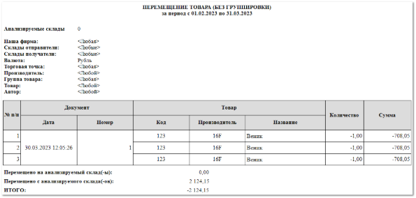
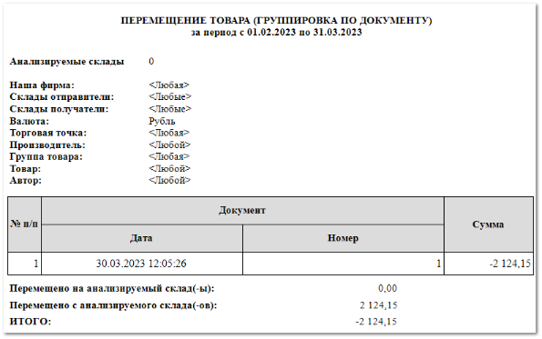
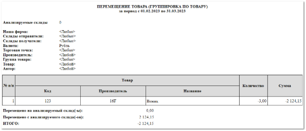

Отчет позволяет увидеть перемещения товаров между складами. При формировании отчета возможны разные варианты группировки, в зависимости от выбранного шаблона:

- **Перемещение товара (без группировки)**;

- **Перемещение товара (группировка по документу)**;

::: info Примечание

В шаблоне **Перемещение товара (группировка по документу)** отсутствуют колонки о перемещенном товаре: **Код**, **Производитель**, **Название**, **Количество**.

:::

- **Перемещение товара (группировка по товару)**.

::: info Примечание

В шаблоне **Перемещение товара (группировка по товару)** отсутствуют колонки с информацией о созданном документе **Перемещения**: **Дата** и **Номер**.

:::

Отчет содержит:

- Период, за который сформирован отчет, в соответствии с выбранными в параметрах;

- Параметры, по которым был сформирован отчет: **Анализируемые склады**, **Наша фирма**, **Склады отправители**, **Склады получатели**, **Валюта**, **Торговая точка**, **Производитель**, **Группа товара**, **Товар**, **Автор**;

- **Табличную часть**, которая включает в себя следующую информацию:

    - **№ п/п** – порядковый номер записи в таблице;

    - **Документ**:

        - **Дата** – дата документа **Перемещение**;

        - **Номер** – номер документа **Перемещение**;

    ::: info Примечание

    **Дата** и **Номер** подставляются из документа **Перемещение** (раздел **Склад и закупки** **► Перемещения товаров**.

    :::
    - **Товар**:

        - **Код** – артикул детали;

        - **Производитель** – наименование производителя;

        - **Название** – наименование детали из документа **Перемещение**;

    - **Количество** – количество перемещенного товара;

- **Сумма** – сумма закупа перемещенных позиций;

::: info Примечание

Значения **Количества** и **Суммы** перемещения выводятся с минусом в случае перемещения с анализируемого склада, без знака в случае перемещения на анализируемый склад.

:::

- **Перемещено на анализируемый склад(-ы)** – общее значение суммы товара, перемещенной на анализируемый склад;

- **Перемещено с анализируемого склада(-ов)** – общее значение суммы товара, списанной с анализируемого склада;

- **Итого** – общая сумма перемещений между складами.

::: details Читайте также

- [Документы Перемещения товаров](../../../specification/sklad_i_zakupki/peremeschenija_tovarov.md) 

:::