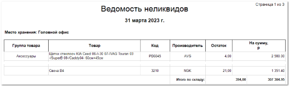

Отчет идентичен шаблону **Ведомость неликвидов** отчета **Отчет об остатках**, отличительной особенностью является то, что информация о позициях на складе выводится общим списком, без информации о количестве дней товара на складе. В рамках отчета можно оценить состав и количество неликвидов независимо по каждому складу, либо в рамках всех складов.

Отчет содержит:

- Дату, относительно которой выведено значение товарных остатков на складе, значение даты берется из настройки **Вычислять до даты**, которая задается при формировании отчета;

- **Место хранения**, по которому был сформирован отчет, в соответствии с выбранными в параметрах;

- **Табличную часть**, которая включает в себя следующую информацию:

    - **Группа товара** – наименование группы товара из заданных в справочнике **Товаров**;

    - **Товар** – наименование товара;

    - **Код** – артикул товара;

    - **Производитель** – наименование производителя товара;

    - **Остаток** – количество единиц товара на складе;

    - **На сумму** – закупочная цена позиции (с НДС) с учетом **Остатка**;

    - **Итого** – итоговое значение единиц товара на складе, а также сумма закупа всех товаров для позиций, которые находятся на складе без продаж заданное количество дней.

::: details Читайте также

- [Справочник Товары](../../../specification/tovary_i_tseny/tovary/README.md) 

:::