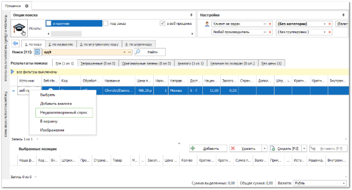
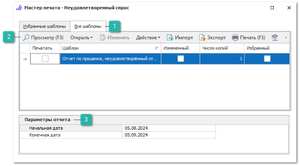
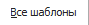
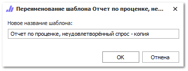
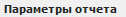
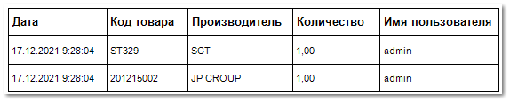
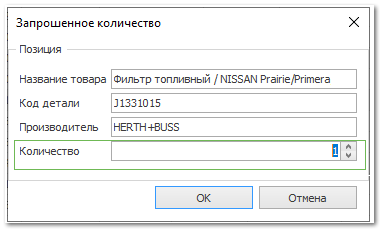

::: info Примечание

Для формирования отчетов из группы Статистика запросов проценки необходимо активировать настройку Сбор статистики запросов проценки в меню **Управление ► Настройки программы**, вкладка **Настройки ► Проценка ► Настройки поиска**, группа настроек **Служба сбора статистики**.

:::

Отчет по товарам, которые имеют статус **Неудовлетворенный спрос**. Этот статус присваивается товарам в **Проценке** в том случае, если на запрос клиента фирма не в состоянии предоставить товар. Для присвоения статуса необходимо в окне **Проценки** вызвать контекстное меню по товару и выбрать команду **Неудовлетворенный спрос**.

Чтобы сформировать отчет **Неудовлетворенный спрос** выполните следующие действия:

**»** Откройте раздел **Отчеты и анализ** ► **Статистика запросов проценки**.

**»** Выберите вариант отчета **Неудовлетворенный спрос**.

**»** В колонке **Печатать** отметьте шаблон, на основе которого нужно сформировать отчет и заполните необходимые параметры.

 **Все шаблоны**

Список доступных шаблонов отчета, позволяет выбрать необходимый для формирования отчет, а так же добавить шаблона в избранные.

 **Панель действий**

Панель состоит из следующих команд:

- **Просмотр (F3)** – позволяет открыть печатную форму для просмотра перед печатью;

- **Открыть** – позволяет открыть документ в выбранном формате. Содержит выпадающий список со следующими командами:

    - **В Word** – позволяет открыть документ в формате **\*.docx**;

    - **В Excel** – позволяет открыть документ в формате **\*.xlsx**;

    - **В PDF** – позволяет открыть документ в формате **\*.pdf**.

- **Изменить** – позволяет открыть редактор шаблонов для внесения изменений;

::: note Замечание

Команда недоступна при редактировании стандартных шаблонов. Редактирование доступно только для шаблонов, которые были скопированы (команда **Действие** ► **Копировать**) или импортированы (команда **Импорт**).

:::

- **Действие** – содержит выпадающий список команд для взаимодействия с шаблоном:

    - **Удалить** – удаляет выбранный шаблон. Команда доступна при выборе только измененных шаблонов;

    - **Копировать** – копирует выбранный шаблон. При нажатии на команду производится открытие окна с вводом наименования нового шаблона;

    - **Переименовать** – позволяет открыть окно для изменения наименования шаблона. Команда доступна только для шаблонов, которые не являются стандартными.

::: note Замечание

Сохранение шаблона недоступно, если: 

- название содержит спец. символы "\",  "/",  ":",  "\*",  "?",  """, "<",  ">",  "|"; 

- название не указано; 

- название и тип шаблона совпадают с уже имеющимся в базе данных.

:::

- **Импорт** – позволяет загрузить файл с шаблоном в расширении \*.mrt;

- **Экспорт** – позволяет выгрузить выделенный в табличной части шаблон, в файл с расширением \*.mrt;

- **Печать (F5)** – позволяет распечатать выбранные шаблоны;

- **Помощь** – позволяет открыть руководство пользователя на странице описания формы мастера печати.

 **Параметры отчета**

Позволяет задать необходимые параметры выбранного отчета:

- **Начальная и конечная даты** – период за который необходимо отобразить отчет.

**»** Нажмите команду **Печать**.

В отчете **Неудовлетворенный спрос** содержится:

- **Дата** – дата и время, в которое товар был отмечен, как не удовлетворяющий спросу;

- **Код товара** – артикул товара;

- **Производитель** – наименование производителя товара;

- **Количество** – количество товара, по которому был не удовлетворен спрос, задается на форме **Запрошенное количество**, в поле **Количество** при пометке товара как неудовлетворяющий спросу в разделе **Продажи** **► Проценка**;

- **Имя пользователя** – пользователь, отметивший в **Проценке** товар, как неудовлетворенный спрос.

::: details Читайте также

- [Справочник Сотрудники](../../../specification/upravlenie/spravochniki/sotrudniki.md)

- [Инструмент Проценка](../../../specification/prodazhi/protsenka.md)

- [Инструмент Быстрая продажа](../../../specification/prodazhi/bystraja_prodazha.md)

- [Справочник Товары](../../../specification/tovary_i_tseny/tovary/README.md)

- [Справочник Производители](../../../specification/tovary_i_tseny/proizvoditeli.md) 

:::