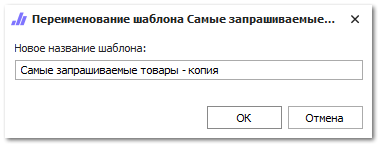

::: info Примечание

Для формирования отчетов из группы Статистика запросов проценки необходимо активировать настройку Сбор статистики запросов проценки в меню **Управление ► Настройки программы**, вкладка **Настройки ► Проценка ► Настройки поиска**, группа настроек **Служба сбора статистики**.

:::

Отчет показывает товары, которые были запрошены при **Проценке** в разрезе заданного периода (с учетом указанных параметров). Товары отображаются от наиболее к наименее запрашиваемым.

Чтобы сформировать отчет **Запрашиваемые товарам** выполните следующие действия:

**»** Откройте раздел **Отчеты и анализ** ► **Статистика запросов проценки**.

**»** Выберите вариант отчета **Запрашиваемые товары**.

**»** В колонке **Печатать** отметьте шаблон, на основе которого нужно сформировать отчет и заполните необходимые параметры.

 **Все шаблоны**

Список доступных шаблонов отчета, позволяет выбрать необходимый для формирования отчет, а так же добавить шаблона в избранные.

 **Панель действий**

Панель состоит из следующих команд:

- **Просмотр (F3)** – позволяет открыть печатную форму для просмотра перед печатью;

- **Открыть** – позволяет открыть документ в выбранном формате. Содержит выпадающий список со следующими командами:

    - **В Word** – позволяет открыть документ в формате **\*.docx**;

    - **В Excel** – позволяет открыть документ в формате **\*.xlsx**;

    - **В PDF** – позволяет открыть документ в формате **\*.pdf**.

- **Изменить** – позволяет открыть редактор шаблонов для внесения изменений;

::: note Замечание

Команда недоступна при редактировании стандартных шаблонов. Редактирование доступно только для шаблонов, которые были скопированы (команда **Действие** ► **Копировать**) или импортированы (команда **Импорт**).

:::

- **Действие** – содержит выпадающий список команд для взаимодействия с шаблоном:

    - **Удалить** – удаляет выбранный шаблон. Команда доступна при выборе только измененных шаблонов;

    - **Копировать** – копирует выбранный шаблон. При нажатии на команду производится открытие окна с вводом наименования нового шаблона;

    - **Переименовать** – позволяет открыть окно для изменения наименования шаблона. Команда доступна только для шаблонов, которые не являются стандартными.

::: note Замечание

Сохранение шаблона недоступно, если: 

- название содержит спец. символы "\",  "/",  ":",  "\*",  "?",  """, "<",  ">",  "|"; 

- название не указано; 

- название и тип шаблона совпадают с уже имеющимся в базе данных.

:::

- **Импорт** – позволяет загрузить файл с шаблоном в расширении \*.mrt;

- **Экспорт** – позволяет выгрузить выделенный в табличной части шаблон, в файл с расширением \*.mrt;

- **Печать (F5)** – позволяет распечатать выбранные шаблоны;

- **Помощь** – позволяет открыть руководство пользователя на странице описания формы мастера печати.

 **Параметры отчета**

Позволяет задать необходимые параметры, наборы параметров отличаются в зависимости от выбранного отчета:

- **Начальная и конечная даты** – период за который необходимо отобразить отчет;

- **Успешность поиска** – при активном значении в отчете отражаются только запросы для которых было найдено предложение;

::: info Примечание

Посмотреть запросы, по которым не было найдено ни одного предложения можно только для **Контекста** – **Быстрая продажа**.

:::
- **Сотрудник** – имя сотрудника, осуществлявшего проценку. Доступен выбор сотрудника из справочника **Сотрудники**;

- **Контекст** – источник, через который выполнялся поиск позиции. Доступные значения (по умолчанию выбраны все значения):

    - **Проценка**;

    - **Быстрая продажа**;

- **Запрошенный товар** – формирование отчета по выбранному товару из справочника **Товары**. Доступен выбор только одного товара из справочника (по умолчанию отчет формируется по всем товарам);

- **Производитель** – формирование отчета по выбранному производителю из справочника **Производители**. Доступен выбор только одного производителя из справочника (по умолчанию отчет формируется по всем производителям);

- **Количество позиций в отчете** – максимальное количество строк с позициями, которое будет выводится в отчете (для отчета **Запрашиваемые товары**).

**»** Нажмите команду **Печать**.

Отчет **Самые запрашиваемые товары** содержит:

Период, за который сформирован отчет (в соответствии с выбранными в параметрах);

- **Табличную часть**, которая включает в себя следующую информацию:

    - **Товар** – артикул товара;

    - **Производитель** – наименование производителя;

    - **Кол-во запросов** – количество выполненных запросов по данной позиции в **Проценке** (за выбранный период).

- **Общее число запросов** – суммарное количество запросов за заданный период.

::: details Читайте также

- [Справочник Сотрудники](../../../specification/upravlenie/spravochniki/sotrudniki.md)

- [Инструмент Проценка](../../../specification/prodazhi/protsenka.md)

- [Инструмент Быстрая продажа](../../../specification/prodazhi/bystraja_prodazha.md)

- [Справочник Товары](../../../specification/tovary_i_tseny/tovary/README.md)

- [Справочник Производители](../../../specification/tovary_i_tseny/proizvoditeli.md) 

:::