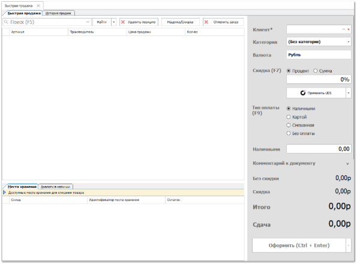
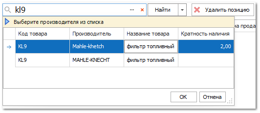
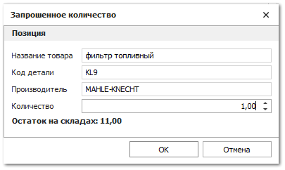
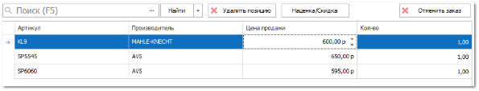
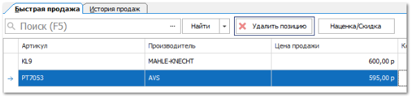
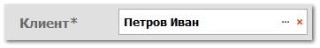
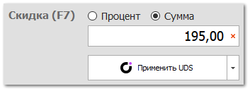
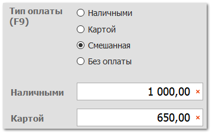
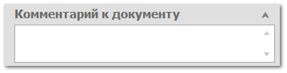
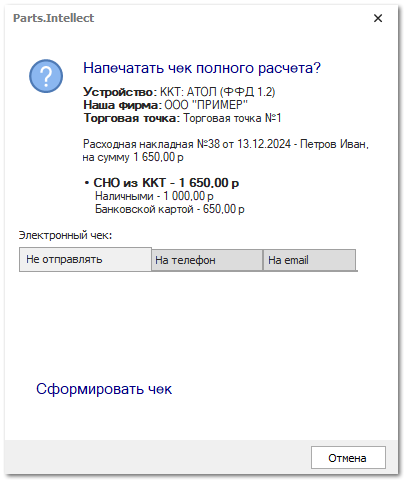

Инструмент **Быстрая продажа** служит для облегчения продажи товара из наличия в магазине. Все необходимые элементы расположены на одной форме, а при совершении продажи формируется требуемый набор документов, например, **Расходная накладная**, **Приходный кассовый ордер** и печатается чек.

Рассмотрим процесс работы с инструментом **Быстрая продажа**. 

::: info Примечание

Инструмент **Быстрая продажа** может быть установлен как **Интерфейс по умолчанию** для пользователя программы. В этом случае при входе в программу будет открыто одно единственное окно инструмента.

:::

**»**  Перейдите в раздел **Продажи** ► **Быстрая продажа** или нажатием сочетания клавиш CTRL+F12 на клавиатуре. Отобразиться окно:

**»** Воспользуйтесь полем поиска товара из наличия в табличной части. Найти необходимый товар можно по артикулу или штрих-коду, так же можно открыть справочник **Товаров** с помощью кнопки.

**»** Укажите необходимое **Количество** товара в табличной части. 

::: note Замечание

При добавлении товара, в табличной части указывается позиция в единичном экземпляре. Для выбора количества товара, предварительно перед его добавлением, необходимо включить настройку **Спрашивать кол-во при выборе позиции** в разделе **Управление** ► **Настройки пользователя** на вкладке **Быстрая продажа**. С включенной настройкой, при добавлении товара будет производится открытие окна для указания количества.

В окне отображена информация из справочника **Товары**: наименование, код и производитель товара, поле для указания необходимого к продаже количества товара, а также текущий остаток на доступных складах.

:::

**»** Измените цену продажи товара, по необходимости, в колонке **Цена продажи**. 

::: note Замечание

Доступность изменения цены продажи определяется разрешением **Можно изменять цену продажи в Быстрой продаже** раздела **Управление** ► **Настройки программы** ► **Роли пользователей** в группе **Документы** ► **Расходные накладные**.** 

:::

**»** При необходимости удалить позиции из табличной части, воспользуйтесь командой **Удалить позицию**. 

**»** После выбора товаров необходимо оформить продажу. Для поля **Клиент** укажите клиента, для которого оформляется продажа.

::: note Замечание

Выбор клиента осуществляется из справочника **Контрагенты**.

Клиента по умолчанию можно установить в настройке **Контрагент по умолчанию** раздела **Управление** ► **Настройки программы** ► **Роли пользователей** в группе **Документы** ► **Расходные накладные**.** 

:::

**»** Поле **Категория** установится по умолчанию в зависимости от установленной категорий выбранного клиента в карточке контрагента. При необходимости измените категорию.

::: note Замечание

Доступность изменения категории клиента в панели оформления продажи определяется разрешением **Можно изменять категорию клиента** раздела **Управление** ► **Настройки программы** ► **Роли пользователей** в группе **Документы** ► **Расходные накладные**.** 

:::

**»** Примените скидку к продаваемым товарам с помощью поля **Скидка (F7)**. На выбор доступны варианты скидки в процентном соотношений и в сумме. Так же существует возможность применить скидку от сервиса UDS воспользовавшись командой **Применить UDS**.

::: note Замечание

Для отображения команды **Применить UDS** необходимо включить настройку **Добавить команды для работы с UDS** в разделе **Управление** ► **Настройки программы** ► **Настройки** в группе **CRM** ► **Накопительная система скидок**. 

Для функционала скидок существует возможность включить округление итоговой стоимости. Механизм включается с помощью настройки **Применить округление цены после скидки** в разделе **Управление** ► **Настройки пользователя** на вкладке **Быстрая продажа**. Округление итоговой стоимости производится согласно установленному округлению цен в разделе **Финансы** ► **Валюты и курсы**.

:::

**»** Выберите соответствующий тип оплаты. При расчете наличными полностью или частично, укажите получаемую сумму от клиента в отобразившихся полях.

**»** При необходимости укажите **Комментарий к документу**. Введенная в поле информация будет отображена в поле **Комментарий** документа **Расходная накладная**.

**»** После заполнения всех данных необходимо создать документ продажи товара – **Расходная накладная**. Для этого необходимо нажать кнопку **Оформить (Ctrl+Enter)**. 

::: note Замечание

Проводка документа **Расходная накладная** осуществляется по командам **Провести и оплатить** и **Провести, оплатить и напечатать** в выпадающем списке команды **Оформить**. 

Для установки действия по умолчанию при нажатии на команду **Оформить** необходимо, в разделе **Управление** ► **Настройки пользователя** на вкладке **Быстрая продажа** в настройке **Действия с новым документом "Расходная накладная"** указать необходимое действие.

:::

::: info Примечание

При оформлении продажи товара клиенту, в программе будут созданы платежи **Приходный кассовый ордер** и/или **Оплата по банковской карте**, в зависимости от выбранного типа оплаты. Данные платежи будут разнесены в созданный документ **Расходная накладная**.

:::

**»** После оформления продажи, с помощью команды **Провести, оплатить и напечатать**, отобразится окно с предложением распечатать чек полного расчета. Выполните печать или отправку чека.

