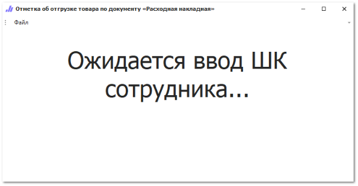
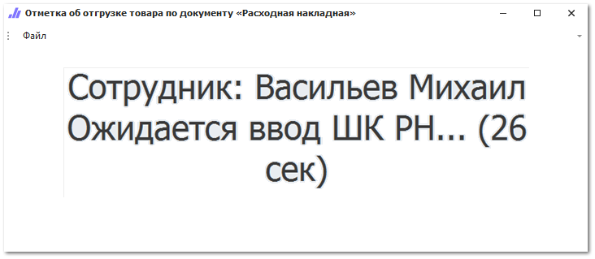

Инструмент **Отметка об отгрузке товара** позволяет кладовщику отмечать в системе собранные **Расходные накладные**. Пользователи программы могут отслеживать информацию по отгрузкам, а также строить **Отчет по кладовщикам**, с информацией какой кладовщик, какое количество позиций собрал за отчетный период.

Для работы инструмента выполните следующие действия:

**»**  В разделе меню **Управление ► Настройки программы ► Настройки ►** группа **Склад и закупки** ► **Движение товара** включите плагин **Отметка об отгрузке товара** и установите необходимые настройки.

**»**  Интерфейс кладовщика, в котором можно устанавливать отметки об отгрузке для **Расходных накладных**, активируется в **Настройках пользователя** на вкладке **Основные**, опция **Интерфейс пользователя**, значение **Отметка об отгрузке товара**.

**»**  После установки данного интерфейса для пользователя, при входе в программу, у него будет отображаться окно с формой ввода **Штрихкода кладовщика** (значение поля **Системный штрихкод** в справочнике **Сотрудники**).

::: info Примечание

Ввод штрихкода сотрудника осуществляется при помощи сканера.

:::

**»**  После ввода штрихкода сотрудника программа его идентифицирует и предлагает в течение 30 секунд отсканировать штрихкод **Расходной накладной** (поле **Системный штрихкод** документа). По истечению 30 секунд форма снова предлагает представиться. Для принудительного перехода к вводу штрихкода сотрудника нажмите клавишу "ESC" на клавиатуре.

**»**  После сканирования штрихкода **Расходной накладной** система проверяет нет ли уже отметки у этого документа. Если нет, то система ставит отметку с датой, временем и кладовщиком, если уже есть, то система запрещает ввод отметки и выводит соответствующую информацию.

Посмотреть данные об отметке можно в списке **Расходных накладных** в колонках **Кладовщик** и **Дата отгрузки**.

::: info Примечание

Отметка об отгрузке товара по документу не очищается в случае отмены проводки документа.

:::

Если необходимо предоставить возможность снимать отметку об отгрузке, то выберите пользователей, которым будет разрешено снимать отметку в разделе **Управление ► Настройки программы ► Настройки ►** группа **Склад и закупки** ► **Движение товара** в соответствующей настройке.

Если разрешение включено, то в списке **Расходных накладных** на панели инструментов становится доступна команда **Снять отметку об отгрузке** в меню команды **Действие**.