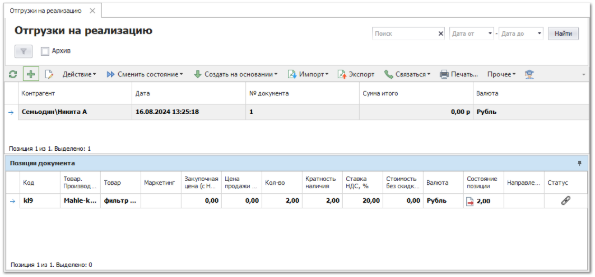
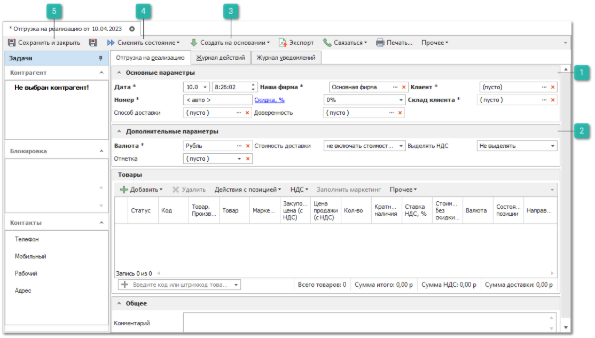
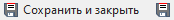
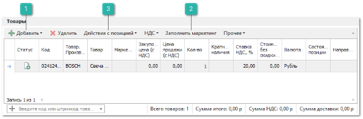
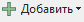
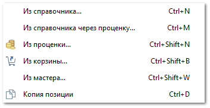
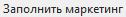
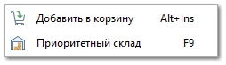

Одной из функций программы является возможность реализации Вашего товара сторонними контрагентами. Для этого создается и проводится документ **Отгрузка на реализацию**. Отгружать товары на реализацию можно только на **Склад клиента**, который необходимо предварительно создать в справочнике **Склады/Торговые точки**.

Для создания нового документа отгрузки выполните следующие действия:

**»** В **Главном меню** выберите пункт **Продажи** ► **Отгрузка на реализацию**. Отобразятся элементы выбранного пункта.

**»** Для добавления нового документа нажмите кнопку **Новый** на панели управления. Отобразится окно инспектора для добавления нового документа.

 **Основные параметры**

Блок содержит параметры:

- **Дата** – дата и время создания документа;

::: info Примечание

Для определения даты и времени программа использует данные компьютера пользователя или время компьютера, где расположена база данных, при активной настройке **Использовать локальное время сервера БД** в разделе меню **Управление ► Настройки программы ► Настройки** блок **Системные настройки**.

Возможность ручного редактирования **Даты** и **Номера документа** для пользователя определяется опциями **Можно редактировать дату и время документа** и **Можно редактировать номер документа** в разделе меню **Управление ► Настройки программы ► Роли пользователей ► Документы ► Отгрузки на реализацию**.

:::

- **Номер** – порядковый номер документа (доступен ручной ввод). Формат и счетчик для формирования номера документа определяется правилом в разделе меню **Управление ► Справочники ► Счетчик номеров документов**;

- **Способ доставки** – укажите способ доставки товара до склада клиента;

- **Наша фирма** – наша фирма от которой будет осуществляться отгрузка товара;

::: warning Внимание!

Стоит учесть значение настройки **Контролировать движение товара по нашей фирме** в разделе меню **Управление ► Настройки программы ► Наши фирмы**, при активации которой запрещается списание товара по расходной накладной оформленной на Нашу фирму, отличную от той, которая в приходе.

:::

- **Скидка, %** – значение процента скидки, которое применяется на все позиции документа. Значение можно указывать в процентах в поле **Скидка (расчетная), %**, или указать непосредственно **Сумму скидки.** Значения полей рассчитываются автоматически на основании значения второго поля;

- **Доверенность** – выберите доверенность, по которой выдается товар;

- **Клиент** – клиент, которой будет реализовывать товар;

- **Склад клиента** – склад из справочника с отметкой "склад клиента".

 **Дополнительные параметры**

Блок содержит параметры:

- **Валюта** – валюта цен в документе. Если изменить валюту документа программа предложит сконвертировать цены на позиции к валюте документа по текущему курсу для валют;

- **Отметка** – выберите отметку для документа из справочника;

- **Стоимость доставки** – укажите влияние стоимости доставки на цену закупа:

    - **Не включать стоимость доставки** – суммарное значение по колонке **Стоимость доставки** не будет влиять на общую сумму документа;

    - **Включать стоимость без учета скидки** – сумма колонки **Стоимость доставки** будет прибавлена к сумме по документу;

    - **Включать стоимость с учетом скидки** – на стоимость доставки будет действовать **Скидка/Наценка, %** по документу;

- **Выделять НДС** – при необходимости, измените значение. По умолчанию значение берется из карточки **Нашей фирмы**, в документе.

 **Создать на основании**

Позволяет создать, на основании **Отгрузки товара на реализацию,** документы:

- **Возврат товара на наш склад** – документ **Перемещение товаров**;

- **Расходная накладная**.

 **Сменить состояние**

Позволяет осуществить проводку документа или отменить ее, в случае необходимости.  А так же добавить документ в архив или извлечь его из архива.

 **Сохранить и закрыть/Сохранить**

Позволяет сохранить и закрыть/сохранить документ **Отгрузка товара на реализацию** без проводки.

**»**  На форме заполните необходимые поля (поля, выделенные жирным шрифтом обязательны для заполнения). 

**»** Добавьте необходимые товары в табличную часть **Отгрузки товара**. Табличная часть содержит список добавленных позиций, а так же ряд команд для выполнения действий над ними. При создании документа на основании заказа клиента, позиции автоматически будут скопированы из документа-родителя. Данные по позиции заполняются автоматически на основе информации источника, из которого происходило добавление. При необходимости, заполните/измените данные по позиции.

 **Добавить**

Позволяет дополнительно добавить товары в документ**.** Доступны следующие источники позиций:

- **Из справочника** – позиция будет добавлена в документ без цен из справочника **Товары**;

- **Из справочника через проценку** – позицию можно будет выбрать вначале в справочнике товаров, а затем она будет передана в **Проценку** для подбора предложений;

- **Из проценки** – программа откроет окно **Проценки** для подбора позиций в документ;

- **Из корзины** – позиции будут добавлены из корзины;

- **Из мастера** – позволяет добавить позиции, которые необходимо заказать из **Мастера расходной накладной**;

- **Копия позиции** – создастся копия выделенной позиции документа.

 **Заполнить маркетинг**

Позволяет автоматически подставить информацию о позиции из существующих **Маркетингов**. Доступна подстановка:

- **Закупочной цены** **(с НДС)** – цена закупа детали у поставщика;

- **Цены продажи (с НДС)** – цена на товар с учетом маркетинга;

- **Направления/ склада** – направление поставки или склад из прайс-листа;

- **Приоритетного склада для списания** – склад, с которого требуется осуществлять списание товара;

Заполнить маркетинг можно как для одной позиции из документа, нажав кнопку **Обновить**, так и для всех, нажав кнопку **Для всех** в открывшемся окне.

::: info Примечание

Функция **Заполнить маркетинг** в **Отгрузках на реализацию** доступна только для позиций с пустым полем **Маркетинг** из источника – **Прайс-лист наличия**.

Функция активна только для не проведенных документов.

:::

::: info Примечание

Для подстановки цен по позиции выполняется проценка с поиском позиции в источниках (из маркетинга, из наличия). Проценка осуществляется в 3 этапа, аналогичным при проценке в документе **Заказ клиента**.

:::

 **Действия с позицией**

- **Добавить в корзину** – позволяет добавить выделенные позиции из документа в корзину;

- **Приоритетный склад** – позволяет выбрать склад и место хранения, с которых требуется осуществлять списание товара.

Указать приоритетный склад для списания можно сразу для нескольких позиций с помощью команды **Действия с позицией** пункт **Приоритетный склад** на панели инструментов, так и в самой позиции документа. При этом **Место хранения**, с которого необходимо выполнить списание товара можно выбрать только по позиции документа.

::: info Примечание

В случае отсутствия товара на выбранном **Складе**, списание товара будет произведено со вложенных в этот склад **Мест хранений** (при активном значении настройки **Подбирать товары сначала на приоритетном складе/ТТ, а затем на вложенных в него МХ** из раздела **Управление ► Настройки программы ► Настройки ►** группа **Склад и закупки** ► **Движение товара**).

В случае отсутствия товара на выбранном **Месте хранения**, списание товара будет произведено со вложенных в него **Мест хранений** (при активном значении настройки **Перемещать товары сначала с выбранного МХ, а затем с вложенных в него МХ** из раздела **Управление ► Настройки программы ► Настройки ►** группа **Склад и закупки** ► **Движение товара**).

:::

::: info Примечание

В разрешениях пользователя (**Управление ► Настройки программы ► Роли пользователей ► Разрешения для роли пользователей ►** группа **Документы ► Отгрузки на реализацию**) доступна опция **Списание/резервирование товаров со складов/МХ, отличных от приоритетного**, которая активирует проверку доступного количества товара на складе при проводке документа. Если количество товара из наличия недостаточно, то программа выдаст соответствующее уведомление.

:::

По умолчанию списание товара (в момент проводки) будет осуществляться среди всех складов **Доступных для списания** пользователю, по действующему в системе **Способу списания товара ФИФО/ЛИФО** в разделе меню **Управление ► Настройки программы ► Настройки**, группа **Склад и закупки ► Движение товара**.

**»** Для вступления документа в силу и списания товара со склада его необходимо провести. Для этого нажмите кнопку **Сменить состояние** и выберите пункт **Провести** (Ctrl+E).

::: info Примечание

Проведение документа расходной может быть заблокировано программой при наличии одного или нескольких ограничений:

- Склад/торговая точка, с которой осуществляется списание находится в данный момент на инвентаризации;

- Склад/торговая точка, выбранный в параметрах документа отсутствует в **Списке складов/ТТ, с которых доступно списание товара** в разрешениях пользователя;

- Проводка блокируется при установке иных ограничений для пользователя в разделе главного меню **Управление ► Настройки программы ► Роли пользователей** ► группа **Документы ► Расходные накладные**.

:::

**»** Для того чтобы сохранить и закрыть документ (можно и без проведения) воспользуйтесь кнопкой **Сохранить и закрыть** (F2).

По мере продажи вашего товара, контрагент представляет документы по проданным товарам. В этом случае на основании документа **Отгрузка на реализацию** создается документ **Расходная накладная**, в котором указывается, сколько и какого товара было реализовано.

По истечению оговоренного времени нереализованный товар можно вернуть на свой склад. Для этого на основании документа **Отгрузка на реализацию** создается документ **Возврат товара на наш склад** (перемещение).