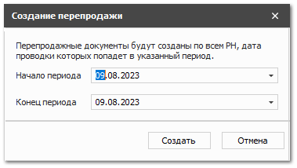

Для создания перепродажи по документам **Расходная накладная** выполните следующие действия:

**»** Перейдите в журнал документов **Расходные накладные** и выполните команду **Создать перепродажу**.

**»** В появившемся окне выберите период для создания перепродажных документов.

По факту перемещения товара между фирмами создаются документы **Приходная накладная** и **Расходная накладная**. 