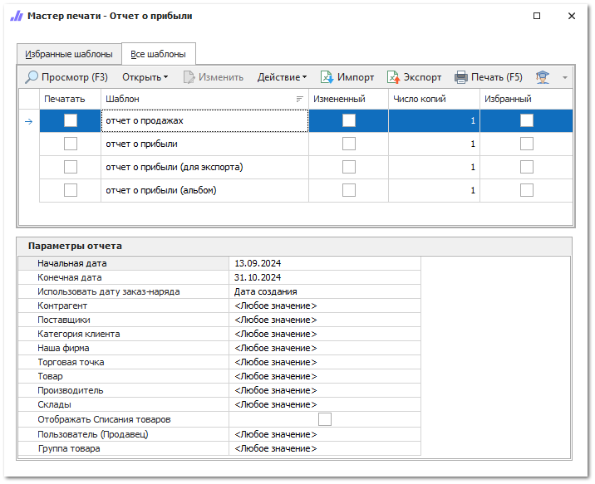
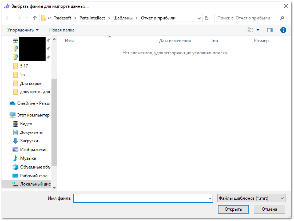
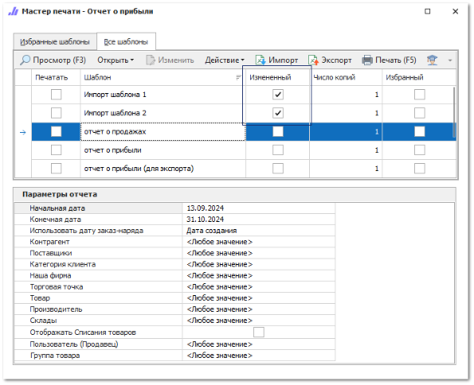

Загрузка печатного шаблона в программу возможна, если у вас есть соответствующий файл с заранее настроенным шаблоном.

::: warning Внимание!

Программа поддерживает загрузку файлов только с расширением **\*.mrt**. Если файл имеет это расширение, но фактически таким не является, тогда система уведомит пользователя о том, что файл поврежден или не является корректным шаблоном.

:::

Для загрузки нового шаблона воспользуйтесь следующими действиями:

**»** Откройте **Мастер печати** в нужном разделе: с помощью команды **Печать** на панели действий или при открытии отчета в разделе **Отчеты и анализ**.

**»** Нажмите на команду **Импорт** на панели действий. Отобразится окно для выбора файлов:

**»** Выберите необходимые для загрузки файлы. 

::: note Замечание

При загрузке одного шаблона отобразится окно для ввода его наименования. Если для загрузки выбрано несколько шаблонов они будут импортированы под своими исходными именами.

:::

**»** Нажмите на кнопку **Открыть**. В табличной части мастера отобразятся шаблоны с автоматически установленным признаком **Измененный**.

Печатные шаблоны готовы к использованию.