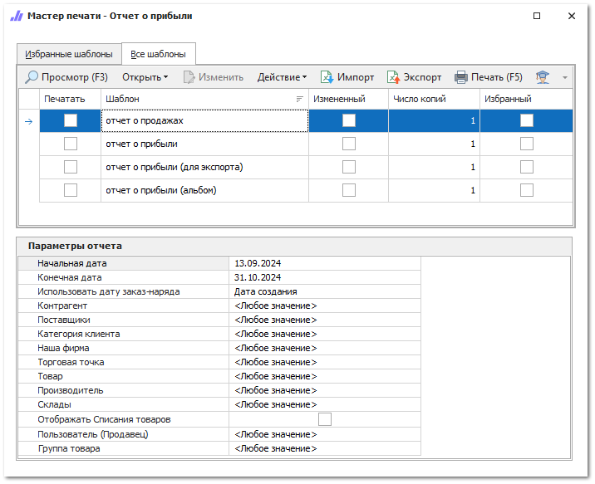

Для копирования шаблона сделайте следующее:

**»** Откройте **Мастер печати** в нужном разделе: с помощью команды **Печать** на панели действий или при открытии отчета в разделе **Отчеты и анализ**.

**»** Выделите необходимый для копирования шаблон в табличной части.

**»** Нажмите на команду **Действие ► Копировать**. Отобразится окно для ввода наименования шаблона:

**»** Введите наименование добавляемого шаблона и нажмите **ОК**.

::: note Замечание

Сохранение шаблона недоступно, если:

- название содержит спец. символы "\",  "/",  ":",  "\*",  "?",  """, "<",  ">",  "|"; 

- название не указано; 

- название и тип шаблона совпадают с уже имеющимся в базе данных.

:::

В табличной части мастера отобразится шаблон с автоматически установленным признаком **Измененный**.

**»** Для копированного шаблона нажмите команду **Изменить** на панели действий. Отобразится окно редактора печатного шаблона:

**»** Внесите необходимые изменения в отчет и сохраните его.

Печатный шаблон готов к использованию.