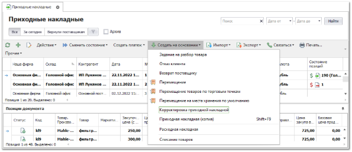
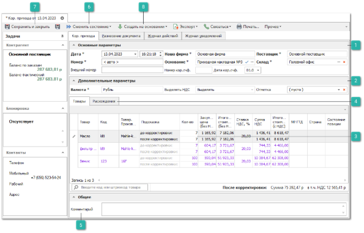
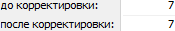
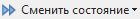
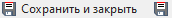
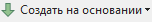

В случае расхождения фактического количества и количества в документе **Приходная накладная** оформляется документ **Корректировка приходной накладной**. Наиболее предпочтительно оформлять документ через создание документа на основании **Приходной накладной**.

В документе **Корректировка приходной накладной** отображаются все позиции выбранного документа-основания **Приходной накладной**.

::: info Примечание

Создание документов **Корректировка приходной накладной** возможно только на основании проведенного документа **Приходная накладная**. Позиции документа **Приходная накладная** должны находиться в доступных состояниях: **Возврат от клиента**, **Резерв**, **Отмена резерва**, **Приход**, **Кор.расхода**, то есть быть в наличии.

:::

Для создания нового документа **Корректировка приходной накладной** выполните следующие действия:

**»** В **Главном меню** выберите пункт **Склад и закупки** ► **Приходные накладные**. Отобразятся элементы выбранного пункта.

**»** Выберите один или несколько приходов, по которым необходимо создать корректировку. На панели управления нажмите на выпадающее меню команды **Создать на основании** и выберите пункт **Корректировка приходной накладной**. Откроется инспектор создания документа **Корректировки расхода**.

 **Основные параметры**

Позволяет задать параметры документа:

- **Дата** – дата и время создания документа;

::: warning Внимание!

Дата документа должна быть позднее даты документа **Основание**.

:::

- **Номер** – номер документа. Возможен как ручной ввод, так и автозаполнение;

::: warning Внимание!

Документ **Корректировка приходной накладной** должен иметь уникальные номер и дату. Проведение документов, не соответствующих этим критериям, блокируется.

:::

- **Внешний номер** – внешний номер документа у поставщика;

- **Наша фирма** – данные из документа-основания о нашей фирме. Поле недоступно для редактирования или ручного ввода;

- **Основание** – выбор документа **Приходная накладная**, подлежащего корректировке количества;

- **Номер кор.счф** – номер корректировочного счета-фактуры;

- **Дата кор.счф** – дата корректировочного счета-фактуры. Поле заполняется автоматически текущей датой при установке **Номера корректировочной счет фактуры**;

- **Поставщик** – данные из документа-основания о поставщике. Поле недоступно для редактирования или ручного ввода;

- **Склад** – **Склад/Торговая** точка для списания товаров. Поле заполняется автоматически из документа-основания.

 **Дополнительные параметры**

Позволяет задать параметры документа:

- **Валюта** – валюта, в которой считать цены по данному документу;

- **Выделять НДС** – выделять НДС или нет;

- **Отметка** – выбор отметки для документа из справочника.

 **Поле ввода корректировки** 

Поле **До корректировки** содержит количество оприходованного товара. Поле **После корректировки** позволяет указать фактическое количество товара.

 **Расхождения**

Вкладка позволяет посмотреть позиции, по которым имеются расхождения перейдите на вкладку **Расхождения**.

 **Комментарий**

Позволяет добавить произвольный комментарий документу, в случае необходимости.

 **Сменить состояние**

Позволяет осуществить проводку документа или отменить ее, в случае необходимости.  А так же добавить документ в архив или извлечь его из архива.

 **Сохранить и закрыть/Сохранить**

Позволяет сохранить и закрыть/сохранить документ без проводки.

 **Создать на основании**

Позволяет на основании документа Корректировка расхода создать документ **Отказ клиента**.

**»** В инспекторе нового документа при необходимости заполните/отредактируйте данные:

::: info Примечание

При выборе **Приходной накладной** в поле **Основание** или создании документа **Корректировка приходной накладной** с помощью команды **Создать на основании** вкладка **Товар** заполняется автоматически позициями документа-основания.

:::

**»** В табличной части на вкладке **Товары** в колонке **Кол-во,** строке **После корректировки** укажите фактическое количество товара.

::: info Примечание

В поле **После корректировки** доступен ввод только значения меньшего, чем значение в поле **До корректировки**.

:::

**»** Для вступления документа **Корректировка приходной накладной** в силу, его необходимо провести. Для этого нажмите кнопку **Сменить состояние** и выберите пункт **Провести** (Ctrl+E).

::: warning Внимание!

Проведение документа **Корректировка приходной накладной** ведет к списанию товаров с расхождением с указанного склада (поле **Склад**), в случае достаточного их количества.

:::

**»** Для того, чтобы сохранить и закрыть документ (можно и без проведения), воспользуйтесь кнопкой **Сохранить и закрыть** (F2).

::: warning Внимание!

При необходимости для одного документа-основания **Приходная накладная** может быть создано несколько документов **Корректировка приходной накладной**, однако в новом документе корректировки не учитывается изменение количества по другим ранее созданным корректировкам.

:::

Для завершения цепочки транзакций по недостающим позициям Вы можете сформировать документ **Отказ клиента** с помощью команды **Создать на основании** или мастера отказа клиента.