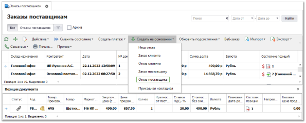
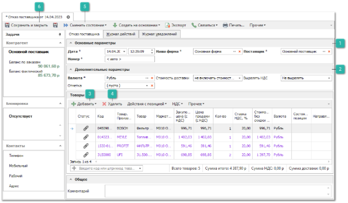
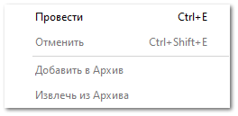
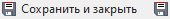

В случае отказа поставщика на ваш заказ оформляется документ **Отказ поставщика**. Наиболее предпочтительно оформлять документ через **Мастер создания Отказа поставщика** или через создание документа на основании **Заказа поставщику**.

Позиции в документе **Отказ поставщика** в первую очередь связываются со "свободными" позициями из документов **Заказ поставщику**. Свободными являются те позиции, которые не были связаны с **Заказами клиентов**», либо **Нашими заказами**.

::: info Примечание

Создание документов **Отказ поставщика** запрещено по позициям, по которым ранее был создан **Возврат поставщика**.

:::

Для создания нового **Отказа поставщика** необходимо:

**»** В **Главном меню** выберите пункт **Склад и** **закупки** ► **Заказы поставщикам**. Отобразятся элементы выбранного пункта. 

**»** Выберите один или несколько заказов, по которым необходимо создать отказ. На панели управления нажмите на выпадающее меню команды **Создать на основании** и выберите пункт **Отказ поставщика**.

 **Основные параметры**

Блок содержит параметры:

- **Дата** – дата и время создания документа**;**

- **Номер** – номер документа. Возможен как ручной ввод, так и автозаполнение;

- **Наша фирма** – выбор нашей фирмы;

- **Поставщик** – поставщик, которому возвращается товар.

 **Дополнительные параметры**

Блок содержит параметры:

- **Валюта** – валюта, в которой считать цены по данному документу;

- **Выделять НДС** – выделять НДС или нет;

- **Отметка** – отметка документа из справочника **Отметки в документах**;

- **Стоимость доставки** – влияние стоимости доставки на цену закупа: 

    - **Не включать стоимость доставки** – суммарное значение по колонке **Стоимость доставки** не будет влиять на общую сумму документа;

    - **Включать стоимость без учета скидки** – сумма колонки **Стоимость доставки** будет прибавлена к сумме по документу; 

    - **Включать стоимость с учетом скидки** – на стоимость доставки будет действовать **Скидка/Наценка**, % по документу

 **Добавить**

- **Из мастера** – позволяет вручную добавить товары, в которых было отказано, если документ **Отказ поставщика** был создан с помощью команды **Новый** в списке отказов. Откроется окно **Мастера создания Отказа поставщика** и предложит выбрать товары из **Заказов поставщику**, по которым было отказано.

 **Удалить**

Позволяет удалить из табличной части выделенные позиции. Если документ был создан на основании **Заказа поставщику**, то необходимо оставить те товары, в которых было отказано. 

 **Сменить состояние**

Позволяет осуществить проводку документа или отменить ее, в случае необходимости.  А так же добавить документ в архив или извлечь его из архива.

 **Сохранить и закрыть/Сохранить**

Позволяет сохранить и закрыть/сохранить документ без проводки.

**»** В инспекторе нового документа **Отказ поставщика** при необходимости заполните/отредактируйте параметры

**»** Определите товары, в которых отказал поставщик.

**»** Добавьте комментарий в случае необходимости.

**»** Для вступления документа **Отказ поставщику** в силу его необходимо провести. Для этого нажмите кнопку **Сменить состояние** и выберите пункт **Провести** (Ctrl+E).

**»** Для того, чтобы сохранить и закрыть документ (можно и без проведения), воспользуйтесь кнопкой **Сохранить и закрыть** (F2).

В случае отказа поставщика от поставки деталей Вы можете перезаказать их у другого поставщика или сформировать **Отказ клиента** для завершения цепочки транзакций.