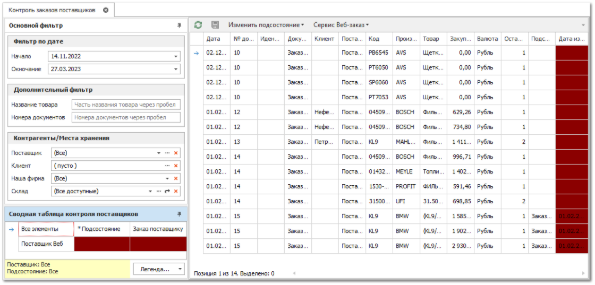
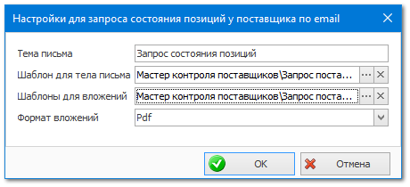

Благодаря этому инструменту осуществляется контроль поставщиков за продвижением Ваших заказов. В **Контроле заказов поставщиков** наглядно видно, в каких подсостояниях у каких поставщиков находятся Ваши заказы (анализируются только позиции в состоянии "заказ поставщику").

У каждой позиции видна дата и время последней смены подсостояния, благодаря чему осуществляется визуальный контроль за положением дел.

Программа по каждому поставщику собирает позиции в анализируемых подсостояниях, выбирает позицию с самой старой датой изменения подсостояния и в соответствии с диапазонами из легенды расцвечивает ячейки на панели **Сводная таблица** **контроля поставщиков**.

Позиции, которые не сменили подсостояние в требуемый интервал времени, можно отправить поставщику в запросе по почте.

**»** Для этого необходимо воспользоваться командой **Запрос поставщику**.

**»** Сначала настроить отправку запроса поставщику.

**»** А затем воспользоваться командой **Отправить по email** для отправки запроса поставщику.

В дополнение к этим возможностям в разделе присутствует возможность автоматического создания **Отказов поставщиков** и **Отказов клиентов** в зависимости от пришедших статусов от поставщика. Настройки этого механизма можно выполнить в разделе меню **Управление ► Настройки программы ► Настройки ►** группа **Склад и закупки ► Закупки**.