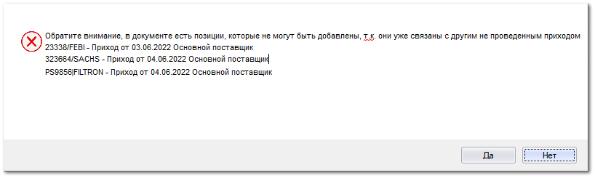
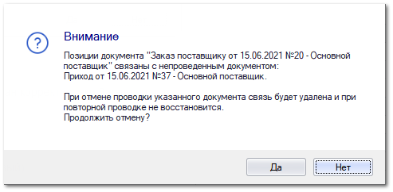

При загрузке файлов из почты происходит подбор позиций для загрузки в программу: данные из полученного от поставщика файла соотносятся с заданными настройками в разделе **Автоимпорт приходных документов** и ранее созданными **Заказами поставщиков**.

До начала процесса импорта позиций выполняется сопоставление значений из **Правила автоматического импорта** и **Заказа поставщику**. Проверка осуществляется по следующим значениям:

- **Поставщик** – контрагент от которого ожидается приход;

- **Наша фирма** – значение организации для которой будет приходоваться товар;

::: warning Внимание!

Значение **Поставщика** и **Нашей фирмы** должно быть доступно пользователю, который является **Ответственным** в **Правиле автоматического импорта**.

:::

- Значение товарных остатков в файле для оприходования> 0;

::: warning Внимание!

Загрузка происходит при точном совпадении вышеперечисленных значений в **Правиле автоматического импорта** и **Заказе поставщику**.

:::

На этапе импорта позиций происходит соотнесение значений из **Заказа поставщику** и файла, полученного на почту от поставщика. Проверка осуществляется по следующим значениям:

- **Код** и **Код-Производитель** (данные значения должны совпадать в **Заказе поставщику** и импортируемом файле);

::: info Примечание

Проверка осуществляется как по точному совпадению, так и среди заданных **Синонимов товаров** и **Синонимов производителей**, значение которых внесено в разделах **Товары и цены** **► Синонимы товаров** и **Товары и цены ► Производители ► Синонимы производителей**.

:::

::: info Примечание

Файл, в котором не размечен **Производитель** (или размечен не для всех позиций) будет сохранен в раздел **Склад и доставка ► Приходные накладные** без проведения (вне зависимости от значения настройки **Действие с Приходной накладной** в правиле автоматического импорта). Для проведения документа необходимо разметить производителей в колонке **Товар. Производитель** вручную, а после провести.

Помимо разметки производителя в файле доступна подстановка значения в колонку **Товар**. Если колонка **Товар** заполнена, смена производителя становится недоступной (при необходимости можно сбросить значение в колонке и изменить производителя).

:::

Дополнительно, если заданы в разметке (раздел) соотносятся значения:

- Идентификатор клиента из считанной позиции;

- Номера документов в **Заказе поставщику** и импортируемом файле;

- Системный штрихкод из **Заказа клиента** (**СШ из позиции ЗК**);

- **Референс от клиента**;

- Системный штрихкод из **Заказа поставщику** (**СШ из позиции ЗП**);

- **Референс от поставщика**.

Настройки, которые учитываются при проверке позиций при **Автоимпорте приходных документов**:

- **Максимально допустимое превышение цены закупа, %** – при включении опции при отборе позиций будет сверяться **Закупочная цена (с НДС)** из файла и **Закупочная цена со скидкой и доставкой** из связанного **Заказа поставщику**. Если цена закупа из файла возросла более чем на указанное количество процентов, то позиция не добавляется в список выбранных, а выводится в лог-файл с указанием причины **Пропущено по цене**. Данная настройка задается в разделе **Склад и доставка ► Мастере создания ► Приходная накладная** при настройке **Разметки** на вкладке **Настройки**.

- **Использовать оригинальные замены в МПН** – при включении опции, в случае обнаружения позиций в импортируемом файле, отсутствующих в **Заказе поставщику**, осуществляется проверка этих позиций через справочник **Оригинальных замен**, происходит поиск устаревших артикулов. Затем программа проверяет **Заказ поставщику** на наличие устаревших артикулов. Данная настройка включается в разделе **Управление ► Настройки программы ► Настройки ►** группа **Склад и закупки ► Закупки**.

::: info Примечание

Настройка работает только при создании документов **Приходная накладная**.

:::

- **Действие с лишними товарами** – при значении настройки **Добавлять в документ**, позиции с превышением количества в сравнении с **Заказом поставщика** будут добавлены в приходный документ. При отключенной настройке лишние позиции будут выведены в лог-файл с указанием причины **Пропущено по количеству**. Настройка задается в **Правиле автоматического импорта**.

::: info Примечание

Информация о результатах импорта, в том числе о всех пропущенных позициях будет отправлена **Ответственному**, заданному в **Правиле автоматического импорта**.

:::

После проведения проверки на соответствие создается документ (**Приходная накладная** и/или **Заказ на разбор товара**), связанный с позициями из **Заказа поставщику**.

::: info Примечание

Документ **Приходная накладная** сохраняется без проведения, документ **Задание на разбор товара** сохраняется в **Состоянии документа**, заданном в **Правиле автоматического импорта**.

Импортированные позиции из непроведенных **Приходных накладных** будут забронированы.

:::

После создания приходного документа происходит бронирование (предварительное связывание) импортируемых позиций из непроведенных **Приходных накладных**. На основании бронированных позиция недоступно создание документов (кроме **Отказа клиента**).

::: warning Внимание!

Бронирование позиций происходит только по документу **Приходная накладная**, бронирование по **Заданию на разбор товара** не происходит.

:::

::: info Примечание

При попытке создания документа на основании **Заказа поставщику** с бронированными и не бронированными позициями, бронированные позиции не будут добавлены в документ с соответствующим уведомлением.

Также стоит учитывать, что некоторые позиции могут быть не добавлены в документ из-за недоступных состояний.

:::

::: info Примечание

Бронированные позиции не отображаются в **Мастере приходной накладной** и не доступны для выбора в **Мастере отказа клиента**.

:::

Метка бронирования снимается при:

- Пометке на удаление приходного документа;

- Удалении приходуемой позиции после сохранения документа;

- Изменении количества приходуемой позиции в меньшую сторону.

::: warning Внимание!

При изменении количества приходуемой позиции метка бронирования будет снята на все количество товара.

:::

::: warning Внимание!

При распроведении или удалении **Заказа поставщику**, по которому есть бронированные позиции, метки брони для позиций снимаются, освобожденные позиции будут отображены в **Мастере создания Приходной накладной** и при повторной проводке **Заказа поставщика** не ставятся в бронь повторно. Для подтверждения действия распроведении/удаления будет выведено соответствующее сообщение.

:::

Все шаги процесса импорта фиксируются в **Журнал** и в лог-файл процесса импорта.