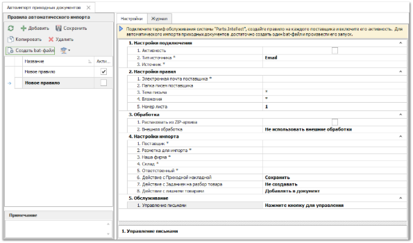
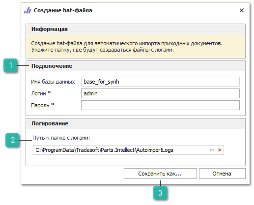
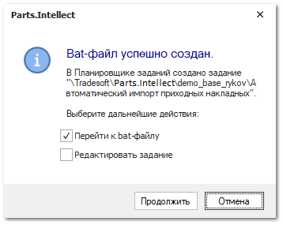

Для создания правила автоматического импорта приходных документов выполните следующие действия:

**»** В Главном меню выберите раздел **Склад и закупки ► Автоимпорт приходных документов**. Отобразятся элементы выбранного пункта.

**»** На панели инструментов блока **Правила автоматического импорта приходных документов** нажмите кнопку **Создать bat-файл**. 

**»** Откроется окно **Создание bat-файла**, для автоматического запуска импорта приходных документов в программу..

 **Подключение**

Позволяет указать учетную запись и пользователя, от лица которого будет выполняться импорт.

::: info Примечание

По логину пользователя от имени которого запускается bat-файл, определяется разрешение на создание документов и непосредственно запуск (доступ к модулю). Рекомендуем создавать bat-файл от имени администратора базы данных.

Bat-файл автоматически добавляется в планировщик заданий Windows, по необходимости можно скорректировать параметры автоматического запуска.

:::

 **Путь к папке с логами**

Позволяет задать путь к директории с файлами-журналами процесса импорта. По умолчанию используется путь C:\ProgramData\Tradesoft\Parts.Intellect\AutoimportLogs.

 **Сохранить как**

Позволяет сохранить внесенные данные, а так же запустить процесс создания исполняемого файла.

**»** В открывшемся окне введите пароль пользователя программы и укажите путь к папке с файлами-журналами процесса импорта. 

**»** После заполнения всех полей нажмите кнопку **Сохранить как**. При успешном создании исполняемого файла откроется окно, с уведомлением об успешном создании bat-файла. В Планировщике заданий Windows автоматически создастся задание на выполнение сохраненного bat-файла с частотой раз в час.

В окне **Bat-файл успешно создан** доступны действия при выставлении отметки у пунктов:

- **Перейти к bat-файлу** – открытие каталога файловой системы, содержащего сохраненный файл;

- **Редактировать задание** – открытие формы редактирования задания планировщика для корректировки его параметров. Задание доступно для редактирования в любой момент времени через стандартные средства операционной системы Windows в Планировщике заданий по пути: Библиотека планировщика – Tradesoft – Parts.Intellect – Название базы данных – Автоимпорт приходных документов.

Все шаги процесса импорта фиксируются в **Журнал** и в лог-файл процесса импорта.

::: info Примечание

Доступ к модулю **Автоимпорт приходных документов** регулируется разрешением **Модуль доступен** в разделе **Управление** **►** **Настройки программы ►** **Роли пользователей**, вкладка **Разрешения для роли пользователей** **►** **Автоимпорт данных ►** **Автоимпорт приходных документов**. По умолчанию модуль доступен для всех пользователей системы.

:::