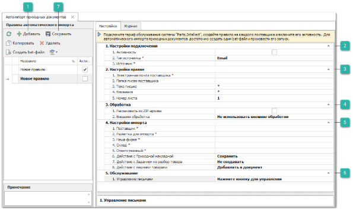
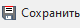
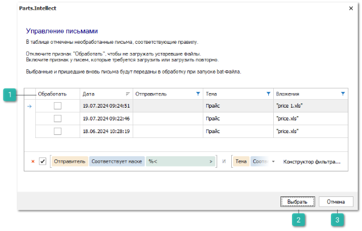
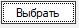
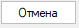

Для создания правила загрузки приходных документов выполните следующий действия:

**»** В Главном меню выберите раздел **Склад и закупки ► Автоимпорт приходных документов**.** Отобразятся элементы выбранного пункта.

 **Добавить**

Позволяет добавить новое правило автоимпорта приходных документов

 **Настройки подключения** 

Позволяет задать параметры:

- **Активность** – позволяет установить активность каждого правила;

::: info Примечание

Автоматическая загрузка приходных документов происходит только по активным правилам.

:::

- **Тип источника \*** – выбор типа источника, по умолчанию доступен только **Email**;

- **Источник \*** – выбор учетной записи электронной почты, с которой будет происходить сбор приходных документов. Пример добавления учетной записи описан в разделе **Настройки электронной почты**.

 **Настройки правил** 

Позволяет задать параметры:

- **Электронная почта поставщика \*** – адрес электронной почты поставщика, с которого поступают письма с приходными документами;

::: note Замечание

Для того, чтобы система осуществляла поиск писем только по определенной части адреса электронной почты (например, только по домену), необходимо заменить необязательные символы в адресе на символ **\*** ("звёздочка").

:::

- **Папка писем поставщика** – в поле указывается папка почтового сервиса, в которой будет производиться поиск писем с приходными документами от поставщика для их дальнейшей загрузки в систему. При пустом значении поля поиск писем будет выполняться в папке "Входящие". Если письма от поставщика находятся в какой-либо подпапке, необходимо указать полный путь на сервере электронной почты, начиная с корневой папки (без указания папки "Входящие"), учитывая разделители для разных почтовых серверов (вместо наименований Корневая папка, Подкаталог, Папка используйте свои названия):

    - **Yandex**:  Корневая папка|Подкаталог|Папка писем поставщика;

    - **GMail, Mail, Outlook**:  Корневая папка/Подкаталог/Папка писем поставщика;

    - **Tradesoft**:  Корневая папка.Подкаталог.Папка писем поставщика.

::: warning Внимание!

Для почт Outlook и Tradesoft, если корневой папкой являются "Входящие", перед указанием пути к серверу требуется написать "INBOX" при этом папку "Входящие" указывать не нужно: INBOX/Подкаталог/Папка писем поставщика.

:::

- **Тема письма** – тема письма от поставщика. В данном поле присутствует возможность использовать символы \* и ?, позволяющие заменить любое количество символов и один символ в теме письма, соответственно;

::: note Замечание

Значение "\*приход" позволяет найти все письма, тема которых оканчивается словом "приход";

Значение "\*накладная\*" позволяет найти все письма, тема которых внутри содержит слово "накладная";

Значение "Накладная\*" позволяет найти все письма, тема которых начинается со слова "Накладная";

Значение "Накладная?" позволяет найти все письма, тема которых начинается со слова "Накладная" и содержит после этого слова только один символ, например, "Накладная1".

:::

- **Вложения** – наименование вложения в письме поставщика, в котором содержится приходный документ. Поле аналогично предыдущему поддерживает возможность использовать символы \* и ?;

::: warning Внимание!

Для корректной идентификации письма должны располагаться в корневой папке "Входящие" почтового ящика, поиск по подпапкам не производится.

:::

- **Номер листа** – номер листа (таблицы), данные с которого необходимо импортировать в систему. Порядковые номера таблиц (листов) определяются в соответствии с их названиями, с сортировкой по алфавиту.

 **Обработка**

Позволяет задать параметры:

- Необходимо включить опцию **Распаковать из ZIP-архива**, если вложение является zip­архивом. Укажите название файла в архиве в поле **Файлы в архиве**, который необходимо загрузить в программу. Поле аналогично полю **Вложение** и поддерживает возможность использовать символы \* и ?;

::: warning Внимание!

Если по заданной маске будет найдено несколько вложений или файлов в архиве, все найденные файлы будут переданы в обработку.

:::

- **Внешняя обработка** – позволяет выбрать один из файлов внешней обработки, которые представляют собой скрипты, написанные на языке VBScript. Доступны следующие обработки исходных файлов:

    - **ConvertToCsv.vbs** – конвертация в формат .csv. Может понадобиться для корректной загрузки данных, так как формат Excel может автоматически преобразовывать некоторые значения в некорректные. Например, в ячейках могут теряться первичные нули чисел;

    - **ConvertToXlsx.vbs** – конвертация в формат .xlsx. Может понадобиться для корректной загрузки данных в случаях, когда исходный файл с расширением .xls\* не может быть распознан системой;

    - **UnArch.vbs** – распаковка архива. Может использоваться в случаях, когда прайс-листы присылают в архиве. Распаковка универсальная, может разархивировать любой формат;

    - **UnArch\_and\_ConvertToCsv.vbs** и **UnArch\_and\_ConvertToXlsx.vbs** – распаковка и конвертирование. Может использоваться в случаях, когда прайс-листы необходимо извлечь из архива, а также выполнить конвертацию в один из доступных форматов.

::: info Примечание

Для использования обработчиков с распаковкой и конвертацией файлов обязательно требуется установленное на компьютере ПО 7-zip и Microsoft Excel 2007 и выше.

:::

 **Настройки импорта** 

Позволяет задать параметры:

- **Поставщик\*** – выберите из справочника **Поставщика**, который будет установлен в соответствующее поле в созданном документе;

- **Разметка для импорта\*** – выберите разметку из сохраненных в **Мастере создания Приходных накладных**. Для выбора доступны не удаленные разметки, созданные пользователем или прочие, созданные как **Общая**;

- **Наша фирма\*** – выберите из справочника **Нашу фирму**, которая будет установлена в соответствующее поле в созданном документе;

- **Склад\*** – выберите из справочника склад, который будет установлен в соответствующее поле в созданном документе;

- **Ответственный\*** – выберите сотрудника из списка пользователей, созданных в разделе **Управление ► Настройки программы ► Пользователи**. Выбранный сотрудник будет являться автором документа **Приходная накладная** и/или **Задания на разбор товара**. Ответственному сотруднику на указанный в карточке пользователя email будет отправляться письмо, содержащее информацию о лишних позициях по цене и/или количеству, нераспознанных позициях, а также отчет о результатах импорта каждого файла (с указанием наименования файла лога).

::: warning Внимание!

Уведомление по лишнему количеству отправляется вне зависимости от значения настройки **Действие с лишними товарами**. 

:::

::: info Примечание

Отбор **Заказов поставщику** по доступным складам, нашим фирмам и поставщикам будет определяться в соответствии с разрешенными доступами ответственного пользователя.

:::

- **Действие с приходной накладной** – выбор действие по созданию документа **Приходная накладная**:

    - **Не создавать** – документ **Приходная накладная** не будет создан;

    - **Сохранить** – документ **Приходная накладная** будет создан и сохранен в программе без проведения.

- **Прайс-лист наличия** – позволяет выбрать прайс-лист, который будет подставлен в документ **Приходная накладная** в свойство **Прайс-лист из наличия**. Настройка доступна для пользователей с **Гибкой схемой ценообразования**, активна при выбранном значении **Сохранить** в настройке **Действие** **с приходной накладной**;

- **Действие с Заданием на разбор товара** – выбор действие по созданию **Задания на разбор товара**:

    - **Не создавать** – документ **Задание на разбор товара** не будет создан;

    - **Черновик** – документ **Задание на разбор товара** будет создан с состоянием документа: **Черновик**. В данном состоянии доступна возможность полного редактирования документа;

    - **В очереди** – документ **Задание на разбор товара** будет создан с состоянием документа: **В очереди**. Данное состояние служит для передачи задания на склад, формируя тем самым очередь на разбор для склада/ТТ. В этом состоянии отсутствует возможность изменять документ**;**

    - **В работе** – документ **Задание на разбор товара** будет создано с состоянием документа: **В работе**. Данное состояние отражает то, что товар из задания разбирается на складе. Ключевой особенностью задания в этом состоянии является возможность работы с документом одновременно нескольким пользователям;

::: warning Внимание!

Для успешного сохранения правила должно быть выбрано действие для создания или **Приходной накладной** и/или **Задания на разбор товара**, то есть должен быть выбран как минимум один тип документа на создание.

:::

- **Действие с лишними товарами** – выберите действия по товарам, не найденным среди **Заказов поставщику**. Доступны значения: **добавлять в документ** и **не добавлять в документ**.

 **Обслуживание** 

Раздел настроек содержит кнопку **Управление** которая позволяет осуществить просмотр необработанных писем, соответствующих заданному правилу (адресу поставщика, теме и вложению). Откроется окно, на форме доступна ручная обработка писем: не обрабатывать или обработать повторно.

 **Сохранить**

Позволяет сохранить внесенные в правило изменения.

**»** На панели инструментов блока **Правила автоматического импорта** нажмите кнопку **Добавить** и введите название правила.

::: info Примечание

Если ранее правила не создавались, то при открытии раздела сразу будет создано правило для настройки с именем **Новое правило**.

:::

**»** На вкладке **Настройки** заполните параметры правила (обязательные для заполнения поля выделены жирным шрифтом и отмечены знаком \*).

**»** После заполнения параметров на вкладке **Настройки** в блоке **Обслуживание** нажмите кнопку **Управление**, для просмотра писем, соответствующих правилу и укажите те, которые требуется загрузить повторно. При запуске bat-файла выбранные и новые письма будут переданы в обработку.

 **Обработать**

Позволяет установить отметку о необходимости загрузки вложений в программу из выбранных писем. 

::: info Примечание

По умолчанию отметка установлена у необработанных писем, вложения которых ранее не загружали. В случае включения признака у ранее обработанных писем, произойдет повторная загрузка их вложений в программу.

:::

 **Выбрать** 

Позволяет переместить все отмеченные письма в очередь на обработку.

 **Отмена**

Позволяет отменить внесенные изменения и закрыть окно управления письмами.

Для дальнейшей обработки необработанных писем, соответствующих правилам, выполните следующие действия:

**»** Включите признак **Обработать** для писем, вложения которых требуется загрузить в программу.

**»** Нажмите кнопку **Выбрать**. Все отмеченные письма будут посещены в очередь на обработку и обработаны при следующем запуске bat-файла автоматического импорта.

**»** Для отмены внесенных изменений нажмите кнопку **Отменить**.

По завершении вышеперечисленных операций необходимо сохранить правило автоимпорта.

**»** Нажмите на кнопку **Сохранить** для сохранения внесенных изменений.