Импорт в **Мастер создания Приходной накладной** позволяет автоматически связать позиции из файла с ожидаемыми от поставщика позициями в программе (позиции в состоянии "заказ поставщику"). Если при импорте в мастер не найдется связанных позиций в заказах поставщикам, то такие товары будут пропущены. В **Мастере создания Приходной накладной** с помощью фильтров необходимо вначале отобрать позиции, среди которых требуется осуществлять подбор (например, фильтр по поставщику), затем подгрузить файл. Программа каждую позицию из файла сопоставляет с ожидаемыми позициями и подбирает найденные позиции в список выбранных. После создания и проводки такой **Приходной накладной** ее позиции связываются с ранее оформленными **Заказом поставщика** и **Заказом клиента**.

Для импорта позиций, ранее заказанных у поставщика, через мастера выполните следующие действия:

**»** Предварительно подготовьте файл для импорта, содержащий список импортируемых позиций.

**»** В **Главном меню** выберите раздел **Склад и закупки ► Мастер создания ► Приходная накладная**. Отобразятся элементы выбранного пункта. 

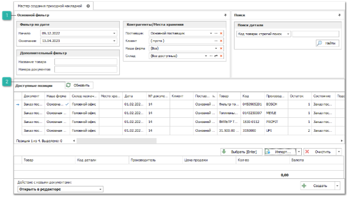

 **Основной фильтр**

Позволяет отобрать позиции среди которых будет производиться отбор импортируемых позиций.

Блок содержит следующие фильтры:

- **Фильтр по дате** – позволяет отобрать позиции за указанный в полях **Начало** и **Окончание** период;

- **Дополнительный фильтр**:

    - **Название товара** – позволяет указать необходимые наименование товара;

    - **Номера документов** – позволяет указать номера документов **Заказ поставщику**, указывается через точку с запятой;

- **Контрагенты/Места хранения**:

    - **Поставщик** – позволяет указать поставщика, от которого будет импортироваться накладная;

    - **Клиент** – позволяет указать контрагента заказ которого связан с **Заказом поставщику**;

    - **Наша фирма** – позволяет указать Нашу фирму, от которой оформлялся **Заказ поставщику**;

    - **Склад** – позволяет указать склад назначения на который, по **Заказу поставщику**, необходимо было переместить товар после оприходования.

 **Обновить**

Позволяет обновить список позиций в блоке Доступные позиции.

**»** В блоке фильтров укажите необходимые параметры фильтрации и нажмите кнопку **Обновить**. Программа отберет только те позиции, которые соответствуют заданным фильтрам.

**»** Нажмите кнопку **Импорт** и выберите пункт **Из файла**. Появятся элементы для выбора файла с компьютера, который содержит импортируемые данные.

**»** После выбора файла откроется окно разметки файла для импорта.

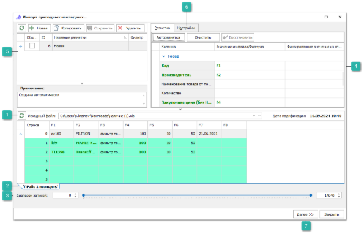

 **Исходный файл**

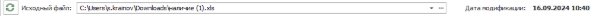

Отображает полный путь до импортируемого файла, при необходимости его можно заменить.

 **Таблица/лист из файла**

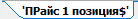

Позволяет выбрать в импортируемом файле необходимую для импорта таблицу или лист, в случае если их несколько.

 **Диапазон записей**

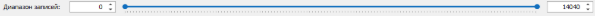

Позволяет указать количество верхних/нижних строк, данные из которых не будут импортированы. Данный параметр используется для того, чтобы предотвратить загрузку заголовка и названия колонок импортируемой таблицы.

 **Разметка колонок**

Позволяет установить соответствия колонок в файле с типом данных в программе в колонке **Значение из файла/формула**. Некоторые значения (валюта, страна и т.п.) можно установить из соответствующего справочника в программе в колонке **Фиксированное значение из справочника**.

::: info Примечание

Поле **Код\*** обязательное для разметки при импорте.

:::

::: info Примечание

При разметке файлов при импорте можно использовать предустановленные в программе специальные формулы для упрощения процесса импорта. 

:::

 **Список ранее сохраненных разметок**

Блок содержит ранее созданные и сохраненные разметки документов.

 **Настройки**

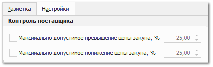

Содержит настройки:

- **Максимально допустимое превышение цены закупа -** позволяет осуществить контроль фактической закупочной цены из файла относительно плановой закупочной ценой из **Заказа поставщику**. Если опция включена, то программа при отборе позиций будет сверять **Закупочную цену (с НДС)** из файла и **Закупочную цену со скидкой и доставкой** из связанного **Заказа поставщику**. Если цена закупа из файла возросла более чем на указанное количество процентов, то позиция не добавляется в список выбранных, а выводится в лог-файл с указанием причины. 

- **Максимально допустимое понижение цены закупа** - позволяет осуществить контроль фактической закупочной цены из файла относительно плановой закупочной ценой из **Заказа поставщику**. , то программа при отборе позиций будет сверять **Закупочную цену (с НДС)** из файла и **Закупочную цену со скидкой и доставкой** из связанного **Заказа поставщику**. Если цена закупа из файла понизилась более чем на указанное количество процентов, то позиция не добавляется в список выбранных, а выводится в лог-файл с указанием причины.

 **Далее**

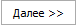

Позволяет перейти к вкладке с информацией о текущей конфигурацией.

**»** Поле **Исходный файл** содержит полный путь до импортируемого файла, при необходимости замените его. В нижней части окна выберите таблицу/лист из файла, который хранит импортируемые данные. В полях **Диапазон записей** укажите количество верхних/нижних строк, данные из которых не будут импортированы.

**»** В верхней правой части окна на вкладке **Разметка** установите соответствия колонок в файле с типом данных в программе в колонке **Значение из файла/формула**. В случае если импорт из аналогичного файла уже осуществлялся и разметка была сохранена, рекомендуется выбрать данную разметку не создавая новую, в верхней левой части из **Списка ранее сохраненных разметок**.

**»** На вкладке **Настройки** в окне разметки, при необходимости, осуществите контроль фактических закупочных цен из фала с плановыми закупочными ценами из заказов поставщику.

**»** Для более быстрой и удобной обработки файлов импорта доступно использование ряда инструментов – **Фильтрация данных и формулы**.

::: info Примечание

Для дальнейшего использования созданной разметки к аналогичным файлам ее необходимо сохранить.

:::

**»** После установки всех параметров разметки загрузки укажите наименование разметки в колонке **Название разметки** в блоке **Список ранее сохраненных разметок**.

**»** Чтобы разметка была общедоступной в программе установите отметку в колонке **Общая** и нажмите кнопку **Сохранить**. Созданная конфигурация импорта будет сохранена и доступна для подстановки в поле **Разметка для импорта**. В случае если новая разметка не была сохранена, при переходе к следующему шагу отобразится диалоговое окно с информирующее о не сохраненной разметки.

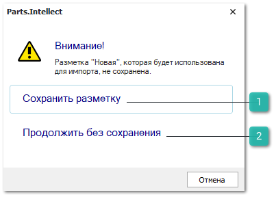

 **Сохранить разметку**

Позволяет сохранить разметку колонок, для дальнейшего использования.

 **Продолжить без сохранения**

Позволяет продолжить работу мастера без сохранения разметки.

**»** Для продолжения загрузки нажмите кнопку **Далее**. Откроется окно с параметрами загрузки. 

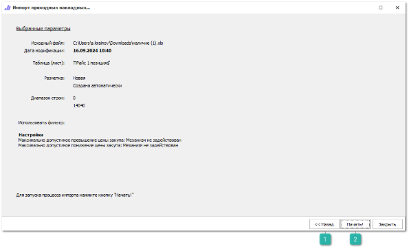

 **Назад**

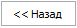

Позволяет перейти к предыдущему шагу импорта для изменения параметров.

 **Начать**

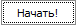

Позволяет запустить процесс импорта документа.

**»** Для изменения параметров нажмите кнопку **Назад**. Для начала процесса импорта нажмите **Начать**!

В процессе импорта программа подберет соответствующие записи в мастере на основе данных из фала и добавит их в **Список выбранных позиций мастера**, а пропущенные позиции выведет в отельный лог-файл.

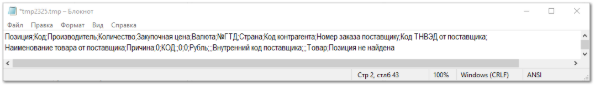

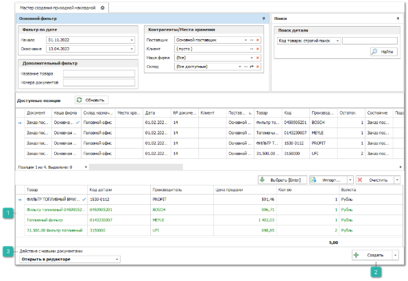

 **Список выбранных позиций мастера**

Содержит список позиций добавленных в мастер из импортируемого файла.

 **Создать**

Позволяет создать следующие документы на основании позиций которые были импортированы из документа.

 **Действие с новыми документами**

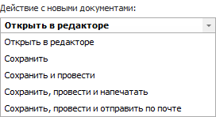

Позволяет задать действие с документами которые будут созданы. По умолчанию выбрано значение **Открыть в редакторе**.

**»** Для создания приходной накладной для выбранных позиций нажмите кнопку **Создать** и выберите пункт **Приходные накладные.**

В данном примере мы импортировали позиции от одного поставщика, но мастер так же позволяет импортировать данные сразу от нескольких поставщиков, в этом случае программа сама отсортирует позиции и создаст **Приходную накладную** отдельно на каждого поставщика.

**»** Откроется редактор приходной накладной на выбранные позиции от поставщика.