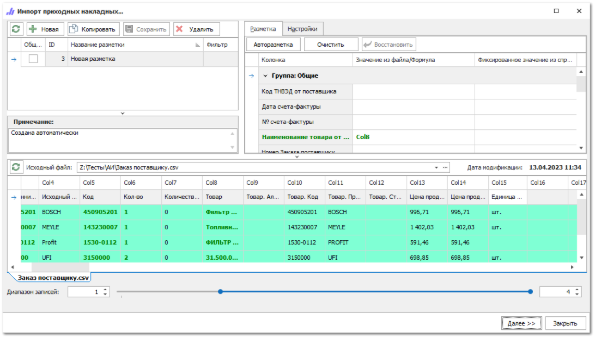
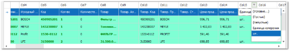
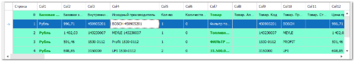
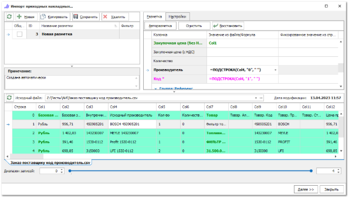
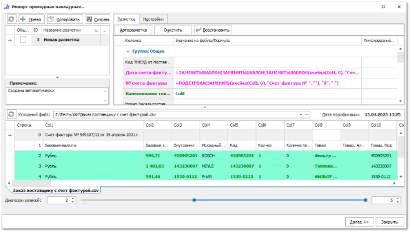

## Пример 1

Для позиций в приходных документах заполнен столбец **Единица измерения** значением "шт.".

С помощью фильтра по значению доступно отображение строк таблицы с товарами. В форме разметки приходного документа доступна установка фильтрации по столбцу, которая позволяет исключить из исходного файла пустые поля или поля с некорректными значениями.

Для того, чтобы настроить фильтр по параметру **Единица измерения**:

**»** В нижней части формы разметки выберите столбец, в котором вписаны единицы измерения.

**»** Нажмите на значок фильтра  рядом с номером строки (появляется при наведении на строку).

**»** Выберите из выпадающего списка значение, по которому будут отобраны строки.

## Пример 2

В приходном документе отсутствуют выделенные колонки с **Кодом** товара и **Производителем**, т.е. оба параметра занесены в одну колонку. Формула **=ПОДСТРОКА (Имя\_поля, «0\_или\_1», «разделитель[ли]»)** позволяет выделить **Код**/**Производитель** товара из колонки с наименованием.

Для вынесения значения из колонок доступно использование предустановленных в программе формул, которые позволяют преобразовать значения в ячейках. В данном случае можно добавить формулу в разметке поля **Код** в колонке **Значение из файла/Формула**.

Параметры формулы:

`=ПОДСТРОКА(Имя\_поля, «0\_или\_1», «разделитель[ли]»)`:

- **Имя\_поля** – позволяет указать наименование колонки, из которой выделяется подстрока;

- **0\_или\_1** – позволяет указать, где расположена подстрока: в начале (0) или конце (1) искомой строки;

- **разделитель[ли]** – позволяет указать один или два символа-разделителя:

    - **"** **"** – искомая подстрока выделена символом "пробел";

    - **"\"** – искомая подстрока выделена символом "\";

    - **"()"** – искомая подстрока находится внутри круглых скобок;

    - **"{}"** – искомая подстрока находится внутри фигурных скобок.

**»** Подставьте формулу в поле **Код** =ПОДСТРОКА(Col4, "1", " ") для выделения подстроки из 4 колонки, с начала искомой строки до символа "пробел". В поле **Производитель** подставьте соответствующую формулу =ПОДСТРОКА(Col4, "0", " ");

## Пример 3

В приходном документе указан текст вида: Счет-фактура № 549107/12 от 29 апреля 2021 г. (располагается в столбце Col1). Формулы =**ЗАМЕНИТЬШАБЛОН** и **=ПОДСТРОКА** разметки позволяют получить номер и дату документа.

Доступно выведение значений **Даты счета-фактуры** и **№ счета-фактуры** из импортируемого файла. Для вынесения значений необходимо подставить формулы в поля **Дата счета-фактуры** и **№ счета-фактуры**;

**»** В поле **Дата счета-фактуры** укажите формулу:

`=**ЗАМЕНИТЬШАБЛОН**(**ЗАМЕНИТЬШАБЛОН**(**ЗАМЕНИТЬШАБЛОН**(ячейка(Col1, 0), "Счет-фактура № ", ""), **ПОДСТРОКА**(**ЗАМЕНИТЬШАБЛОН**(ячейка(Col1, 0), "Счет-фактура № ", ""), "0", " "), ""), " от ", "")`

**»** В поле **№ счета-фактуры** укажите формулу:

`=**ПОДСТРОКА**(**ЗАМЕНИТЬ**(ячейка(Col1, 0), "Счет-фактура № ", ""), "0", " ")`

