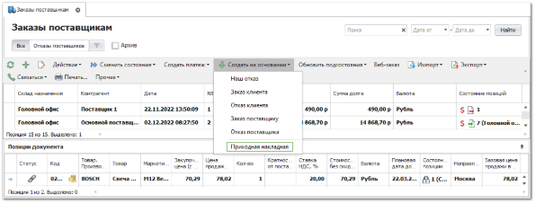
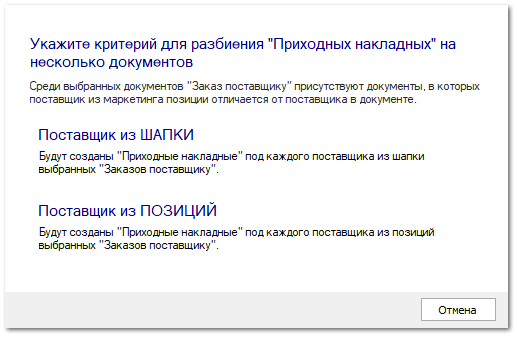
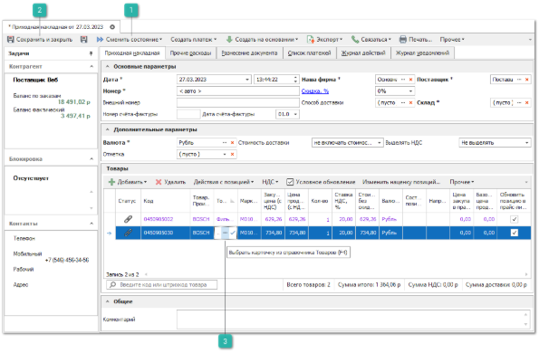
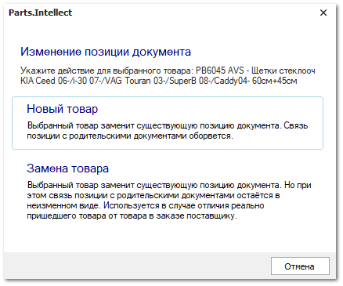

Для создания прихода товара на основании существующего заказа поставщику выполните следующие действия:

**»** В **Главном меню** выберите пункт **Склад и закупки** ► **Заказы поставщикам**. Отобразятся элементы выбранного пункта.

**»** Выберите один или несколько заказов, по которым необходимо создать поступление. На панели управления нажмите на выпадающее меню команды **Создать на основании** и выберите пункт **Приходная накладная**.

При создании **Приходной накладной** на основании **Заказа поставщику**, программа сверяет поставщиков из шапки документа и поставщиков из маркетингов в позициях документа. Если обнаружено расхождение, то программа предлагает пользователю осуществить самостоятельный выбор источника информации о поставщике.

Программа создаст одну или несколько приходных накладных, объединив их отдельно по каждому поставщику. Информация по складу, поставщику и позициям будет полностью скопирована из заказов-источников. При необходимости Вы можете изменить и скорректировать необходимую информацию.

 **Сменить состояние**

Позволяет осуществить проводку документа или отменить ее, в случае необходимости.  А так же добавить документ в архив или извлечь его из архива.

 **Сохранить и закрыть/Сохранить**

Позволяет сохранить и закрыть/сохранить документ без проводки.

 **Выбор карточки из справочника Товары**

Позволяет добавить или осуществить замену позиции в документе **Приходная накладная**.

**»** Для вступления документа **Приходная накладная** в силу его необходимо провести. Для этого нажмите кнопку **Сменить состояние** и выберите пункт **Провести** (Ctrl+E).

**»** Для того чтобы сохранить и закрыть документ (можно и без проведения) воспользуйтесь кнопкой **Сохранить и закрыть** (F2).

В случае возникновения ситуации, когда поставщик прислал товар, отличающийся от товара в **Заказе поставщику**, существует возможность оформить **замену товара**. Замена товара осуществляется только в документе **Приходная накладная**. Для этого необходимо:

**»** Добавить позицию в **Приходную накладную** (через **Мастер создания Приходной накладной** или создав на основании родительского документа),

**»** В списке позиций документа в колонке **Товар** нажать на кнопку  и выбрать товар из справочника (добавить новый, если пришедший товар отсутствует),

**»** Отобразится диалоговое окно для выбора действия с новой позицией:

- **Новый товар** – с помощью данной команды товар в документе помечается как "Новый", при этом связи с позициями родительского документа рвутся.

- **Замена товара** – товар заменяется на выбранный, но при этом сохраняется связь с родительскими документами.

**»** Далее в появившемся окне **Проценки** появляется возможность вычислить закупочную цену на товар. Если этого не требуется, следует закрыть **Проценку**.

Работа с приходной накладной описана в разделе **Первичное оприходование остатков на склад**.

При необходимости распределения пришедших товаров по местам хранения или на места выдачи клиентам воспользуйтесь одним из инструментов **Перемещения**.