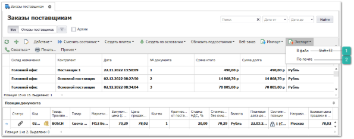
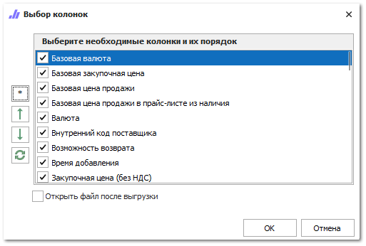

Предварительно перед отправкой заказа поставщику на электронную почту установите формат вложения к письму с заказом в разделе меню **Управление ► Настройки программы ► Настройки ► Уведомления ► Электронная почта. Шаблоны  ► Проводка Заказа поставщику**.

::: note Замечание

По умолчанию заданное значение формата вложения – **.pdf**

:::

Для отправка сформированного заказа поставщику по электронной почту выполните следующие действия:

**»** В **Главном меню** выберите пункт **Склад и закупки** ► **Заказы поставщикам**. Отобразятся элементы выбранного пункта.

 **В файл**

Позволяет выгрузить **Заказ поставщику** в файл.

 **По почте**

Позволяет отправить **Заказ поставщику** по почте.

**»** Выберите один или несколько заказов, которые хотите отправить. На панели управления нажмите на выпадающее меню команды **Экспорт** и выберите пункт **По почте**.

**»** В открывшемся окне укажите столбцы, которые будут включены в файл заказа поставщику, который будет отправлен по почте.

**»** Нажмите кнопку **Ок**. Информация будет передана установленному на компьютере по умолчанию почтовому клиенту для отправки нового письма.

**»** Если на компьютере не установлен почтовый клиент, то можно предварительно выгрузить файлы с заказами в файлы через команду **Экспорт**, пункт **В файл** и отправить их потом по почте привычным для Вас способом.

Данный вид экспорта позволяет выгрузить в файл позиции из **Заказа поставщику**. При этом позиции разбиваются по клиентам и Нашим фирмам, которые заказали данный товар.