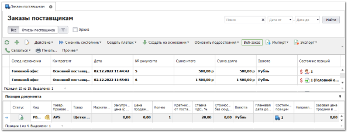
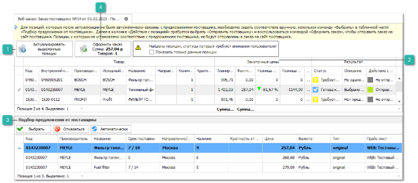
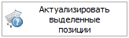
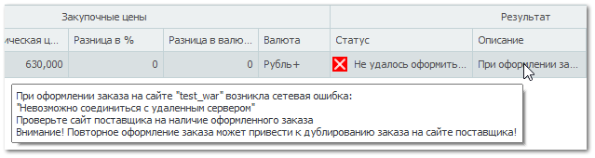
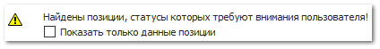
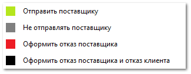
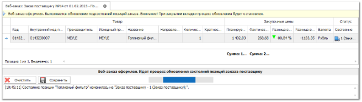

Сервис **Веб-заказ** используется для формирования заказа веб-поставщику, а также обновления данных по заказанным позициям при помощи синхронизации (в зависимости от поставщиков, часть функций может не поддерживаться). Подробную информацию по возможностям и работе сервиса можно получить у наших менеджеров.

Для отправки заказа поставщику через сервис веб-заказ выполните следующие действия:

**»** В **Главном меню** выберите пункт **Склад и закупки** ► **Заказы поставщикам**. Отобразятся элементы выбранного пункта.

**»** Выберите один или несколько заказов для поставщика, поддерживающего онлайн-заказ. На панели управления нажмите на кнопку **Веб-заказ**. После чего откроется вкладка мастера оформления веб-заказа.

::: info Примечание

Для отправки заказа поставщику через сервис веб-заказ необходимо соблюдение ряда условий:

- сайт поставщика должен поддерживать возможность передачи позиций из программы в корзину на сайте и оформление заказа по этим позициям;

- Для вас должен быть предоставлен доступ к возможности оформления заказа у требуемого веб-поставщика. Подробнее о сервисе можно узнать в [отделе продаж](http://www.tradesoft.ru/about/contacts/) компании [Tradesoft](http://www.tradesoft.ru/about/contacts/);

- В карточке контрагента (поставщика) на вкладке **Веб-заказ** должен быть выбран актуальный **Веб-прайс-лист поставщика из списка подключенных Веб-прайс-листов** в пункте меню **Товары и цены ► Веб-прайс-листы поставщиков**. При отправке заказа будет использоваться учетная запись и опции выбранного прайс-листа;

- Выбранный **Заказ поставщику** должен быть проведен и иметь позиции в состоянии "заказ поставщику";

- Наличие стабильного интернет-соединения.

:::

 **Актуализировать выделенные позиции**

Позволяет запустить процесс актуализации позиций.

 **Закупочные цены**

Позволяет проконтролировать расхождение плановых и фактических закупочных цен.

- **Планируемая цена** – цена из заказа поставщику;

- **Фактическая цена** – цена в сервисе поставщика в текущий момент;

- **Разница в %** – расхождение цен в процентах;

- **Разница в валюте** – расхождение цен в выбранной валюте.

 **Подбор предложения от поставщика**

Позволяет выбрать вручную или изменить уже выбранное предложение от поставщика для позиций заказа.

 **Оформить заказ**

Позволяет оформить заказ. На кнопке отображается сумма заказа и количество позиций.

**»** На первом шаге, при открытии мастера, происходит автоматическая актуализация позиций.

Также позиции можно актуализировать вручную, для этого необходимо выделить позиции и нажать кнопку **Актуализировать выделенные позиции**.

По каждой позиции заказа осуществляется проценка на сайте поставщика для подбора соответствия "*позиции заказа*" *–* "*актуальное предложение поставщика*".

Т.е. по каждой позиции **Заказа поставщику** программа пытается связаться с позицией из актуального предложения поставщика.

Если автоматически не удалось найти подходящую позицию, ее должен выбрать сам пользователь. Позиции из заказа, у которых не установлено соответствие с предложением поставщика, нельзя поместить в заказ на сайте. Проценка осуществляется без учета синонимов производителей.

После актуализации позициям присваивается статус. Список возможных статусов позиций:

-  – Готова к оформлению;

-  – Возможно недостаточно товара (недостаточное количество по позиции либо количество задано в нечисловом виде);

-  – Требуется выбрать предложение поставщика (не найдено прямых предложение либо вообще не найдено предложений);

-  – Требуется актуализация (нет предложение от поставщика);

-  – Отправлена на сайт поставщика;

-  – Не удалось оформить заказ (Текст ошибки оформления заказа).

::: warning Внимание!

В случае возникновения сетевой ошибки (такой как отключение интернета, кроме ошибок 401 и 403) выводится диалоговое окно с текстом ошибки: "*При оформлении заказа на сайте "%Название поставщика%" возникла сетевая ошибка: "Базовое соединение закрыто: Соединение было неожиданно закрыто." Проверьте сайт поставщика на наличие оформленного заказа. Внимание! Повторное оформление заказа может привести к дублированию заказа на сайте поставщика!*", аналогичное сообщение выводится в списке позиций по каждому товару. В этом случае необходимо перейти на сайт поставщика и в личном кабинете проверить наличие оформленного заказа, во избежание его дублирования.

:::

::: warning Внимание!

Автоматический подбор подходящей позиции осуществляется по хэш-сумме, складывающейся из кода, производителя, направления, цены и срока поставки товара.

При отсутствии позиции у веб-поставщика с сохраненным значением хэш-суммы выполнится поиск позиции по коду, производителю, направлению и цене. Если и по данным параметрам не будет найдена позиция, то будут отобраны все позиции, подходящие по коду, производителю и направлению и отсортированы по цене, сроку и наличию с выбором наилучшей.

:::

Если в заказе имеются позиции в состояниях **Возможно недостаточно товара**, **Требуется выбрать предложение поставщика** и **Требуется актуализация**, то выводится предупреждение о наличии позиций, требующих внимания, на форме предупреждения есть возможность отфильтровать такие позиции, по умолчанию фильтр выключен.

**»** При клике на позицию правой кнопкой мыши будет вызвано контекстное меню, в котором можно принудительно выбрать необходимое действие над позицией: **Отправить поставщику**, **Не отправлять поставщику**, **Оформить отказ поставщика**, **Оформить отказ поставщика и отказ клиента** (если были заказы клиентов) на выбранные позиции.

**»** Для продолжения отправки заказа нажмите кнопку **Оформить заказ**. 

::: info Примечание

Проверка количества товара на соответствие кратности не осуществляется.

:::

**»** На втором шаге позиции передаются на сайт поставщика, где в зависимости от возможностей сайта поставщика они помещаются либо в корзину, либо сразу в заказ. При оформлении позиций в корзину есть возможность сразу перейти из программы на сайт поставщика нажатием на кнопку **Перейти на сайт поставщика**.

**»** После оформления веб-заказа открывается окно процесса обновления состояний позиций по заказу.

При последующем вызове команды **Веб-заказ** для уже оформленных позиций откроется окно процесса обновления состояний позиций заказа поставщику.

