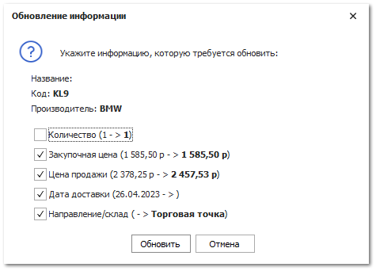

В случае, если по каким-либо причинам поставщик отказался от поставки деталей, их зачастую требуется перезаказать у другого поставщика.

Чтобы корректно оформить перезаказ деталей у другого поставщика, при этом сохранив связь (цепочку транзакций) между документами **Заказ клиента/Наш заказ на склад-Заказ поставщику-Отказ поставщика-Заказ поставщику (новый)**, необходимо:

**»** Сформировать **Отказ поставщика** на заказ, по которому уже не будут поставлены детали.

**»** Далее можно сформировать новый заказ другому поставщику несколькими путями:

- Найдите и выберите **Заказ клиента/Наш заказ на склад** для которого везлись детали и с помощью команды **Создать на основании** выбираем пункт **Заказ поставщику**;

- Перейдите в раздел меню **Склад и закупки ► Мастер создания ► Заказ поставщику**, в котором отображаются позиции в состоянии "отказ поставщика". Найдите интересующие позиции заказа, выберите их и нажмите кнопку **Создать**, для формирования нового заказа поставщику;

- В **Главном меню** выберите пункт **Склад и** **закупки** ► **Заказы поставщикам**. Нажмите кнопку **Новый**, для создания нового документа. Для добавления позиций в документ обязательной используйте команду **Добавить** – **Из мастера**.

При добавлении позиций в новый заказ поставщику описанными выше способами, связь между документами и их позициями будет сохраняться.

**»** В заказе поставщику при необходимости изменить **Поставщика** в параметрах документа. Для перепроценки позиции у другого поставщика необходимо в колонке **Маркетинг** нужной детали нажать на кнопку . После подбора другого предложения в проценке программа просто предложит заменить нужные параметры.

**»** Установите галки напротив тех параметров, которые необходимо заменить и нажмите кнопку **Обновить.**

**»** Для вступления документа **Заказ поставщику** в силу его необходимо провести. Для этого нажмите кнопку **Сменить состояние** и выберите пункт **Провести** (Ctrl+E).

При этом новый **Заказ поставщику** должен связаться с **Заказом клиента**, а позиции поменять состояние с "отказ поставщика" на "заказ поставщику".

**»** Для того чтобы сохранить и закрыть документ (можно и без проведения) воспользуйтесь кнопкой **Сохранить и закрыть** (F2).