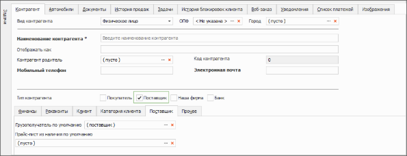

Процесс добавления/редактирования/удаления поставщика аналогичен процессу добавления нового клиента через справочник **Контрагенты**. Только при добавлении нового контрагента необходимо установить галочку типа контрагента – **Поставщик**.

При этом данный контрагент отображается в категории **Поставщики** и имеет формулы расчета балансов для поставщиков.

::: info Примечание

Если для поставщика будет использоваться отправка заказов через сервис веб-заказ. В карточке контрагента-поставщика на вкладке **Веб-заказ** выберите актуального веб-поставщика и укажите свой логин и пароль от учетной записи на сайте веб-поставщика.

:::