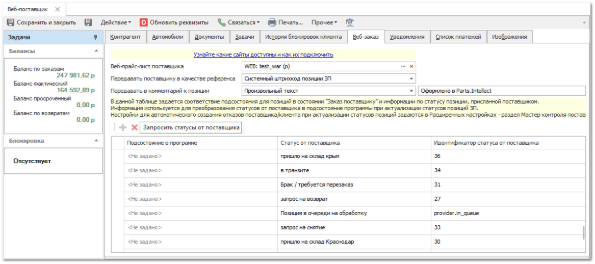
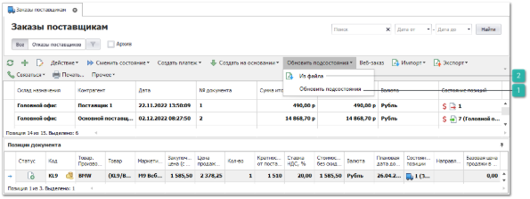
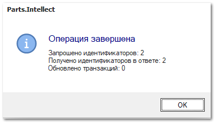
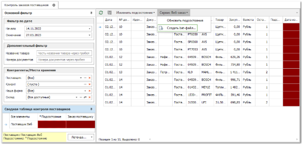
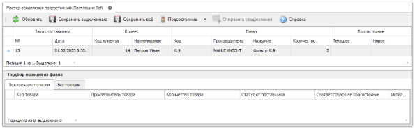

По позициям заказов поставщикам, отправленным через сервис веб-заказ, доступна также синхронизация подсостояний.

::: warning Внимание!

Для поставщиков, поддерживающих функционал веб-заказа не полностью, при оформлении заказа отображаются уведомления о существующих ограничениях. Исходя из этих ограничений, функционал синхронизации может быть не доступен.

:::
Синхронизацию подсостояний можно осуществлять как с помощью сервиса веб-заказ, так и с помощью импорта файлов с информацией о движении заказов у поставщика.

Для использования обновления состояний через веб-сервис в первую очередь необходимо заполнить таблицу соответствия **Подсостояния в программе** и **Статуса от поставщика**, в карточке контрагента-поставщика на вкладке **Веб-заказ**.

**»**  Для этого откройте карточку поставщика в справочнике **Склад и закупки** ► **Поставщики** и перейдите на вкладку **Веб-заказ**. 

**»** Нажмите на команду **Запросить статусы от поставщика** (позволяет через сервис веб-заказ получит статусы, используемые поставщиком для работы) и укажите соответствующие **Подсостояния** для состояния **заказ поставщику** (из справочника **Подсостояния**), соответствующие этим статусам. Сохраните внесенные изменения.

**»** В **Главном меню** выберите пункт **Склад и закупки** ► **Заказы поставщикам**. Отобразятся элементы выбранного пункта.

 **Обновить подсостояния**

Позволяет запросить в сервисе актуальные состояний на сайте поставщика и установит соответствующие подсостояния в программе, согласно настроенным соответствиям в карточке поставщика на вкладке **Веб-заказ**.

 **Из файла**

Позволяет выполнить загрузку состояний поставщика из файла.

**»** Выберите один или несколько заказов для поставщика, поддерживающего онлайн-заказ. На панели управления нажмите на кнопку **Обновить подсостояния** и в раскрывающемся подменю выберите **Из сервиса Веб-заказ**.  После завершения программа отобразит окно с результатами операции.

**»** Процесс актуализации состояния позиции из файла можно автоматизировать, для этого необходимо в Главном меню выбрать **Склад и** **закупки** ► **Контроль заказов поставщикам**. Выбрать команду **Создать bat-файл – Из сервиса Веб-заказ**, на форме указать пароль от администратора БД и выбрать поставщиков, по которым будет актуализироваться информация из веб-сервиса.

**»** Если в команде **Обновить подсостояния** выбрать **Из файла**, то необходимо в мастере импорта разметить присланный поставщиком файл.

Сверка позиций программы и файла может осуществляться и по номеру заказа поставщику, и по коду контрагента (клиента), если эта информация есть в присланном файле.

::: warning Внимание!

Сверка позиций осуществляется по точному совпадению полей **Код**, **Производитель**, **Количество** и, если указаны в разметке и пришли в файле, **№ЗП** и **Коду контрагента** (клиента).

:::
После успешного импорта будет открыт журнал **Смены подсостояний**.

**»** Позициям заказов поставщику, которые по ключевым полям были связаны с позициями файла, присваивается новое подсостояние (если в карточке поставщика было найдено соответствие присланного текста и подсостояния в программе).

**»** Затем анализируются позиции мастера, которым не было присвоено новое подсостояние. По результатам анализа им либо присваивается новое подсостояние с помощью команды **Подсостояние** на панели инструментов, или через команду в раскрывающемся меню ячейки с новым подсостояние. Либо их текущее подсостояние остается в неизменном виде.

**»** Для сохранения новых подсостояний используйте команды **Сохранить выделенные** для выделенных позиций мастера, или **Сохранить все** для всех позиций мастера. Эти команды применяют новое подсостояние и устанавливают его в качестве текущего.

**»** Если есть необходимость уведомить ваших клиентов об изменившихся подсостояниях их заказов у поставщика, то вызывается команда **Отправить** **email**.

Уведомления рассылаются клиентам, чьи позиции в заказе поставщику сменили текущее подсостояние.