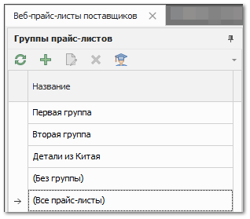
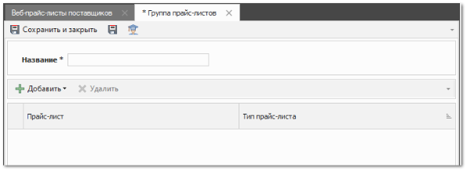
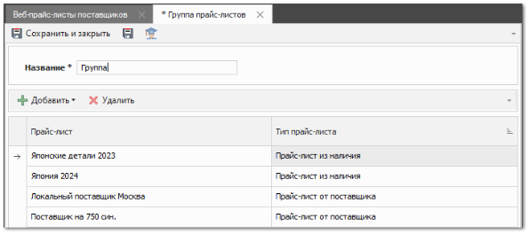

Для создания группы прайс-листов сделайте следующее.

**»** Перейдите в журнал **Прайс-листы поставщиков** или **Веб-прайс-листы поставщиков**.

**»** На панели **Группы прайс-листов** нажмите команду **Новый** . Откроется инспектор группы прайс-листов.

**»** Введите название группы в поле **Название**.

**»** Добавьте прайс-листы с помощью команды **Добавить**:

- **Прайс-лист из наличия** – позволяет открыть окно добавления прайс-листа из наличия (на **Гибкой** СЦО);

::: info Примечание

На **Расширенной** и **Партионной** СЦО прайс-лист автоматически добавляется в группу при нажатии команды **Прайс-лист из наличия**.

:::

- **Прайс-лист от поставщиков** – позволяет открыть окно добавления прайс-листа от поставщика;

- **Веб-прайс-лист от поставщиков** – позволяет открыть окно добавления веб-прайс-листа от поставщика;

::: note Замечание

Добавление прайс-листов в группы также доступно в инспекторе прайс-листа, поле **Группы прайс-листа**.

:::

**»** Нажмите **Сохранить и закрыть** .

