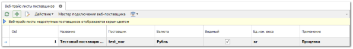
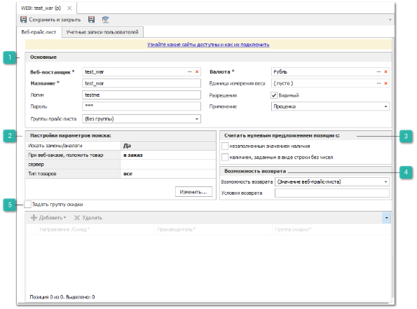
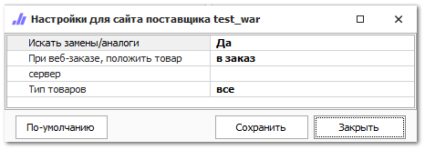
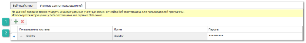

Для получения актуальных цен и информации о наличии деталей на складах поставщиков используется подключение к их сайтам непосредственно из программы. Для этого необходимо подключить сервис веб-проценка для поставщиков и получить данные для доступа к их веб-сервисам, а также подключить веб-прайс-листы в программе.

::: info Примечание

Доступность включения сервиса веб-проценки определяется состоянием подписки, наличием подключенной услуги к вашей учетной записи. Условия подключения можно узнать у наших менеджеров (контактные данные можно найти по адресу [www.tradesoft.ru/about/contacts](https://www.tradesoft.ru/about/contacts/)).

:::

Для получения актуальных цен и информации о наличии деталей на складах поставщиков используется подключение к их сайтам непосредственно из программы. Для этого необходимо подключить сервис веб-проценка для поставщиков и получить данные для доступа к их веб-сервисам, а также подключить веб-прайс-листы в программе.

::: info Примечание

Доступность включения сервиса веб-проценки определяется состоянием подписки, наличием подключенной услуги к вашей учетной записи. Условия подключения можно узнать у наших менеджеров (контактные данные можно найти по адресу [www.tradesoft.ru/about/contacts](https://www.tradesoft.ru/about/contacts/)).

:::

Для подключения веб-прайс-листа от веб-поставщика необходимо:

**»** Перейти в меню **Товары и цены** ► **Веб-прайс-листы поставщиков**. Откроются элементы выбранного пункта, содержащий список веб-прайс-листов поставщиков.

**»** Нажать кнопку **Новый** на панели управления для добавления веб-прайс-листа.** В появившемся окне на вкладке **Веб-прайс-лист** заполнить следующие поля (обязательные для заполнения поля выделены жирным шрифтом и отмечены знаком \*):

**Основные**

Блок содержит:

- **Веб-поставщик \*** – выбирается веб-поставщик из списка, прайс-лист которого будет подключен. Если в списке отсутствуют поставщики, необходимо обратиться в техническую поддержку;

- **Название \*** – указывается название прайс-листа, которое будет отображаться в результатах Проценки в колонках **Описание** и **Прайс-лист**;

- **Логин и Пароль** – указывается имя пользователя и пароль от веб-сервиса (сайта) поставщика. Предварительно необходимо получить их у выбранного для работы поставщика;

- **Валюта \*** – указывается валюта для цен, передаваемых в прайс-листе;

::: info Примечание

Если поставщик возвращает цены, например, в Евро, но устанавливает свой курс, то можно создать в справочнике **Валюты и курсы** новую валюту "Евро Имя поставщика" и для нее указать курс поставщика.

:::
- **Единица измерения веса** – указывается единица измерения веса деталей, передаваемого поставщиком;

- **Видимый** – значение опции определяет, будет прайс-лист участвовать в поиске предложений в Проценке или нет;

- **Применение** – указывается применение веб-прайс-листа. В качестве применения можно указать:

   - **Проценка** – получение от поставщика списка результатов по запрошенной детали, а также предложений по аналогам из его базы;

   - **Получение аналогов** – получение от поставщика списка аналогов его базы для дальнейшего поиска предложений по ним;

   - **Проценка и получение аналогов** – сочетание обоих видов применения.

**Настройки параметров поиска**

Для каждого веб-поставщика доступны индивидуальные параметры поиска. Сервис веб-проценки отправляет запросы поставщикам в соответствии с параметрами по умолчанию. Если их требуется изменить, необходимо открыть диалоговое окно **Настройки для сайта поставщика** с помощью команды **Изменить**.

Список доступных для изменения параметров предоставляется самим веб-поставщиком. Для применения указанных значений параметров поиска необходимо нажать кнопку **Сохранить**.

**Считать нулевым предложением позиции**

Позиции, которые передает поставщик, можно фильтровать по наличию. Чтобы исключить нулевые предложения из результатов поиска необходимо указать, какие предложения являются нулевыми, с:

- **Незаполненным значением наличия** – нулевыми предложениями будут считаться позиции, для которых не заполнена колонка с наличием;

- **Наличием, заданным в виде строки без чисел** – нулевыми предложениями будут считаться позиции, если поставщик передал их наличие текстом без чисел.

**Возможность возврата**

Позволяет установить признак возможности возврата для всех позиций прайс-листа:

- **значение веб-прайс-листа** - позволяет транслировать признак возврата, передаваемый веб-поставщиком;

- **возврат возможен** - будет отображаться признак доступности возврата;

- **возврат невозможен** - будет отображаться признак недоступности возврата;

- **возврат с условием** - будет отображаться признак возврата с условием. **Условие возврата** задается в соответствующем поле. Текст условия будет отображаться при наведении на иконку возврата.

::: info Примечание

Если у прайс-листа не заполнен маркетинг, то признак возможности возврата будет отображаться только в окне проценки.

:::

**Задать группы скидки**

Если цены продажи товара зависят от их производителей и/или направлений/складов поставки, необходимо включить опцию **Задать группу скидки**. В таблице ниже добавить записи вида **Направление/Склад – Производитель – Группа скидки**. Затем на указанные группы скидки создать маркетинги с индивидуальными условиями ценообразования;

::: info Примечание

Если созданы две записи: "*Любое направление – Bosch – Бош*" и "*MSK – Любой – МСК*"*,* и в результатах пришла позиция *Bosch с направлением MSK*, то будет использована группа скидки "*МСК*", т.к. направление приоритетнее производителя.

:::

**»** При необходимости перейдите на вкладку **Учетные записи пользователя**, чтобы указать индивидуальные учетные записи от веб-сервиса (сайта) поставщика для пользователей программы. Индивидуальные учетные данные будут использованы при проценке, а так же оформлении **Веб-заказа**.

**Добавить/Удалить**

Позволяет добавить/удалить новую позицию в список.

**Табличная часть**

Позволяет указать для добавленных позиций данные:

- **Пользователь системы** – выберите имя пользователя программы **Parts.Intellect** из выпадающего списка;

- **Логин и Пароль** – укажите данные учетной записи к сервису Веб-поставщика.

**»** Для сохранения веб-прайс-листа нажмите кнопку **Сохранить и Закрыть**.

