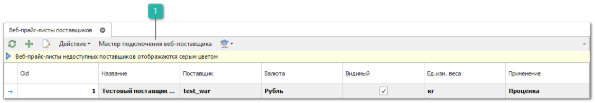
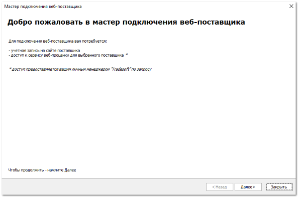
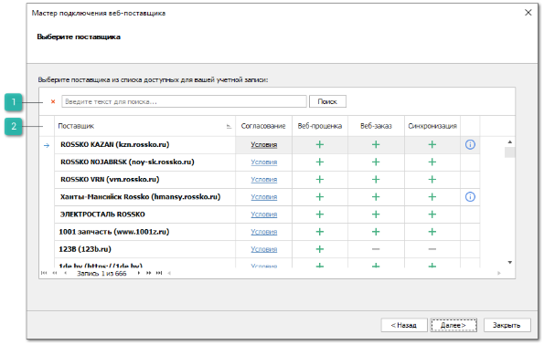
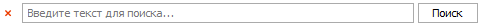
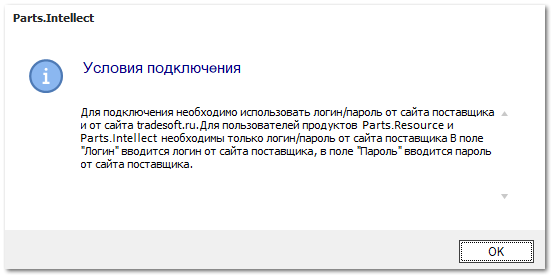
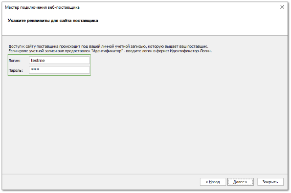
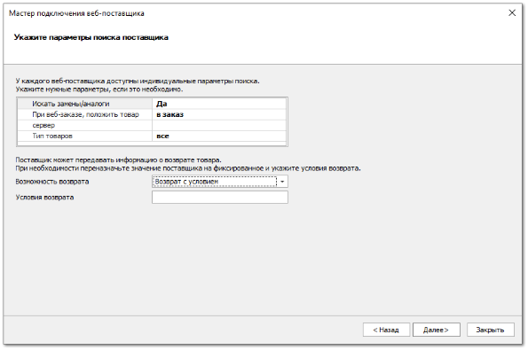
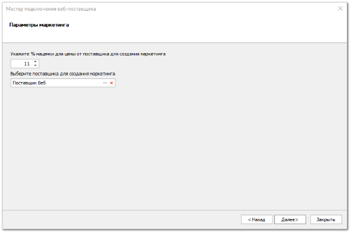
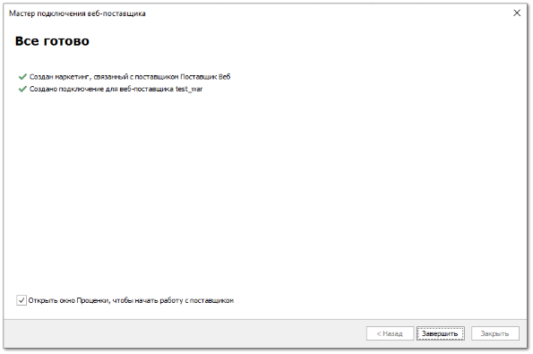

Для получения актуальных цен и информации о наличии деталей на складах поставщиков используется подключение к их сайтам непосредственно из программы. Для этого необходимо подключить сервис веб-проценка для поставщиков и получить данные для доступа к их веб-сервисам, а также подключить веб-прайс-листы в программе.

::: info Примечание

Доступность включения сервиса веб-проценки определяется состоянием подписки, наличием подключенной услуги к вашей учетной записи. Условия подключения можно узнать у наших менеджеров (контактные данные можно найти по адресу [www.tradesoft.ru/about/contacts](www.tradesoft.ru/about/contacts)).

:::

Мастер подключения веб-поставщика позволяет быстро добавить новое подключение, заполнив минимальное количество полей.

Для подключения веб-прайс-листа от веб-поставщика с помощью мастера выполните следующие действия:

**»** Перейдите в меню **Товары и цены** ► **Веб-прайс-листы поставщиков**.

**Мастер подключения веб-поставщика**

Позволяет вызвать инструмент **Мастер подключения веб-поставщика**, который позволяет заполнить минимальное количество параметров и настроить новое подключение.

**»** Нажмите кнопку **Мастер подключения веб-поставщика** на панели управления для добавления веб-прайс-листа. Откроется окно мастера.

**»** Ознакомьтесь с текстом и нажмите кнопку **Далее**. Откроется следующий шаг в котором необходимо выбрать поставщика, прайс-лист которого будет подключен.

**Строка поиска**

Позволяет осуществить поиск необходимого поставщика из представленного списка.

**Табличная часть**

В **Табличной части** отображаются столбцы:

- **Поставщик** – наименование веб-поставщика;

- **Согласование** – информация о необходимых условиях для работы с веб-поставщиком или правила заполнения логина и пароля;

- **Веб-проценка** – информация о доступности услуги **Веб-проценка**;

- **Веб-заказ** – информация о доступности и статусе услуги **Веб-заказ**;

- **Синхронизация** – информация о доступности и статусе услуги **Синхронизация** (подключается совместно с услугой **Веб-заказ**);

::: note Замечание

В колонках **Веб-заказ** и **Синхронизация** используются следующие обозначения:  – услуга не доступна для данного веб-поставщика,  – услуга доступна для подключения,  – услуга подключена.

:::

- **Описание веб-поставщика**   – информация о веб-поставщике.

::: info Примечание

Если в списке отсутствуют поставщики, необходимо обратиться в техническую поддержку.

:::

**»** После выбора поставщика нажмите кнопку **Далее**. При наличии у поставщика условий согласования доступа отобразится окно **Условия подключения**.

**»** После ознакомления с условиями подключения нажмите **Согласен с условиями подключения**, откроется следующий шаг **Укажите реквизиты для сайта поставщика**.

**»** Заполните поля **Логин** и **Пароль** и нажмите кнопку **Далее**. Откроется следующий шаг, в котором необходимо указать параметры поиска поставщика. Набор параметров индивидуален для каждого веб-поставщика. 

::: info Примечание

При переходе к четвертому шагу выполняется попытка подключения к сайту поставщика. В случае ошибки отобразится соответствующее уведомление, переход к следующему шагу будет недоступен.

:::

**»** После задания параметров поиска поставщика нажмите кнопку **Далее**, откроется пятый шаг **Параметры маркетинга**.

**»** Укажите процент наценки для цены от поставщика для создания маркетинга в соответствующем поле, а также выберите поставщика из справочника контрагента для привязки к нему прайс-листа. Нажмите кнопку **Далее**. Отобразится подтверждение успешного добавления веб-поставщика и маркетинга.

**»** Установите опцию **Открыть окно Проценки, чтобы начать работу с поставщиком**, если необходимо открыть окно проценки по завершению подключения веб-поставщика. Нажмите кнопку **Завершить**.

