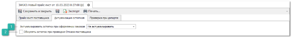

На вкладке **Актуализация остатков** в **Прайс-листе поставщика** доступна возможность актуализировать остатки товаров в прайс-листе до следующего глобального обновления прайс-листа. 

 **Актуализировать остатки при оформлении заказа**

Указывается документ-основание для уменьшения остатков по товару: **Заказ клиента,** либо **Заказ поставщику**. Т.е. если выбран документ для актуализации, то при проводке документа программа уменьшает остатки в связанных с его позициями прайс-листах. Связь осуществляется через маркетинг.

::: warning Внимание!

После отмены проводки документа остатки не возвращаются на исходное количество!

:::

 **Обнулять остаток при проводке Отказа поставщика**

В дополнение присутствует опция **Обнулять остатки при проводке Отказа поставщика**, позволяющая в случае отказа поставщиком в поставке товара обнулять остатки этого товара в прайс-листе.

::: warning Внимание!

Как и в случае с актуализацией остатков при проводке **Заказа клиента**, либо **Заказ поставщику**, отмена проводки **Отказ поставщика** не возвращает остатки в исходное состояние!

:::