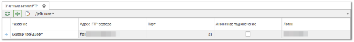
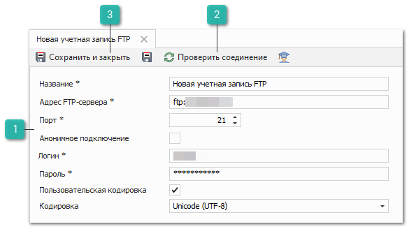
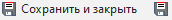

Перед началом работы с разделом программы **Автоимпорт прайс-листов**, необходимо добавить учетную запись FTP-сервера, где располагаются прайс-листы от поставщиков. Для этого:

**»** В Главном меню выберите раздел **Управление ► Справочники** **►** **Учетные записи FTP**.

**»** На панели инструментов открывшегося окна нажмите кнопку **Новый**.

**»** Заполните параметры учетной записи:

 **Параметры учетной записи**

Параметры:

- **Название** – название учетной записи;

- **Адрес FTP-сервера** – адрес FTP-сервера, где располагаются письма, например, ftp://test\_ts.ru;

- **Порт** – порт для подключения к FTP-серверу;

- **Анонимное подключение** – опция, которая отвечает за подключение к FTP-серверу без логина и пароля. Возможность должна поддерживаться FTP-сервером;

- **Логин** и **Пароль** – данные от учетной записи для доступа к FTP-серверу;

- **Пользовательская кодировка** – опция, которая отвечает за назначение пользовательской кодировки загружаемых файлов при подключении к FTP-серверу;

- **Кодировка** – список доступных для выбора кодировок загружаемых файлов.

 **Проверить соединение**

Позволяет проверить с учетом указанных параметров. В случае, если соединение не установлено, проверьте корректность введенных данных и повторите проверку.

 **Сохранить и закрыть/Сохранить** 

Позволяет сохранить и закрыть/Сохранить учетную запись. Выполните это действие, если Проверка соединения прошла успешно.