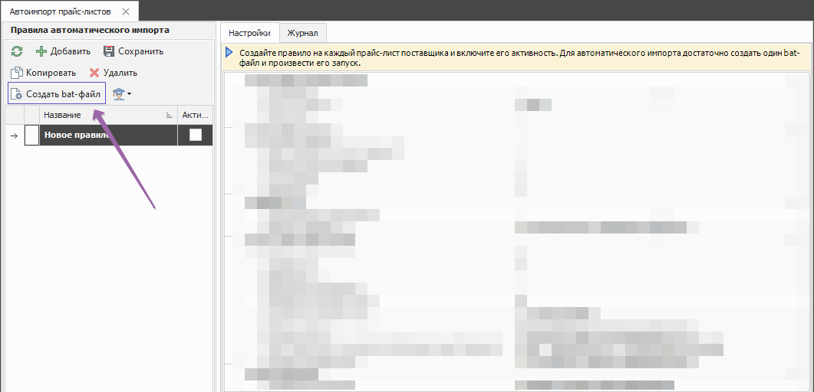
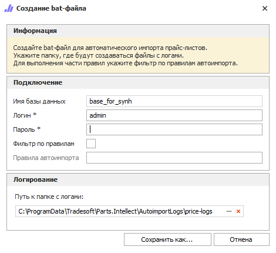
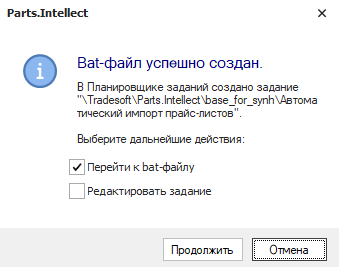

Для создания исполняемого файла автоматического запуска импорта прайс-листов в программу выполните следующие действия:

**»** На панели инструментов блока **Правила автоматического импорта прайс-листов** нажмите кнопку **Создать bat-файл**. 



Откроется окно **Создание bat-файла**.



**»** В открывшемся окне в блоке **Подключение** введите пароль пользователя программы.

Если вы хотите запускать несколько bat-файлов одновременно по разным правилам автоимпорта, то

**»** Включите опцию **Фильтр по правилам**.

**»** В опции **Правила автоимпорта** выберите правила, которые вы настроили в разделе **Автоимпорт прайс-листов**.

::: tip Совет

Создание нескольких bat-файлов позволит ускорить автоимпорт прайс-листов, если они не заблокированы. Прайс-лист считается заблокированным, если несколько bat-файлов обрабатывают один и тот же прайс-лист одновременно. Блокировка снимается автоматически после завершения обработки правила автоимпорта.

:::

::: info примечание

Чтобы создать bat-файл, который будет работать по всем активным правилам автоимпорта – пропустите опции **Фильтр по правилам** и **Правила автоимпорта**.

:::

**»** Укажите путь к папке с файлами-журналами процесса импорта. По умолчанию используется путь:

```
C:\ProgramData\Tradesoft\Parts.Intellect\AutoimportLogs
```

**»** После заполнения всех полей нажмите кнопку **Сохранить как**. При успешном создании исполняемого файла откроется окно, с уведомлением об успешном создании bat-файла. В «Планировщике заданий Windows» автоматически появится задание на выполнение созданного bat-файла с частотой 1 раз в час.



В окне **Bat-файл успешно создан** доступны действия при выставлении отметки у пунктов:

- **Перейти к bat-файлу** – открытие каталога файловой системы, содержащего сохраненный файл;

- **Редактировать задание** – открытие формы редактирования задания планировщика для корректировки его параметров. Задание доступно для редактирования в любой момент времени через стандартные средства операционной системы Windows в **Планировщике заданий** по пути: **Библиотека планировщика** – **Tradesoft** – **Parts.Intellect** – **Название базы данных** – **Автоимпорт прайс-листов**.

**»** Нажмите кнопку **Продолжить**.

Далее рассмотрим процесс автоматического импорта прайс-листов поставщиков.