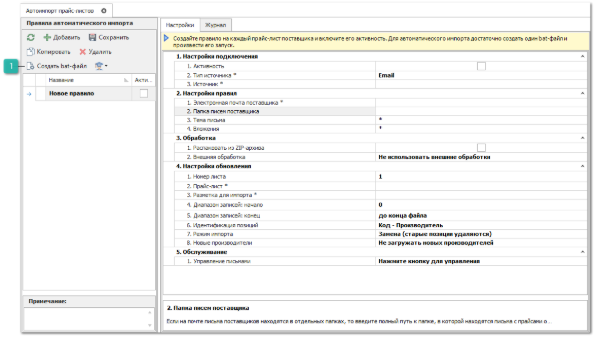
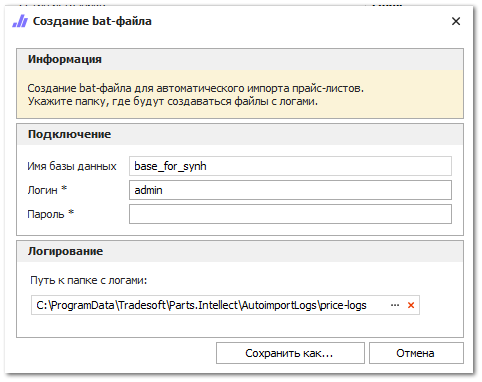
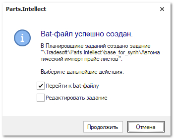

Для создания исполняемого файла автоматического запуска импорта прайс-листов в программу выполните следующие действия:

**»** На панели инструментов блока **Правила автоматического импорта прайс-листов** нажмите кнопку **Создать bat-файл**. 

 **Создать bat-файл**

Позволяет создать исполняемый bat-файл для автоматического запуска импорта прайс-листов в программу.

Откроется окно **Создание bat-файла**.

**»** В открывшемся окне введите пароль пользователя программы и укажите путь к папке с файлами-журналами процесса импорта. По умолчанию используется путь:

::: note Пример

`C:\ProgramData\Tradesoft\Parts.Intellect\AutoimportLogs`

:::

**»** После заполнения всех полей нажмите кнопку **Сохранить как**. При успешном создании исполняемого файла откроется окно, с уведомлением об успешном создании bat-файла. В Планировщике заданий Windows автоматически создастся задание на выполнение сохраненного bat-файла с частотой раз в час.

В окне **Bat-файл успешно создан** доступны действия при выставлении отметки у пунктов:

- **Перейти к bat-файлу** – открытие каталога файловой системы, содержащего сохраненный файл;

- **Редактировать задание** – открытие формы редактирования задания планировщика для корректировки его параметров. Задание доступно для редактирования в любой момент времени через стандартные средства операционной системы Windows в **Планировщике заданий** по пути: **Библиотека планировщика** – **Tradesoft** – **Parts.Intellect** – **Название базы данных** – **Автоимпорт прайс-листов**.

Далее рассмотрим процесс автоматического импорта прайс-листов поставщиков.

