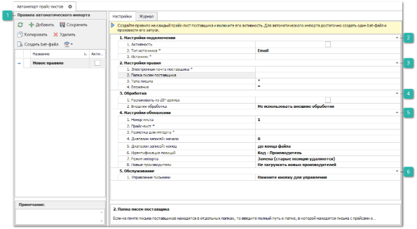
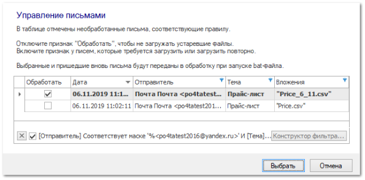

Для создания правила загрузки и обновления прайс-листа выполните следующий действия:

**»** В Главном меню выберите раздел **Товары и цены ► Действия с прайс-листами ► Автоимпорт прайс-листов**. Откроется окно **Автоимпорта прайс-листов**. 

 **Правила автоматического импорта**

Блок содержит список правил для автоматического импорта прайс-листов. Создайте новое правило Путем нажатия кнопки **Добавить** на панели действий блока, либо выберете существующее правило.

::: info Примечание

Если ранее правила не создавались, то при открытии раздела сразу будет создано правило для настройки с именем **Новое правило**.

:::

 **Настройки** 

В блоке заполните следующие параметры:

- **Активность** – определяет активность каждого правила;

::: info Примечание

Автоматическая загрузка и обновление прайс-листов происходит только по активным правилам.

:::

- **Тип источника \*** – Email;

- **Источник \*** – учетная запись электронной почты, с которой будет происходить сбор прайс-листов. 

 **Настройка правил**

В блоке заполните следующие параметры:

Для типа источника **Email**:

- **Электронная почта поставщика \*** – адрес электронной почты поставщика, с которого поступают письма с прайс-листами;

::: note Замечание

Для того, чтобы система осуществляла поиск писем только по определенной части адреса электронной почты (например, только по домену), необходимо заменить необязательные символы в адресе на символ **\*** ("звёздочка").

:::

- **Папка писем поставщика** – в поле указывается папка почтового сервиса, в которой будет производиться поиск писем с прайс-листами от поставщика для их дальнейшей загрузки в систему. При пустом значении поля, поиск писем будет выполняться в папке "Входящие". Если письма от поставщика находятся в какой-либо подпапке, необходимо указать полный путь на сервере электронной почты, начиная с корневой папки (без указания папки "Входящие"), учитывая разделители для разных почтовых серверов (вместо наименований Корневая папка, Подкаталог, Папка используйте свои названия):

   - **Yandex**:  Корневая папка|Подкаталог|Папка писем поставщика;

   - **GMail, Mail, Outlook**:  Корневая папка/Подкаталог/Папка писем поставщика;

   - **Tradesoft**:  Корневая папка.Подкаталог.Папка писем поставщика.

::: warning Внимание!

Для почт Outlook и Tradesoft, если корневой папкой являются "Входящие", перед указанием пути к серверу требуется написать "INBOX" при этом папку "Входящие" указывать не нужно: INBOX/Подкаталог/Папка писем поставщика.

:::

- **Тема письма** – тема письма от поставщика. В данном поле присутствует возможность использовать символы \* и ?, позволяющие заменить любое количество символов и один символ в теме письма, соответственно. Например:
   - текст "\*остатки" позволяет найти все письма, тема которых оканчивается словом "остатки";
   - текст "\*прайс\*" позволяет найти все письма, тема которых внутри содержит слово "прайс";
   - текст "Прайс\*" позволяет найти все письма, тема которых начинается со слова "Прайс";
   - текст "Прайс?" позволяет найти все письма, тема которых начинается со слова "Прайс" и содержит после этого слова только один символ, например, "Прайс1".

- **Вложения** – наименование вложения в письме поставщика, в котором содержится прайс-лист. Поле аналогично предыдущему и поддерживает возможность использовать символы \* и ?.

::: warning Внимание!

Для корректной идентификации письма должны располагаться в корневой папке "Входящие" почтового ящика, поиск по подпапкам не производится.

:::

Для типа источника **Ftp**:

- **Путь до файла на сервере** – полный путь к файлу на FTP-сервере с указанием имени файла. Имя сервера указывать не надо. В данном поле присутствует возможность использовать символы \* и ?, позволяющие заменить любое количество символов и один символ в названии файла, соответственно. Например:

   - текст "/price/\*price.csv" позволяет найти все файлы на FTP-сервере в каталоге price, наименование которых оканчивается словом "price.csv";

   - текст "/\*price\*" позволяет найти все файлы в корневом каталоге FTP-сервера, наименование которых внутри содержит слово "price";

   - текст "/price?" позволяет найти все файлы в корневом каталоге FTP сервера, наименование которых начинается со слова "price" и содержит после этого слова только один символ, например, "price 1".

 **Обработка**

В блоке указывается, какой прайс-лист необходимо извлекать из архива, а также дополнительные обработчики:

- Включите опцию **Распаковать из ZIP-архива**, если вложение является zip-­архивом. Укажите название файла в архиве, который необходимо загрузить в программу. Поле аналогично полю **Вложение** и поддерживает возможность использовать символы \* и ?;

::: warning Внимание!

Если по заданной маске будет найдено несколько вложений или файлов в архиве, все найденные файлы будут переданы в обработку.

:::

- **Внешняя обработка** в одноименном поле присутствует возможность выбрать один из файлов внешней обработки, которые представляют собой скрипты, написанные на языке VBScript. Доступны следующие обработки исходных файлов:

   - **ConvertToCsv.vbs** – конвертация в формат .csv. Может понадобиться для корректной загрузки данных, так как формат Excel может автоматически преобразовывать некоторые значения в некорректные. Например, в ячейках могут теряться первичные нули чисел;

   - **ConvertToXlsx.vbs** – конвертация в формат .xlsx. Может понадобиться для корректной загрузки данных в случаях, когда исходный файл с расширением .xls\* не может быть распознан системой;

   - **UnArch.vbs** – распаковка архива. Может использоваться в случаях, когда прайс-листы присылают в архиве. Распаковка универсальная, может разархивировать любой формат;

   - **UnArch\_and\_ConvertToCsv.vbs** и **UnArch\_and\_ConvertToXlsx.vbs** – распаковка и конвертирование. Может использоваться в случаях, когда прайс-листы необходимо извлечь из архива, а также выполнить конвертацию в один из доступных форматов.

::: info Примечание

Для использования обработчиков с распаковкой и конвертацией файлов обязательно требуется установленное на компьютере ПО 7-zip и Microsoft Excel 2007 и выше.

:::

 **Настройки обновления**

В блоке заполните следующие параметры:

- **Номер листа** – номер таблиц (листа), данные с которого необходимо импортировать в систему. Порядковые номера таблиц (листов) определяются в соответствии с их названиями, с сортировкой по алфавиту;

- **Прайс-лист** – прайс-лист поставщика в программе, подлежащий обновлению;

::: info Примечание

Прайс-лист поставщика предварительно должен быть загружен в программу вручную. 

:::

- **Разметка для импорта** – разметка для импорта прайс-листа. Добавляется при ручной загрузке файла в систему;

- **Диапазон записей: начало** и **Диапазон записей: конец** – диапазон строк, содержащих данные для загрузки. Например, если в прайс-листе присутствует заголовок таблицы в первой строке, то ее нужно пропустить, диапазон в этом случае: 1 – до конца файла;

- **Идентификация позиций** – свойства для идентификации позиций при их обновлении. Доступны Код – Производитель и Внутренний код.

::: info Примечание

В случае использования в качестве идентификатора свойства **Внутренний код**, оно должно быть заполнено в карточке товара.

:::

- **Режим импорта** – режим обновления позиций в прайс-листе. Доступны следующие варианты загрузки:

   - **Замена (старые позиции удаляются)** – импортируемый прайс-лист заменит своим содержанием текущий прайс-лист;

   - **Обновление только существующих позиций** – в прайс-листе будут обновлены записи согласно данным из импортируемого прайс-листа;

   - **Обновление существующих позиций и добавление новых** – в прайс-листе будут обновлены и добавлены новые записи согласно данным из импортируемого прайс-листа;

- **Новые производители** – действие для новых производителей, встретившихся в прайс-листе поставщика:

   - **Добавить новых производителей** – все новые производители будут добавлены в справочник **Производители**;

   - **Не загружать новых производителей** – все новые производители будут проигнорированы;

   - **Спросить пользователя** – откроется диалоговое окно для выбора действия с новым производителем.

 **Обслуживание**

В блоке нажмите кнопку **Управление** в поле **Управление письмами** для просмотра писем, соответствующих заданному правилу (адресу поставщика, теме и вложению). Откроется окно **Управления письмами**. Данный инструмент необходим для отладки заданных правил, чтобы убедиться, что письма находятся корректно, доступен только для типа источника Email.

**»** Включите признак **Обработать**, в табличной части, для писем, вложения которых требуется загрузить в программу. По умолчанию признак включен у необработанных писем, вложения которых ранее не загружали. В случае включения признака у ранее обработанных писем, произойдет повторная загрузка их вложений в программу.

**»** Отключите признак **Обработать** для писем, вложения которых не требуется загружать в программу.

**»** Нажмите кнопку **Выбрать**. Все отмеченные письма помещаются в очередь на обработку и будут обработаны при следующем запуске bat-файла автоматического импорта.

**»** Нажмите кнопку **Сохранить**, на панели действий блока **Правила автоматического импорта**, для сохранения внесенных изменений.

После настройки правил импорта перейдите к настройкам исполняемого файла загрузки и обновления прайс-листов.