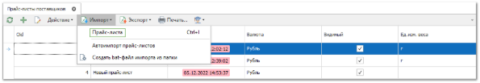
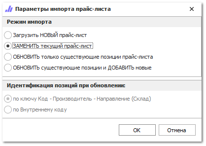
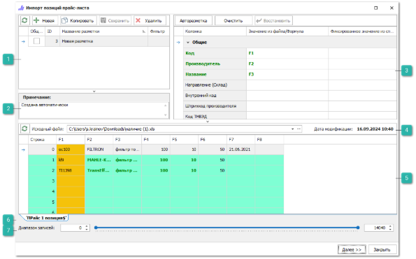
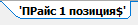

Импортировать прайс-листы от поставщиков можно из файлов.

**»** Подготовьте файл прайс-листа для импорта и перейдите в раздел меню **Товары и цены ► Прайс-листы поставщиков**.

::: info Примечание

Системой поддерживаются следующие форматы файлов для загрузки:Файла MS Access (\*.mdb);
Microsoft Excel 95-2003 (\*.xls);
Microsoft Excel 2007-2013 (\*.xlsx, \*.xlsm);
Файлы dBase (\*.dbf);
Текстовые файлы с разделителями "точка с запятой", "запятая", "табуляция" (\*.txt, \*.csv).

:::

**»** Нажмите команду **Прайс-листа** в пункте **Импорт** на панели инструментов. 

Для импорта прайс-листов от поставщика мастер заранее предложит выбрать один из режимов импорта:

- **Загрузить новый прайс-лист** – импортируемый прайс-лист будет загружен во вновь созданный документ в программе.

- **Заменить текущий прайс-лист** – импортируемый прайс-лист заменит своим содержанием текущий прайс-лист.

- **Обновить только существующие позиции в прайс-листе** – в прайс-листе будут обновлены записи согласно данным из импортируемого прайс-листа.

- **Обновить существующие позиции и добавить новые** – в прайс-листе будут обновлены и добавлены новые записи согласно данным из импортируемого прайс-листа.

- **Идентификация позиций при обновлении** – при обновлении прайс-листа доступна возможность выбора идентификационных полей. Либо пара значений "КОД-ПРОИЗВОДИТЕЛЬ", либо "Внутренний код поставщика".

::: info Примечание

На MS SQL и PostgreSQL доступна возможность импорта для справочников товаров и контрагентов в режиме обновления. Это позволяет обновить информацию по каждой записи в справочнике на основании информации из файла.

:::
**»** Нажмите кнопку **Ок** для подтверждения выбора. Появятся элементы для выбора файла с компьютера, который содержит импортируемые данные.

**»** После выбора файла откроется окно разметки файла для импорта. Выполните разметку файла используя подходящую ранее созданную разметку, либо выполните разметку файла вручную.

 **Ранее созданные разметки**

Блок  **Ранее созданные разметки**, содержит ранее созданные и сохраненные разметки документов. Если импорт в приход из аналогично размеченного файла уже осуществлялся, и в программе сохранена эта разметка, то рекомендуется выбрать ее в списке, не создавая новую. Блок содержит **Панель действий** с командами:

- **Обновить** – позволяет обновить список разметок;

- **Новая** – позволяет добавить новую разметку;

- **Копировать** – позволяет копировать существующую разметку, для дальнейшего редактирования;

- **Сохранить** – позволяет сохранить созданную или отредактированную разметку, которая будет доступна для последующего использования;

- **Удалить** – позволяет удалить существующую разметку.

 **Примечание**

Блок позволяет оставить текстовое примечание для разметки.

 **Разметка колонок**

Позволяет установить соответствия колонок в файле с типом данных в программе в колонке **Значение из файла/формула**. Некоторые значения (валюта, страна и т.п.) можно установить из соответствующего справочника в программе в колонке **Фиксированное значение из справочника**.

::: info Примечание

Обязательными полями для разметки при импорте приходя являются: **Отображаемый код** и **Производитель**.

:::

 **Информация об импортируемом файле**

Блок содержит:

- **Команду Обновить** – которая позволят обновить данные о загруженном документе; 

- **Исходный файл** – содержит полный путь на компьютере до импортируемого файла, при необходимости его можно заменить;

- **Дата модификации** – отображается последняя дата изменения документа.

 **Табличная часть** 

Содержит список записей импортируемых из документа, с названием колонок для установки разметки.

 **Таблицы/листы документа**

Отображаются вкладки таблиц/листов документа, который хранит импортируемые данные. При необходимости, выберите необходимую вкладку.

 **Диапазон записей**

Позволяет указать количество верхних/нижних строк, данные из которых не будут импортированы. Обычно данный параметр используется для того, чтобы предотвратить загрузку заголовка и названия колонок импортируемой таблицы.

::: info Примечание

При разметке импорта из файлов можно использовать предустановленные в программе специальные формулы для упрощения процесса импорта. 

:::

**»** Для продолжения загрузки нажмите кнопку **Далее.** Откроется окно с параметрами загрузки. Для изменения параметров нажмите кнопку **Назад**. Для начала процесса импорта нажмите **Начать**!

**»** После завершения загрузки программа отобразит окно с результатами загрузки и лог пропущенных позиций.

Программа позволяет настроить автоматическое обновление прайс-листа из файла.

После успешной загрузки прайс-листа поставщика, откроется вкладка **Маркетинг**, для настройки ценообразования прайс-листа. 

