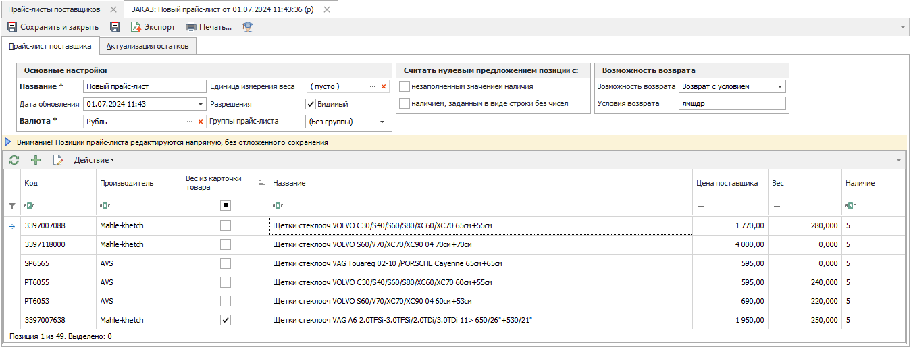
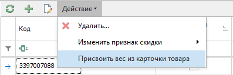
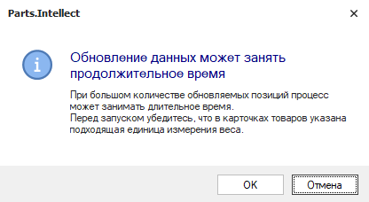
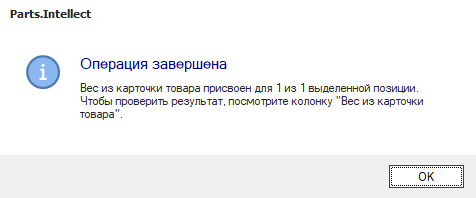
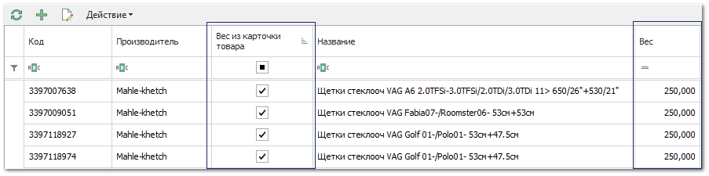

Вы можете массово присвоить вес позициям прайс-листа поставщиков. Вес присваивается из карточки товара (справочник Товары). Для присваивания сделайте следующее:

**»** Перейдите в инспектор прайс-листа в разделе **Товары и цены ► Прайс-листы поставщиков**.

» В табличной части выделите необходимые позиции прайс-листа. Если вы хотите выделить все позиции, то нажмите сочетание клавиш `Ctrl + A` (англ.)

» В панели действий табличной части нажмите на команду **Действие ► Присвоить вес из карточки товара**.

::: info Примечание

Команда **Действие ► Присвоить вес из карточки товара** заполняет колонку **Вес** в выбранных позициях прайс-листа значениями веса из карточек товаров (раздел **Товары и цены ► Товары**). Поиск товара в справочнике производится по связке **Код + Производитель** с учетом синонимов производителя.

:::

::: note Замечание

Особенности присваивания веса:
- для дублирующих позиций прайс-листа поставщика (с одинаковыми значениями полей **Код** и **Производитель**) устанавливается одинаковое значение веса;

- вес не присваивается позиции:

    - если карточка товара отсутствует в справочнике;
    - если в карточке товара указано нулевое значение веса;
    - пользователем была остановлена процедура присвоения веса, а позиция еще не была обработана.

:::

Перед запуском действия отобразится уведомление:

**»** Нажмите кнопку **ОК**. По окончанию процесса отобразится уведомление с количеством обновленных позиций прайс-листа.

У обновленных позиций прайс-листа будет обновлен **Вес** и указан признак **Вес из карточки товара**.

::: warning Внимание!

Действие позволяет лишь присвоить вес позиции из справочника, но не актуализируется при его изменении в карточке товара.

Признак **Вес из карточки товара** для позиции снимается автоматически, если:

- для позиций был присвоен новый вес, при обновлении прайс-листа загрузкой из файла или автоимпортом;

- вес в прайс-листе был изменен пользователем вручную.

:::