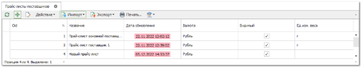
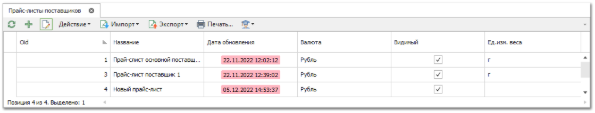
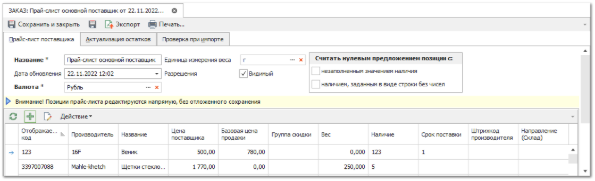
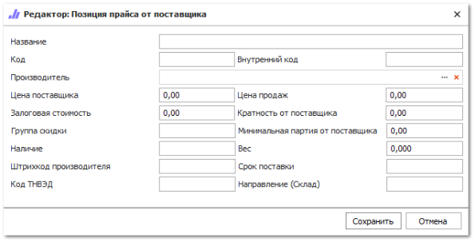
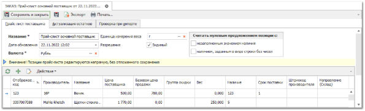

**Прайс-листы поставщиков** содержат информацию о товарах от поставщиков.

**»** Для добавления в систему нового прайс-листа перейдите в раздел **Товары и цены** – **Прайс-листы поставщиков** и** нажмите кнопку **Новый**. Так как прайс-листы содержат большое количество позиций, наиболее рационально наполнять их через **Импорт** из файла. 

При этом всегда остается возможность добавить позиции вручную. Для ручного добавления позиций в прайс-лист необходимо:

**»** Выделить требуемый прайс-лист от поставщика и нажать кнопку **Править**.

**»** На панели инструментов списка позиций прайс-листа воспользоваться кнопкой **Добавить**.

**»** Откроется форма для добавления новой позиции. 

**»** После добавления всех записей нажмите кнопку **Сохранить и закрыть** на панели управления.

