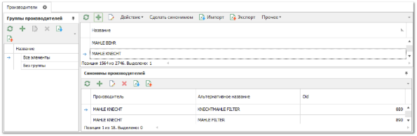
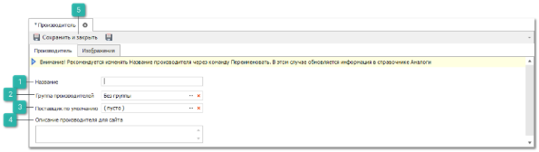
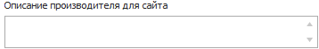
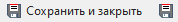

**»** В **Главном меню** выберите раздел **Товары и цены** ► **Производители** (Ctrl+P). В **Рабочей области** появятся элементы выбранного пункта. 

**»** Нажмите кнопку . В **Рабочей области** отобразятся элементы для добавления новой записи в справочник.

 **Название**

Позволяет указать наименование производителя.

 **Группа производителей**

Позволяет указать группу, к которой относится производитель. Например, наименование концерна, если добавляемый производитель входит в объединение производителей. Объединение производителей в группы позволяет объединять в одну строку товары с несколькими производителями и одним кодом на первом шаге **Проценки**. Для этого необходимо добавить искомых производителей в одну группу и включить опции для агрегирования в разделе меню в разделе **Управление ► Настройки программы ► Настройки**, группа **Проценка ► Настройки поиска** опция **Использовать свертку по группам производителей при поиске**. **Группы производителей** на первом шаге проценки выделяются жирным начертанием шрифта.

 **Поставщик по умолчанию**

Позволяет задать поставщика по умолчанию. В дальнейшем это сэкономит время при работе с **Мастером заказа Поставщику**.

 **Описание производителя для сайта**

Позволяет задать описание/справку производителя, вызов которой можно добавить на сайте интерент-магазина.

 **Сохранить и закрыть/Сохранить** 

Позволяет сохранить и закрыть/сохранить запись в справочник **Производители**.

**»** Введите необходимые данные по производителю.

**»** Нажмите кнопку **Сохранить и закрыть (F2)** для сохранения записи в справочнике.