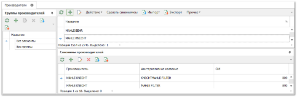
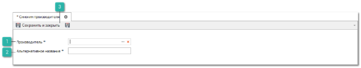
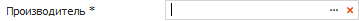
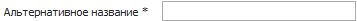
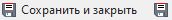
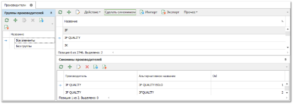
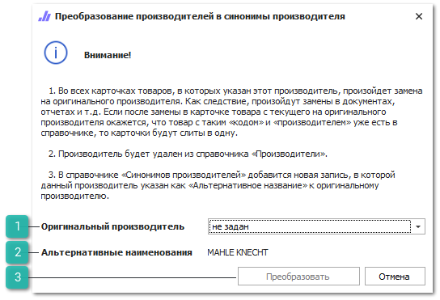

Синонимы производителей позволяют указать различные написания названия фирмы производителя, а также объединить несколько брендов в основной (для программы). Существует два способа, которыми можно указать синонимы производителей:

## Первый способ

**»** В **Главном меню** выберите раздел **Товары и цены** ► **Производители** (Ctrl+P). В **Рабочей области** появятся элементы выбранного пункта. 

**»** Нажмите кнопку **Новый** на панели инструментов таблицы **Синонимы производителей** справочника. В **Рабочей области** отобразятся элементы для добавления новой записи в справочник. 

 **Производитель** 

Позволяет выбрать производителя из справочника, для которого необходимо добавить синоним.

 **Альтернативное название**

Позволяет указать для выбранного производителя синоним.

 **Сохранить и закрыть/Сохранить** 

Позволяет сохранить и закрыть/сохранить запись в справочник **Производители**.

**»** Выберите **Производителя** из справочника и введите для него **Альтернативное** **наименование**, которое встречается в прайс-листах.

## Второй способ

Если же производитель и его синоним уже внесены в справочник **Производителей**, то их можно сделать синонимами друг друга:

**»** В **Главном меню** выбираем раздел **Товары и цены** ► **Производители**. В **Рабочей области** появятся элементы выбранного пункта.

**»** Выделите один или несколько производителей в справочнике и нажимаем кнопку **Сделать синонимом**.

**»** При выполнении команды является диалог, в котором указывается **Оригинальный производитель** из справочника производителей, по отношению к которому выделенные производителя являются альтернативными названиями.

 **Оригинальный производитель**

Позволяет указать для выбранных позиций оригинального производителя.

 **Альтернативные наименования**

Отображаются названия выбранных производителей.

 **Преобразовать**

Позволяет выполнить создание синонимов производителей.

**»** Для продолжения нажмите кнопку **Преобразовать**. Далее происходят следующие операции: осуществляется подмена производителей в карточках товара (на оригинального производителя); если появляются карточки с одинаковым кодом и производителем, то происходит их слияние; указанные производители удаляются из справочника **Производителей**; затем добавляются новые записи в **Синонимы производителей**.

::: info Примечание

Настоятельно рекомендуется проверять список новых наименований производителей на возможность наличия существующих синонимов в справочнике. В противном случае синонимы в системе будут установлены как различные производители, при этом кроссы и замены на их детали будут независимы друг от друга. Это значительно снизит эффективность и корректность поиска клиентами деталей и их аналогов в системе.

:::