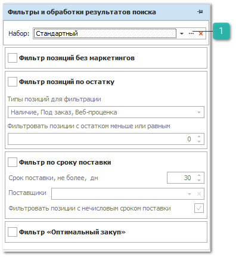
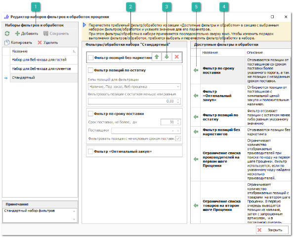
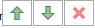
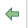

Фильтрация и обработка результатов поиска Проценки осуществляется на панели **Фильтры и обработки результатов поиска**.

::: info Примечание

Возможность изменять фильтры проценки для пользователя определяется значением настройки **Разрешения для фильтров и обработок в проценке** в разделе меню **Управление ► Настройки программы ► Роли пользователей ► Прайс-листы ► Проценка**.

:::

Для изменения параметров фильтров результатов поиска в проценке выполните следующие действия:

**»** В окне проценки вызовите панель **Фильтры и обработки результатов** **поиска** на левой боковой панели.

**»** На панели в раскрывающемся списке выберете заранее созданный набор фильтров и обработок, а затем установите/снимите галки напротив необходимых фильтров/обработок из выбранного набора.

**»** Если необходимо, задайте дополнительные параметры для выбранного фильтра/обработки.

Порядок применения фильтров/обработок для результатов поиска в **Проценке** соответствует порядку фильтров/обработок в наборе: фильтры/обработки применяются по очереди от первого до последнего.

По умолчанию задан один набор с фильтрами/обработками **Стандартный**, который применяется при сбросе набора и его нельзя удалить, но можно изменить, для этого необходимо нажать на на троеточие в поле с выбранным набором.

 **Редактор наборов фильтров и обработок проценки**

Позволяет открыть окно **Редактора набора фильтров и обработок проценки**.

**»** При редактировании набора открывается форма с редактором.

 **Наборы фильтров и обработок**

Блок содержит список ранее созданных наборов фильтров и обработок, а так же команды для управления ими:

- **Обновить** – позволяет обновить данные в таблице;

- **Добавить** – позволяет добавить новую запись в таблицу;

- **Сохранить** – позволяет сохранить внесенные в набор фильтров и обработок изменения;

- **Копировать** – позволяет скопировать выбранную запись;

- **Удалить** – позволяет удалить выбранную запись.

 **Фильтр/обработка набора "Наименование фильтра/обработки"**

Блок содержит фильтры/обработки из активного набора, их параметры по умолчанию и порядок применения.

 **Команды управления фильтром**

Позволяют осуществить управление порядком выбранных фильтров – **Переместить выше**, **Переместить ниже**, **Удалить фильтр из набора** соответственно. Для отображения команд управления необходимо выбрать требующий изменения фильтр.

 **Доступные фильтры и обработки**

Блок содержит список доступных фильтров/обработок, которые можно использовать для формирования наборов. 

Описание доступных фильтров/обработок для формирования наборов:

- **Фильтр по сроку поставки, дн**. – позволяет отсеять позиции от поставщиков по сроку доставки. На экране остаются позиции, сроки доставки по которым менее либо равны указанному в фильтре количеству дней. При этом позиции от поставщиков, в которых не задан срок поставки отсеиваются или нет в зависимости от опции "Фильтровать позиции с нечисловым сроком поставки";

- **Фильтр** "**Оптимальный закуп**" – позволяет отобрать для каждого товара позицию с минимальной ценой закупа и ненулевым наличием. Например, если товар есть в трех прайс-листах от поставщиков, то на экране будет отображена только позиция из прайс-листа с минимальной ценой закупа среди всех поставщиков и ненулевым наличием;

- **Фильтр позиций по остатку** – фильтр отсеивает позиции с остатком менее либо равным указанному значению;

- **Фильтр позиций без маркетингов** – при включении фильтра в Проценке отфильтровываются позиции, которые не имеют заданного маркетинга для выбранных условий поиска;

- **Ограничение списка производителей на первом шаге Проценки** – при включении фильтра, на первом шаге Проценки в соответствии с заданным порогом обрезается список с производителями (при условии, что по коду найдено несколько производителей);

- **Ограничение списка товаров на втором шаге Проценки** – при включении фильтра, на втором шаге Проценки в соответствии с заданным порогом обрезается список найденных товаров. Ограничение на количество позиций в результатах Проценки работает по следующему алгоритму: в первую очередь выводятся товары в наличии, затем запрошенный артикул, а уже затем его аналоги и заменители;

- **Фильтр позиций с нулевой ценой** – отсеиваются позиции с нулевой ценой продажи;

- **Фильтр** "**Предложение для посетителей сайта**" – данный фильтр позволяет оставить в результатах поиска только позиции от поставщиков, от веб-поставщиков и позиции из наличия, если они не находятся в состоянии «Резерв» либо «Отгрузка на реализацию». К тому же отфильтровываются позиции во внутреннем резерве;

- **Фильтр по дате актуализации прайс-листов от поставщиков** – отсеиваются позиции прайс-листов от поставщиков, которые не актуализировались указанное количество дней;

- **Веб-проценка: фильтр по колонке** "**Направление/Склад**" – отсеиваются результаты веб-проценки от заданного поставщика с указанными направлениями. Допускается ввод полного текста направления, частичного написания с использованием символа \*, макроса {ПУСТО} для отсеивания позиций с незаполненным направлением/складом;

- **Веб-проценка: фильтр по рейтингу поставщика** – отсеиваются результаты веб-проценки от заданного поставщика с рейтингом, менее указанного;

- **Веб-проценка: фильтр по производителям** – отсеиваются результаты веб-проценки в зависимости от производителя товара;

- **Фильтр для позиций под заказ с незаполненным весом** – отсеиваются результаты проценки от выбранных поставщиков (с учетом направлений/складов) с незаполненного весом товара;

- **Лучшее предложение от поставщиков**. Данный фильтр позволяет отобразить в результатах Проценки только лучшие предложения под заказ: Х лучших по цене продажи и Y лучших по сроку доставки. При этом фильтр можно настроить под конкретного поставщика или список поставщиков. Фильтр можно применять как в рамках всех предложений товаров от поставщиков в результатах поиска, так и по каждому товару независимо (код+производитель). При фильтрации по лучшей цене среди предложений с одинаковой ценой выберутся предложения с наименьшими сроками поставки, среди предложений с одинаковыми ценой и сроком поставки выберутся предложения с наибольшим остатком. При фильтрации по лучшему сроку среди предложений с одинаковым сроком выберутся предложения с наименьшими ценами, среди предложений с одинаковыми сроком и ценой выберутся предложения с наибольшим остатком;

- **Фильтр по складам** – данный фильтр позволяет указать список складов, на которых будет осуществляться подбор товаров в наличии;

- **Скрывать предложение поставщиков, которое есть в собственном наличии** – фильтр позволяет отсеять предложение поставщиков, которое имеется в собственном наличии. Можно отсеивать все предложение поставщиков, а можно только более дешевые позиции (цена продажи поставщика <= цены на такой же товар в наличии);

- **Подмена цен на наличие** – данная обработка позволяет подменить цены на товары в наличии ценами, подобранными из прайс-листов и веб-прайс-листов от поставщиков. Можно подменять цены на все наличие, по которым найдены предложения, выбрав самую минимальную, максимальную или среднюю цену поставщика. Можно подменять только те позиции, цена на которые выше цен поставщика или только те позиции, цена на которые ниже цен поставщика. Для этого необходимо выбрать значение в поле **Подменять цены на наличие**: **Всегда**/ **Если оно дешевле предложений поставщика**/ **Если оно дороже предложений поставщика**. При этом замена предложений произойдет только если цена в наличии меньше или больше (в зависимости от выбранного значения настройки) ВСЕХ предложений выбранных поставщиков. С помощью фильтров по складу/группе товаров/производителям можно сузить круг товаров в наличии для подмены цен. А если включена опция **Фильтровать позиции прайс-листа**, то позиции выбранных прайс-листов после подмены будут удалены из результатов Проценки. Можно фильтровать все позиции прайс-листов или те, по которым осуществлялась подмена цен на наличие, выбрав соответствующее значение опции;

- **Веб-проценка: подмена текста в колонке** "**Направление/Склад**" – обработка подменяет текст в колонке **Направление/Склад** позиций от указанных веб-поставщиков на новый текст, согласно правилу подмены. Допускается ввод текста направления для подмены, его частичного написания с использованием символа \*(любое количество символов), макроса {ПУСТО} для позиций с незаполненным направлением/складом. А также использование нескольких текстов для подмены, разделенных символом ";".

 **Добавить фильтр/обработку в набор**

Позволяет добавить фильтр/обработку в набор.

**»** После внесения изменений необходимо их сохранить, путем нажатия на кнопку **Сохранить** в блоке **Наборы фильтров и обработок**.