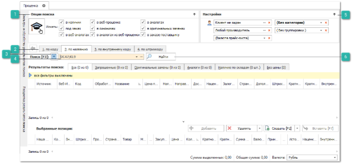
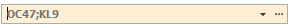

Для поиска предложений с использованием инструмента **Проценка**, необходимо настроить источники и условия поиска предложений среди разных источников программы:

**»** В **Главном меню** выберите раздел **Продажи** ► **Проценка.** Отобразятся элементы выбранного пункта.

 **Опции поиска**

Позволяет указать какие источники поиска необходимо использовать при проценке.

::: info Примечание

Перечень доступных для пользователя источников поиска в проценке определяется разрешениями в меню **Управление ► Настройки программы ► Роли пользователей ► Прайс-листы ► Проценка**.

:::

Инструмент проценки позволяет осуществлять поиск в следующих источниках:

- **В наличии** – поиск предложений осуществляется среди позиций доступных пользователю **Прайс-листов из наличия**;

::: info Примечание

Видимость скрытых прайс-листов определяется настройкой **Видны скрытые прайс-листы** в разрешениях пользователя в разделе меню **Управление ►** **Настройки программы ► Роли пользователей ► Прайс-листы ► Прайс-листы из наличия**.

:::

- **Под заказ** – поиск предложений осуществляется среди позиции загруженных в программу **Прайс-листов от поставщиков**;

- **В веб-проценке** – поиск предложений осуществляется среди подключенных в программе **Веб-прайс-листов от поставщиков**. В веб-прайс-листах доступен поиск только "**1. По коду**" и действует только строгое совпадение;

::: info Примечание

При активной настройке **Исключать повторные предложения от одного веб-поставщика** (**Управление ► Настройки программы ► Настройки**, группа **Проценка ► Настройки поиска**), если на втором шаге проценки от одного веб-поставщика найдено несколько предложений с одинаковыми значениями полей: Код, Производитель, Направление/Склад, Срок поставки, Цена (поставщика), то в результатах поиска будет отображено только первое предложение из подобранных.

:::

::: info Примечание

Видимость скрытых прайс-листов определяется настройкой **Видны скрытые прайс-листы** в разрешениях пользователя в разделе меню **Управление ►** **Настройки программы ► Роли пользователей ► Прайс-листы ► Прайс-листы от поставщиков** и **Веб-прайс-листы от поставщиков**.

:::

- **В синонимах** – поиск предложений осуществляется с учетом позиций справочника **Синонимы товаров**;

- **В аналогах** – поиск предложений осуществляется с учетом позиций справочника **Аналоги**;

::: info Примечание

Поиск в справочнике аналогов осуществляется с учетом значения настройки **Глубина поиска аналогов** в разделе меню **Управление ► Настройки программы ► Настройки,** группа **Проценка** ► **Аналоги**.

:::

- **В оригинальных заменах** – поиск осуществляется среди позиций справочника **Оригинальные замены производителей**;

- **В веб-аналогах** – поиск аналогов на запрошенный артикул будет осуществляться в базе сервиса **Веб-аналоги**, который предназначен для дополнения или замещения локальной базы аналогов (кроссов) программы. Данная возможность значительно расширяет вашу базу аналогов, что повышает результативность поиска аналогов для запчастей;

::: info Примечание

Поиск в сервисе веб-аналоги осуществляется с учетом значения настройки Глубина поиска **Уровень доверия к аналогам** в разделе меню **Управление ► Настройки программы ► Настройки,** группа **Проценка** ► **Аналоги**.

:::

- **В заказе поставщику –** данный источник позволяет искать детали, которые "едут на склад" и находятся в заказе поставщику;

- **В аналогах из веб-проценки** – данный источник используется для поиска аналогов у веб-поставщиков (среди позиций, подключенных веб-прайс-листов). Для поиска аналогов с помощью проценки в веб-прайс-листе необходимо настроить эту возможность в карточке веб-прайс-листа.

::: info Примечание

Подключение веб-сервисов **Веб-проценки**, **Веб-заказ** и **Веб-аналоги** осуществляется по запросу. Условия подключения можно узнать у наших менеджеров (контактные данные можно найти по адресу [www.tradesoft.ru/about/contacts](http://www.tradesoft.ru/about/contacts/)).

:::

 **Вкладки поиска**

Позволяет осуществить выбор вкладки поиска, по которой будет осуществляться поиск товара. Доступны параметры поиска:

- **По коду** – позволяет осуществить проценку товара по артикулу;

- **По названию** – позволяет выполнить проценку товара используя его наименование;

- **По внутреннему коду** – позволяет проценить товар по его внутреннему коду из карточки товара;

- **По штрих коду** – позволяет осуществить проценку товара по его штрихкоду.

 **Режим поиска**

Позволяет определить режим вхождения поискового запроса:

-  – поиск по началу (например, если строкой поиска является "123", то будут найдены все записи, начинающиеся с 123: **123**4, **123**555, **123**00 и т.д.),

-  – поиск по вхождению (например, если строкой поиска является "123", то будут найдены все записи, содержащие 123: 00**123**4, **123**555, 0113**123** и т.д.),

-  – поиск по строгому совпадению (например, если строкой поиска является "123", то будут найдены записи, полностью совпадающие с 123: **123**).

 **Строка поиска**

Позволяет ввести искомый параметр.

::: info Примечание

Если в поисковую строку одновременно введены русские и латинские буквы, строка окрашивается в розовый цвет, тем самым уведомляя о возможной ошибке в веденном искомом параметре.

:::

 **Настройки**

Позволяет задать следующие параметры поиска, для утонения результатов поиска:

- **Клиент** – с помощью данного параметра автоматически определяется **Категория клиента**, а при формировании документов на основании процененных товаров, выбранный клиент будет автоматически подставляться в документ;4

- **Производитель** – заданный производитель товара, позволяет сократить область поиска на первом шаге проценки;

- **Категория** **клиента** – в зависимости от выбора категории будет применять тот или иной уровень цен (маркетинг) на искомые позиции согласно алгоритму по подбору маркетингов;

- **Валюта** – выберите валюту в которой необходимо отобразить цены в результатах поиска;

::: info Примечание

Если валюта источника и валюта отображения различны, то между ними обязательно должен быть задан курс в справочнике **Валюты и курсы**.

:::

- **Способ группировки** – опция позволяет сгруппировать результаты поиска. Возможные варианты:

    - **Без группировки** – в этом случае группировку можно либо совсем не использовать, либо группировать вручную штатными средствами по имеющимся колонкам;

    - **Наличие, в пути, под заказ** – при данном способе группировке в первой группе будет отображено все "наличие" (запрошенные товары и их аналоги), затем товары "в пути" (если включен источник **В заказе поставщику**), затем товары "под заказ" (запрошенные товары и их аналоги). В конце секция с отсутствующими на складах товарами;

    - **Запрошенный, аналоги** – в первой группе будут запрошенные товары "в наличии", затем аналоги "в наличии", далее запрошенные товары "в пути", затем аналоги "в пути", далее запрошенные товары "под заказ", затем аналоги "под заказ". В конце секция с отсутствующими на складах товарами.

 **Найти**

Позволяет осуществить проценку в соответствии с заданными параметрами поиска.

**»** На панели **Опции поиска** установите галки напротив доступных источников поиска.

**»** Выберете соответствующую вкладку поиска, для определения параметра, по которому будет осуществляться запрос в строке поиска.

**»** В строке поиска введите искомый параметр и выберите режим для поиска:

**»** При необходимости, укажите дополнительные параметры поиска в блоке **Настройки**.

**»** После установки всех параметров и условий поиска нажмите кнопку **Найти**. После чего запустится процесс проценки.