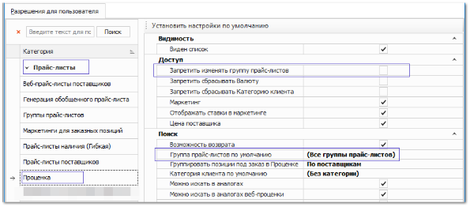
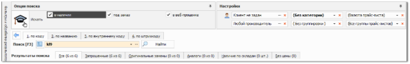

Вы можете настроить поиск только по конкретному прайс-листу для пользователей программы.

**»** Перейдите в раздел **Управление ► Настройки программы**, вкладка **Роли пользователей**, группа настроек **Прайс-листы ► Проценка**.

**»** В опции **Группа прайс-листов по умолчанию** выберите группу, которая будет подставляться в поле выбора группы окна проценки.

::: details Поле выбора группы окна проценки:

:::

**»** В опции **Запретить изменять группу прайс-листов** установите галочку. 

**»** Закройте вкладку **Настройки программы** для применения настроек.

::: note Замечание

Так пользователь не сможет изменять значение в поле выбора группы окна проценки, но сможет проценивать детали по выбранной группе прайс-листов.

:::