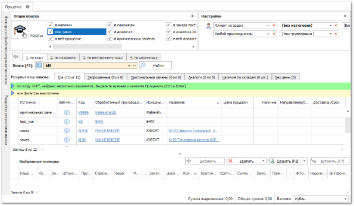
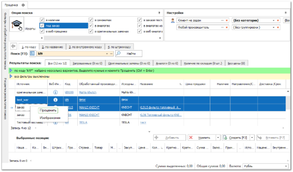
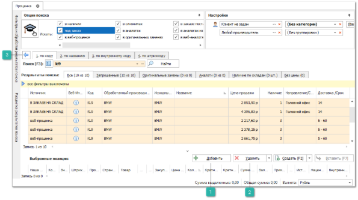
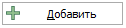
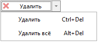
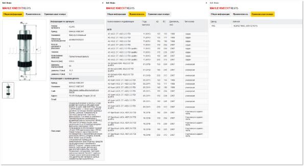

Процесс поиска предложений состоит из двух этапов:

**»** Результатом поиска на первом этапе в **Рабочей области** отобразится список производителей (из заданных источников поиска), имеющих указанный код.

В случае нахождения синонимов к оригинальным наименованиям производителей, синонимы будут заменены на оригинальные наименования. При этом производитель в колонке **Обработанный производитель** всегда отображается с учетом обработки через справочник **Синонимы производителей**. А в колонку **Исходный производитель** выводится имя производителя в том виде, как оно фигурировало в источнике поиска. В документы, созданные из **Проценки**, всегда передается обработанный производитель.

**»** Далее необходимо выбрать одного или несколько производителей, детали которых требуется проценить.

Для этого выделите их в списке (для выделения нескольких записей удерживайте клавишу Ctrl на клавиатуре) и нажмите сочетание клавиш Ctrl+Enter, либо команда **Проценить** в выпадающем меню, при нажатии правой кнопкой мыши.

Если проценить требуется только одну их предложенных позиций, то проценка запустится по нажатию на одну из гиперссылок в колонках: **Код**, **Обработанный** **производитель** или **Наименование**.

**»** На втором этапе происходит поиск аналогов и определение цен и наличия по всем найденным позициям. Таким образом, в результате поиска программа предоставляет полную картину о запрошенном товаре и его аналогах в наличии и под заказ.

Товар из наличия группируется в Проценке по складу, для исключения разночтений о реальном количестве товара.

Товар под заказ группируется по набору полей **Направление/Склад**, **Срок поставки**, **Поставщик**. При этом если в прайс-листе от поставщика позиция встречается несколько раз, то и в Проценке она будет представлена несколько раз.

 **Добавить**

Позволяет осуществить выбор выделенных позиций из результатов поиска для последующего создания документов с ними. После нажатия кнопки выбранные позиции переместятся в список **Выбранные позиции** окна **Проценки**.

 **Удалить**

Позволяет произвести удаление позиции из списка **Выбранные позиции** окна **Проценки**:

- **Удалить** – удаление выбранных позиций;

- **Удалить все** – удаление всех позиций.

 **Возврат к выбору производителя**

Позволяет вернуться к шагу выбора производителя.

В таблице результатов поиска доступны следующие поля:

- **ID товара** – Oid товара согласно справочнику **Товаров** (для позиций, отсутствующих в справочнике, значение -1);

- **Альтернативное** **название** **товара** – значение поля **Альтернативное название** из карточки товара (для позиций, присутствующих в справочнике **Товаров**);

- **Валюта** – валюта прайс-листа-источника позиции или значения в **Параметрах проценки** (для позиций из документов не отображается);

- **Веб-инфо** – при нажатии на иконку  в колонке, есть возможность получить более расширенную информацию о детали. При нажатии на эту иконку программа запрашивает товар в сервисе Веб-инфо и, если там найден этот товар, отображает окно с информацией о нем;

- **Вес –** значение веса детали (если указано в источнике);

- **Внутренний код** – значение поля **Внутренний код** из справочника **Товаров** или из Прайс-листа от поставщика;

- **Внутренний резерв** – отображает время до окончания **Внутреннего резерва** по позиции (**Управление ► Настройки программы ► Настройки ►** группа **Склад и закупки ► Движение товара**);

- **Время заказа** – данная колонка отображает ближайшее доступное время отправки заказа поставщику, согласно **Графику поставок**;

::: info Примечание

Подробнее о работе с модулем **Графики поставок** читайте в [руководстве пользователя](https://product-doc.tradesoft.ru/ai/delivery_schedule/index.htm).

:::

- **Группа товара** – отображает основную группа товара по справочнику **Товаров**;

- **Дополнительные свойства товара** – дополнительные свойства из карточки товара;

- **Доставка/Срок** – срок поставки детали. Если в результатах проценки присутствуют сроки, заданные диапазоном, то сортировка производится по максимальному значению диапазона. Например, в результатах поиска позиции со сроками в днях: 2-5, 1, 4, 6-7. При сортировке позиции отобразятся в последовательности 1, 4, 2-5, 6-7. Позиции с не числовым сроком при сортировке отображаются в конце списка;

::: info Примечание

Срок поставки детали берется с учетом значения в маркетинге **Конечный срок доставки до клиента**:

- **Оригинальная строка из прайс-листа**. В поле "Срок доставки" будет передан срок доставки в том виде, в котором он задан в прайс-листе. Например, "7 дней"; "от 5 до 7 дней" и т.д.;

- **Оригинальная строка из маркетинга**. В поле "Срок доставки" будет передан срок доставки в том виде, в котором он задан в Маркетинге. Например, "14 дней"; "от 1 и до 10 дней" и т.д.;

- **Обработанная строка из прайс-листа**. В поле "Срок доставки" будет передан срок доставки из прайс-листа в обработанном виде. Формат срока доставки будет приведен к виду 7, 5-7;

- **Обработанная строка из маркетинга**. В поле "Срок доставки" будет передан срок доставки из Маркетинга в обработанном виде. Формат срока доставки будет приведен к виду 14, 1-10;

- **Сумма сроков из прайс-листа и маркетинга**. В поле "Срок доставки" будет передана сумма сроков по доставке из прайс-листа и маркетинга. Формат итогового срока доставки будет приведен к виду 21, 6-17.

:::

::: note Примеры расчета:

- доставка в прайс-листе "1 день", в маркетинге "3дн", итоговая доставка "4";

- доставка в прайс-листе "1-11дн", в маркетинге "3 дня", итоговая доставка "4-14";

- доставка в прайс-листе "от 1 до 11 дней", в маркетинге "2-12дн", итоговая доставка "3-23".

Программа всегда измеряет срок доставки в днях. В случае, если в прайс-листе или маркетинге задан срок доставки "2 месяца", то он будет преобразован в "2", что повлечет искажение информации.

Если срок доставки указан в виде нестандартной строки ("неделя", "два дня", "месяц" и т.д.), то будет передано пустое значение.

К данным срокам поставки может быть прибавлен срок, заданный в справочнике **Доставки по направлениям и складам**.

:::

- **Доставка: закуп** – значение из маркетинга **Цена доставки** для закупа;

- **Доставка: продажа** – значение из маркетинга **Цена доставки** для продажи;

- **Закупочная цена** – цена закупа (поставщика) из прайс-листа с учетом маркетинга;

- **Залоговая стоимость** – значение поля Залоговая стоимость из прайс-листа от поставщика;

- **Изображения товара** – кнопка – ссылка на изображения товара из карточки товара;

- **Источник** – источник позиции:

- **в наличии** – позиция из прайс-листа из наличия;

    - **в резерве** – позиция на складе, но зарезервирована для другого клиента;

    - **во внутреннем резерве** – позиция находится в временном резерве (см. колонку **Внутренний резерв**);

    - **под заказ** – позиция из прайс-листа от поставщика;

    - **веб-проценка** – позиция из веб-прайс-листа от поставщика;

    - **в заказе для клиента** – позиция находится в заказе поставщику, но едет под заказ клиента;

    - **в заказе на склад** – позиция находится в заказе поставщику и едет под **Наш заказ** **на склад**;

- **Исходный производитель** – наименование производителя в том виде, как оно записано в источнике поиска;

- **Код** – артикул детали;

- **Название** – наименование товара;

- **Наличие –** количество товара в источнике;

- **Кратность наличия** – коэффициент, согласно которому может быть выбрано количество для заказа из наличия. Также выполняет роль минимального количества к заказу;

- **Кратность от поставщика** – коэффициент, согласно которому может быть выбрано количество для заказа от поставщика. Также выполняет роль минимального количества к заказу;

- **Наценка, %** – наценка на основании Цены продажи и Закупочной цены на товар;

- **Обновлено** – дата последнего обновления по позиции из прайс-листа;

- **Обработанный производитель** – наименование производителя с учетом обработки через справочник **Синонимы производителей**;

- **Описание** – описание источника поиска;

- **Описание** **товара** – описание из карточки товара;

- **Плановая дата поставки** – данная колонка отображает ближайшую дату и время отгрузки детали от поставщика при соблюдении **Времени заказа**, согласно **Графику поставок**;

::: info Примечание

Подробнее о работе с модулем **Графики поставок** читайте в [руководстве пользователя](https://product-doc.tradesoft.ru/ai/delivery_schedule/index.htm).

:::

- **Направление/Склад** – направление поставки или склад из прайс-листа;

::: info Примечание

Из выпадающего списка в колонке **Направление/Склад** доступен выбор **Нашей фирмы** и **Места хранения** (для товаров из наличия), с которых необходимо списать товар.

Выбранная **Наша фирма будет** отображаться:

- в колонке **Наша фирма** в окне **Выбранные позиции**;

- в шапке созданного документа, поле **Наша фирма**.

Выбранное **Место хранения** будет отображаться:

- в поле **Приоритетный склад для списания** в табличной части созданного документа.

Применяется для документов: **VIN-запрос**, **Заказ клиента**, **Отгрузка на реализацию**, **Расходная накладная**, **Резервирование**.

Выбор товара из выпадающего списка доступен при задании настройки **Разделять позиции по НФ при создании документа из проценки** в значение **Автовыбор НФ** (раздел **Управление ► Настройки программы ► Настройки ► Документы**).

:::

- **Наша фирма** – фирма, на которую оприходован товар, отображается только для **Партионной СЦО**;

- **Поставщик** – поставщик из маркетинга, который применился к позиции;

- **Прайс-лист** – наименование прайс-листа из которого отображается позиция;

- **Рейтинг поставщика** – рейтинг поставщика (только по данным веб-прайс-листов);

- **Розница** – цена продажи для категории клиентов Розница (если есть маркетинг для данной категории);

- **Статистика поставок** – гиперссылка для просмотра **Статистики поставки товара поставщиками** (разделе меню **Управление ► Настройки программы ► Настройки ►** группа **Склад и закупки ► Закупки**);

- **Страна-изготовитель** – одноименное значение из карточки товара;

- **Тип позиции** – если в качестве источника поиска выбрано **В оригинальных заменах**, то по колонке **Тип позиции** в результатах поиска можно уточнить, текущая позиция относится к аналогам, устаревшему или новому коду в случае наличия оригинальных замен и аналогам или запрошенному коду в случае отсутствия оригинальных замен;

- **Цена продажи** – цена на товар с учетом маркетинга;

- **Штрихкод производителя** – штрихкод производителя из источника позиции;

- **Минимальная партия от поставщика** – минимальное количество единиц товара под заказ в одной партии.

::: note Замечание

Чтобы настроить разрешение на проведение документа с количеством меньше минимальной партии, в разделе **Управление ► Настройки программы**, вкладка **Роли пользователей ► Разрешения для роли пользователей,** группы настроек **Заказы клиентов, Наши заказы на склад, Заказы поставщикам, VIN-запросы** воспользуйтесь настройкой **Можно проводить с количеством меньше минимальной партии поставщика** для нужных документов и пользователей.

:::

Для того, чтобы отобразить/скрыть колонку необходимо на заголовке любой колонки, путем нажатия правой кнопкой мыши, через контекстное меню вызвать команду **Выбор колонок**. В окне Выбора колонок доступен поиск нужной колонки, поиск осуществляется по вхождению строки. Для выбора установите у соответствующих колонок отметки, после чего закройте окно.

**»** Для выбора позиций из результатов поиска для последующего создания документов с ними, выделите нужную позицию и нажмите кнопку **Добавить,** либо двойной щелчок мыши по выбранной позиции. Выбранные детали отобразятся в списке **Выбранные позиции** окна **Проценки**.

**»** При повторном добавлении позиции в список **Выбранных позиций** происходит увеличение количества товара на единицу.

Если включен механизм **Внутреннего резервирования товаров** (разделе меню **Управление ► Настройки программы ► Настройки ►** группа **Склад и закупки ► Движение товара**), то при добавлении позиции в список выбранных она резервируется за пользователем. Тем самым позицию никто, кроме этого пользователя, не сможет продать в отведенное под резерв время.

**»** Для возврата на первый этап проценки необходимо нажать кнопку **Возврат к выбору производителя** ()

**»** Если работа с проценкой окончена, то с товарами в списке **Выбранные позиции** можно выполнить действия через команду **Создать**. Команда содержит следующие доступные действия:

- **VIN-запрос** – для выбранных позиций создается документ **VIN-запрос**;

- **Заказ клиент**а – если товара нет в наличии, но есть под заказ, то оформляется документ **Заказ клиента**;

- **Наш заказ – д**ля формирования заказа товара у поставщиков от лица нашей фирмы создается документ **Наш заказ на склад**;

- **Отгрузка на реализацию –** выбранный товар уйдет в документ **Отгрузка на реализацию**;

- **Расходная накладная –** если процененный товар есть в наличии, то оформляется **Расходная накладная**;

- **Резервирование** – для резервирования выбранного товара за клиентом оформляется документ **Резервирование**;

- **Заказ поставщику** – заказ процененных товаров у поставщика через документ **Заказ поставщику**;

- **Приходная накладная** – создается документ **Приходная накладная**;

- **Перемещение** – будет создан документ **Перемещение** для выбранных позиций проценки;

- **Заказ-Наряд** – будет создан документ **Заказ-Наряд** и на вкладку с товарами будут добавлены выбранные позиции проценки;

- **Новый товар** – добавление нового товара в справочник товаров. В поле наименование товара передается строка поиска из **Проценки**;

- **Списать товар** – будет создан документ **Списание товара** для выбранных позиций проценки;

- **Списать товар** – будет создан документ **Списание товара**;

- **Очистить позиции** – если опция включена, то после создания документа будет очищаться список выбранных позиций. Иначе – нет;

- **Сбросить опции поиска** – если опция включена, то после создания документа опции поиска проценки будут сброшены в стандартное состояние;

- **Для выделенных товаров** – если опция включена, то в создаваемый документ будут переданы только выделенные позиции, иначе – все;

- **Удалить позиции после создания** – это опция, позволяющая указать программе, очищать или нет список выбранных позиций в проценке после создания документа.

::: info Примечание

В разделе **Проценка** доступно интерактивное обучение, которое появляется по нажатию на кнопку . В ходе обучения в пустом интерфейсе поочередно подсвечиваются основные блоки, рядом выводится текст с кратким описанием назначения блока. При этом неактивные блоки затемняются. В конце **Интерактивного обучения** рассматривается работа **Проценки** на примере. Рядом с каждым подсвеченным блоком отображается текстовое окно с подсказкой. На последнем шаге обучения пользователю выводится окно со ссылкой на видео по работе в **Проценке**, по загрузке различных прайс-листов и настройке цен для этих прайс-листов.

Наличие интерактивного обучения определяется настройкой **Отображать иконку интерактивного обучения в проценке** в разделе Управление **► Настройки программы ► Пользователи ► Настройки пользователя ►** вкладка **Проценка**.

:::

