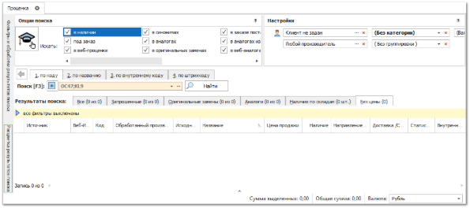
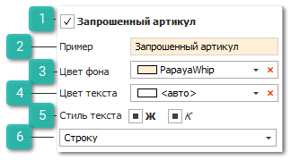
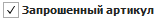
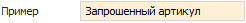
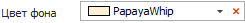
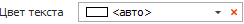
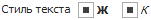
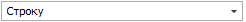
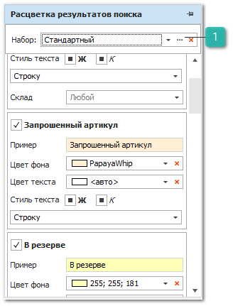
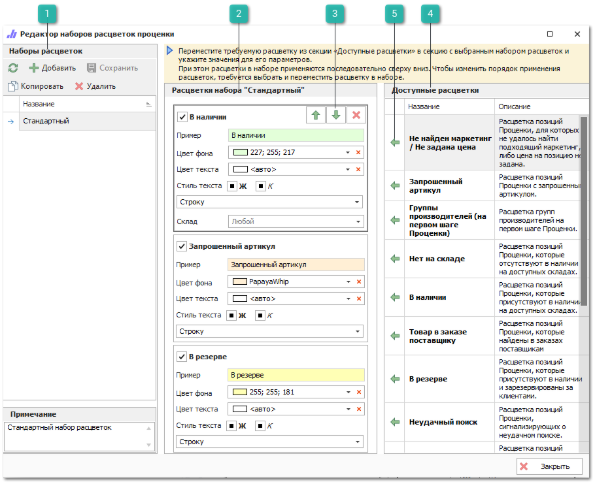

Аналогично работе с фильтрацией результатов поиска организован механизм расцвечивания (выделения) результатов поиска. Существуют темы, аналогичные наборам с фильтрами, в которые добавляются требуемые расцветки.

::: info Примечание

Возможность изменять фильтры проценки для пользователя определяется значением настройки **Разрешения для расцветок проценки** в разделе меню **Управление ► Настройки программы ► Роли пользователей ► Прайс-листы ► Проценка**.

:::

Для изменения расцветки результатов поиска в проценке выполните следующие действия:

**»** В окне проценки вызовите панель **Расцветка результатов** **поиска** на боковой панели.

 **Наименование расцветки**

Отображает название расцветки.

 **Пример**

Отображается пример отображения расцветки в соответствии с заданными параметрами.

 **Цвет фона**

Позволяет задать цвет фона для всей строки или выбранной ячейки.

 **Цвет текста**

Позволяет задать цвет текста для всей строки или выбранной ячейки.

 **Стиль текста**

Позволяет задать стиль текста для всей строки или выбранной ячейки, для выбора доступны стили: **Жирный**, *Курсив*.

 **Область расцвечивания**

Позволяет выбрать область расцвечивания, для выбора доступны: вся строка или конкретная ячейка.

Последующая расцветка в теме перекрывает действие предыдущих, если она раскрашивает ту же самую область.

::: note Замечание

Например, установлены две расцветки, первая выделяет строку с позициями в наличии синим цветом, вторая так же для позиций в наличии выделяет строку зеленым, то в результатах поиска позиции из наличия будут выделены зеленым цветом фона ячейки. Но если последующая расцветка имеет параметр цвета <авто>, то она не отменяет действие предыдущей расцветки.

:::

**»** По умолчанию задан один набор с фильтрами/обработками **Стандартный**, который применяется при сбросе набора и его нельзя удалить, но можно изменить, для этого необходимо нажать на на троеточие в поле с выбранным набором.

 **Редактор наборов расцветок проценки**

Позволяет открыть окно **Редактора набора расцветок проценки**.

**»** При редактировании набора открывается форма с редактором.

 **Наборы расцветок**

Блок содержит список ранее созданных наборов расцветок проценки, а так же команды для управления ими:

- **Обновить** – позволяет обновить данные в таблице;

- **Добавить** – позволяет добавить новую запись в таблицу;

- **Сохранить** – позволяет сохранить внесенные в набор расцветок изменения;

- **Копировать** – позволяет скопировать выбранную запись;

- **Удалить** – позволяет удалить выбранную запись.

 **Расцветки набора набора "Наименование расцветки"**

Блок содержит расцветки из активного набора, их параметры по умолчанию и порядок применения.

 **Команды управления расцветками**

Позволяют осуществить управление порядком выбранных расцветок – **Переместить выше**, **Переместить ниже**, **Удалить расцветку из набора** соответственно. Для отображения команд управления необходимо выбрать требующую изменения расцветку.

 **Доступные расцветки**

Блок содержит список доступных фильтров/обработок, которые можно использовать для формирования наборов.

Описание доступных для использования расцветок:

- **Не найден маркетинг/ Не задана цена** – выделение результатов поиска, для которых не удалось найти подходящий маркетинг, либо на которые не задана цена продажи;

- **Запрошенный артикул** – выделение товаров в результатах поиска, которые содержат запрошенный артикул;

- **Группы производителей (на первом шаге Проценки**) – выделение групп с производителями, образованными с помощью справочника "Группы производителей" на первом шаге Проценки;

- **Нет на складе** – выделение товаров, отсутствующих в наличии на доступных складах;

- **В наличии** – выделение товаров в наличии, в зависимости от склада;

- **Товар в заказе поставщику** – расцветка позиций Проценки, которые найдены в заказах поставщикам;

- **В резерве** – выделение товаров, зарезервированных за клиентами;

- **Неудачный поиск** – сигнализация неудачного поиска в Проценке;

- **Поставщик с активными заказами** – выделение позиций от поставщиков, для которых оформлены "Заказы поставщику" на сумму, попадающую в заданный диапазон;

- **Актуальность прайс-листов от поставщиков** – расцветка позиций Проценки в зависимости от количества дней, прошедших с момента последнего обновления прайс-листа от поставщика;

- **Поставщики** – расцветка позиций Проценки в зависимости от поставщика: позициям каждого поставщика свой стиль расцветки;

- **Веб-проценка: "Направление/Склад" поставщика** – расцветка позиций в Проценке в зависимости от направления/склада веб-поставщика;

- **Склад на инвентаризации** – расцветка позиций Проценки из наличия, которые расположены на Складах/ТТ, находящихся в данный момент на инвентаризации. Причем позиции будут расцвечены даже на тех Складах/ТТ, которые сами не на инвентаризации, но имеют вложенные Склады/МХ на инвентаризации.

 **Добавить расцветку в набор**

Позволяет добавить расцветку в набор.

**»** После внесения изменений необходимо их сохранить, путем нажатия на кнопку **Сохранить** в блоке **Наборы расцветок**.