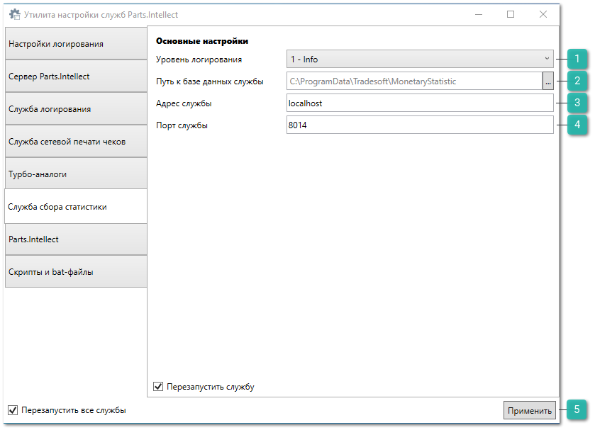
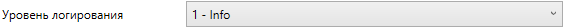
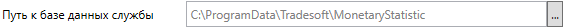
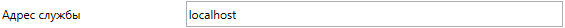
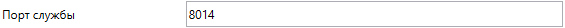
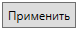

Для сбора информации по запрашиваемым товарам используется **Служба сбора статистики**, которая собирает информацию о запросах товаров в **Проценке** из программы (также **Быстрой продажи**). Данная информация используется для построения отчетов **Статистики запросов проценки**.

Для запуска службы выполните следующие действия:

**»** Установите на компьютере-сервере программу **Parts.Intellect** в режиме **Полной** установки. В этом режиме на компьютере регистрируется новая служба **Tradesoft. Сбор статистики (Tradesoft.MonetaryStatisticsService)**. Убедитесь, что она успешно зарегистрирована в списке служб **Windows** (меню Пуск – Компьютер – Управление (контекстное меню) – Службы и приложения – Службы).

**»** Запустите **Утилиту настройки служб** **Parts.Intellect** и перейдите на вкладку **Служба сбора статистики**.

 **Уровень логирования** 

Позволяет указать уровень детализации логов, по умолчанию задается значение – **1-Info**.

 **Путь к базе данных службы** 

Позволяет указать путь к папке, где расположена база данных службы сбора статистики, по умолчанию задается значение – **C:\ProgramData\Tradesoft\MonetaryStatistic**.

 **Адрес службы** 

Позволяет указать IP-адрес по которому запускается служба сбора статистики, по умолчанию задается значение – **localhost**.

 **Порт службы** 

Позволяет указать порт службы сбора статистики, по умолчанию задается значение – 8014.

 **Применить**

Позволяет сохранить заданные параметры, для применения настроек будет осуществлен перезапуск службы логирования*.*

**»** В текстовом поле **Адрес службы** вместо **localhost** введите внутренний ip-адрес сервера или **Имя компьютера**.

**»** Измените **Порт службы**, если это необходимо.

**»** Сохраните заданные параметры нажатием кнопки **Применить***.*

::: info Примечание

По умолчанию база данных службы сбора статистики разворачивается в каталоге *%ProgramData%\Tradesoft\MonetaryStatistic*. Для смены этого пути (например, при переносе базы на другой винчестер) необходимо в поле **Путь к базе данных службы**  новый путь к базе.

:::
**»** После запуска службы войдите в базу данных под учетной записью администратора, и выполните настройки в меню **Управление ► Настройки программы ► Настройки ► Проценка ► Настройки поиска**, группа настроек **Служба сбора статистики**.

**»** Для корректного сбора статистики все пользователи должны переподключиться к базе данных.

Результаты сбора информации о запросах к **Проценке** можно увидеть в меню **Отчеты и анализ ► Статистика запросов проценки**.

|||
| :- | :- |
||**Читайте также**

[Инструмент Быстрая продажа](#d90d1c9b-0bc7-4310-8d4c-cc42d0952850)

[Статистика запросов проценки](#b6a32965-5767-4325-80a3-b353a87b1898)

[Установка программы и компонентов](#d537b17e-ec88-45e7-a04d-ef2fc4781614)

[Утилита настройки службы Parts.Intellect](#ad2f2e35-fa68-4c27-aaab-b4686c4e5f29)

[Настройки программы - Настройки - Проценка - Настройки поиска](#db482753-94b3-4280-8b7f-dbd71c2ef288)|
|||

