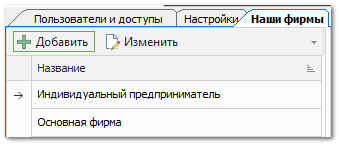
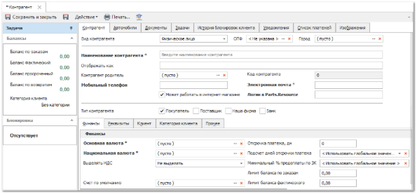

Добавление информации и реквизитов о ваших организациях. Как правило, создается одна фирма и от ее лица осуществляется работа в программе. Но возможен вариант работы в программе от лица нескольких фирм.

Для добавления новой фирмы сделайте следующее:

**»** Перейдите в раздел **Управление ► Настройки программы**.

**»** Перейдите на вкладку **Наши фирмы**.

**»** Нажмите кнопку . Откроется инспектор создания нового контрагента.

**»** Заполните обязательные данные о контрагенте на вкладке [**Контрагент**](./zapolnenie_dannykh/README.md).

**»** При необходимости заполните дополнительные данные на вкладках:

**Уведомления** – позволяет установить индивидуальные настройки для каждого типа уведомления в программе. Данные уведомления будут уходить, если контрагент типа **Наша фирма** будет являться покупателем по документу;

**Изображения** – позволяет установить изображение контрагента.

**»** После заполнения всех данных об организации нажмите **Сохранить и закрыть**.

