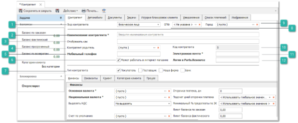
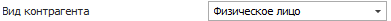
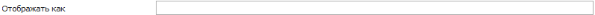
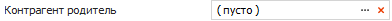
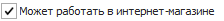
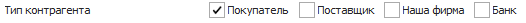
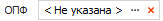
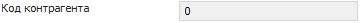
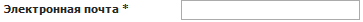
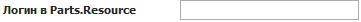

**»** Перейдите на вкладку **Контрагент** карточки контрагента.

**Вид контрагента**

Позволяет установить вид контрагента: **Физическое лицо** и **Юридическое лицо**. По умолчанию у всех новых и существующих контрагентов будет значение **Физическое лицо**, при установке значения поля ОПФ, автоматически подставляется **Физическое лицо**.

**Наименование контрагента**

Позволяет задать наименование организации. **Наименование контрагента** выводится во всех документах, если не задано поле **Отображать как**.

::: warning Внимание!

Опция обязательна к заполнению.

:::

**Отображать как**

Позволяет задать наименование контрагента.

::: info Примечание

Если заполнено поле **Отображать как**, то во всех документа используется значение этого поля. Иначе используется значение из поля **Наименование контрагента**. Данный механизм удобно использовать для скрытия реального наименования поставщика от пользователей системы, либо для использования более широко употребляемого наименования.

:::

**Контрагент родитель**

Позволяет указать вышестоящего контрагента. Указывается в случае подчиненности или представительства.

**Мобильный телефон**

Позволяет указать контактный телефон.

::: note Замечание

Ввод мобильного телефона осуществляется согласно заданной маске в разделе **Управление ► Настройки программы ► Настройки**, группа настроек **CRM ► Контрагенты**.

:::

**Может работать в интернет-магазине**

Позволяет установить признак может ли контрагента работать в интернет-магазине Parts.Resource. При установленном чекбоксе  доступна для редактирования опция **Логин в Parts.Resource**.

::: info Примечание

Опция **Может работать в интернет-магазине** доступна, если установлен чекбокс в разделе **Управление ► Настройки программы ► Настройки**, группа настроек **Обмен данными с Parts.Resource**, опция **Включить механизм обмена данными с Parts.Resource**. Раздел доступен при подключении услуги, подробнее можно уточнить в отделе продаж компании Tradesoft.

:::

**Тип контрагента**

Позволяет выбрать тип контрагента. По умолчанию выбрано значение **Наша фирма**, если вы создаете контрагента из раздела **Управление ► Настройки программы ► Настройки**.

**ОПФ**

Позволяет выбрать организационно-правовую форму организации из справочника. В справочник можно добавить новую форму организации с помощью команды .

**Город**

Позволяет указать город, где находится организация.

**Код контрагента**

Выводит код контрагента в программе, присваивается автоматически при создании/сохранении контрагента. Значение нельзя редактировать.

**Электронная почта**

Позволяет указать почтовый ящик организации.

**Логин в Parts.Resource**

Позволяет задать логин контрагента в системе Parts.Resource. Опция доступна при установленном чекбоксе  в опции **Может работать в интернет-магазине**.

::: info Примечание

Опция **Может работать в интернет-магазине** доступна, если установлен чекбокс в разделе **Управление ► Настройки программы ► Настройки**, группа настроек **Обмен данными с Parts.Resource**, опция **Включить механизм обмена данными с Parts.Resource**. Раздел доступен при подключении услуги, подробнее можно уточнить в отделе продаж компании Tradesoft.

:::

**»** Заполните данные на следующих вкладках:

- **Финансы**. Подробнее по [ссылке](./vkladka_finansy.md);

- **Реквизиты**. Подробнее по [ссылке](./vkladka_rekvizity.md).

Данные на вкладках ниже не обязательны к заполнению:

- **Клиент**. Подробнее по ссылке;

- **Категория клиента**. Подробнее по ссылке;

- **Прочее**. Подробнее по [ссылке](./vkladka_prochee.md).

**»** Заполните дополнительные данные на вкладках:

**»** Нажмите кнопку **Сохранить и закрыть**

::: info Примечание

Поля **Отсрочка платежа, дн**, **Подсчет дней отсрочки платежа**, **Минимальный % предоплаты по ЗК** не заполняются для Нашей фирмы.

:::

**»** Заполните при необходимости информацию на следующих вкладках:

- На вкладке **Клиент** и **Категория клиента** для контрагента типа **Наша фирма** не обязательно заполнять данные.

- На вкладке **Прочее** укажите дополнительную информацию о фирме, при необходимости.

- На вкладке **Уведомления** можно установить индивидуальные настройки для каждого типа уведомления в программе для получения email или SMS уведомлений. Но данные уведомления будут уходить, только если контрагент типа **Наша фирма** будет являться покупателем по документу.

- Вкладка **Список платежей** отображает список платежных документов, в которых фигурирует контрагент.

- На вкладке **Изображения** прикрепите изображения к карточке, при необходимости.

**»** Нажмите кнопку **Сохранить и закрыть (F2)** для сохранения карточки.

