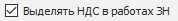

**»** Перейдите на вкладку **Финансы** в карточке контрагента.

**»** Заполните необходимые данные:

**Основная валюта**

Позволяет задать основную валюту, в которой будут создаваться все документы, с участием данной **Нашей фирмой**.

**Национальная валюта**

Позволяет задать валюту в которой формируется **Оборотно-сальдовая ведомость по контрагентам** и выгружаются данные в 1С.

**Выделять НДС**

Позволяет задать значение выделять ли НДС в документах, в которых участвует выбранная **Наша фирма**. Значение из поля подставляется в поле **Выделять НДС** инспектора документов, при создании которых выбранная **Наша фирма** подставилась автоматически в поле **Наша фирма** инспектора документа.

::: info Примечание

При создании документов **Заказ поставщику** и **Приходная накладная** из формы **Проценки** значение для поля **Выделять НДС** возьмется из карточки поставщика.

:::

**Выделять НДС в работах ЗН**

Позволяет определить выделять ли НДС для работ в документах **Заказ-Наряд**. Значение подставляется в поле **Выделять НДС** инспектора документа **Заказ-наряд**, если при создании документа в поле **Наша фирма** автоматически подставилась выбранная **Наша фирма**.

**Счет по умолчанию**

Позволяет задать счет из справочника **Счета и Кассы**, который будет использоваться в формируемых печатных шаблонах, а также при создании платежей в ситуациях, когда **Наша** **Фирма** выступает в качестве одного из контрагентов. Для указания фактического счета **Нашей** **фирмы** следует воспользоваться функционалом **Правила подбора счетов/касс по умолчанию**.

::: warning Внимание!

Оставшиеся опции вкладки **Финансы** не заполняются для **Нашей фирмы**.

:::

