Чтобы создать новую торговую точку или склад, выполните следующие действия:

**»** В **Главном меню** выберите раздел **Склад и закупки ► Склады/Торговые точки**.

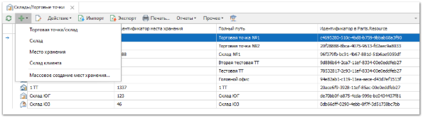

**»** Нажмите кнопку **Новый** и выберите тип создаваемой торговой точки/склада:

- **Торговая точка/Склад** – магазин, филиал или склад, который может иметь своей наличие и использоваться для формирования приходной накладной, участвовать как "место выдачи" для заказов клиентов. Для данного типа можно создавать подчиненные **Склады** и **Места хранения**, а также заполнять дополнительные **Реквизиты** (адрес, расписание работы и пр.);

- **Склад** – склад для хранения товаров, может иметь своей наличие и использоваться для формирования приходной накладной, участвовать как "место выдачи" для заказов клиентов. В подчинении может иметь только **Места хранения**;

- **Место хранения** – место хранения всегда подчинено какому-либо склад или торговой точке. Места хранения используются для структурированного расположения товара на складе;

- **Склад клиента** – склад клиента участвует в документах **Отгрузки на реализацию**.

**»** В окне откроется окно инспектора для добавления новой торговой точки/склада. 

На вкладке **Склад/Торговая точка** заполните следующие поля:

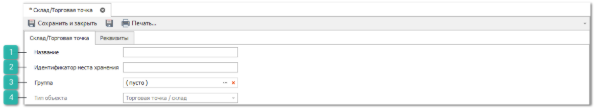

**Название** 

Позволяет заполнить наименование торговой точки.

**Идентификатор места хранения**

Позволяет задать краткий символьный идентификатор склада или места хранения. Данное значение удобно использовать в документах и печатных бланках, для быстрого определения места расположения товара.

Например: 

::: note Пример

Место хранения товара вида *Склад Москва – Стеллаж 12 – полка 3*, можно отобразить на этикетках как *MSK-12-3*

:::

**Группа** 

Позволяет, при использовании типа **Склад** или **Место хранения**, выбрать основной склад/торговую точку.

**Тип объекта** 

Поле заполняется автоматически и отражает выбранный тип склада/торговой точки.

**»** Вкладка **Реквизиты** служит для внесения дополнительной информации по торговой точке, которую можно использовать в печатных формах. 

Заполните следующие поля на вкладке:

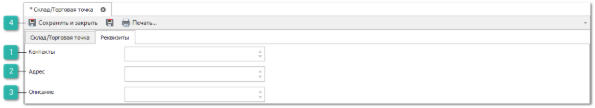

**Контакты** 

Позволяет задать контактные данные торговой точки/склада.

**Адрес** 

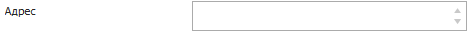

Позволяет заполнить адрес магазина/склада.

**Описание** 

Позволяет добавить описание торговой точки.

**Сохранить и закрыть** 

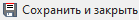

Позволяет сохранить внесенные изменения и закрыть окно инспектора. Новая запись отобразится в таблице справочника.

В системе возможно создание многоуровневой структуры складов. Для этого необходимо:

**»** В **Главном меню** выберите раздел **Склад и закупки ► Склады/Торговые точки**.

**»** Нажмите кнопку **Новый** и выберите тип создаваемой записи **Место хранения**.

**»** В окне инспектора в качестве **Названия** указывается сектор склада или место расположения, а в поле **Группа** выбирается основной объект (склад/тт/другой сектор, сектор на складе), к которому относится место хранения.

Создать сразу несколько мест хранения на складе (стеллажи, полки и т.п.) можно с использованием инструмента **Конструктор мест хранения**. Для этого:

**»** Выделите в списке торговую точку/склад для которого хотите создать места хранения, нажмите кнопку **Новый** и выберите команду **Массовое создание мест хранения**. Откроется окно конструктора.

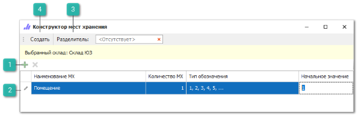

**Добавить/удалить**

Позволяют добавить или удалить новое место хранения для **Выбранного склада**.

**Список добавленных мест хранения**

Позволяет для добавленного места хранения задать:

- **Наименование МХ** – название места хранения;

- **Количество МХ** – количество позиций добавленного места хранения на **Выбранном складе**;

- **Тип обозначения** – тип обозначения мест хранения;

- **Начальное значение** – указывается начальное значение нумерации места хранения.

**Разделитель**

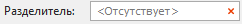

Позволяет указать символ, который будет разделять значения мест хранения при формировании идентификатора.

**Создать**

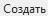

Позволяет создать добавленные места хранения и завершить работу **Конструктора мест хранения**.

На примере показанном ниже, после нажатия на кнопку **Создать** для склада "Торговая точка" будет создано 5 стеллажей, по 2 полки и на каждой полке по 2 ячейки. 

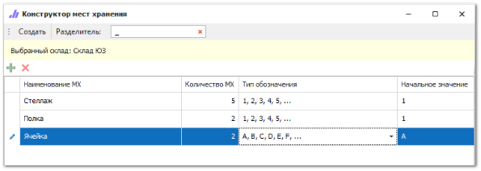

Для каждого места хранения сгенерирован идентификатор в соответствии с правилами конструктора: у ячеек обозначение латинскими буквами, у остальных мест хранения цифрами, разделитель "\_".

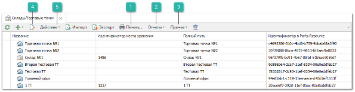

**Печать** 

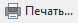

Позволяет осуществить печать этикеток для выбранных и подчиненных им мест хранения, на которых можно вывести идентификатор места хранения в виде штрихкода, используя кодировку.

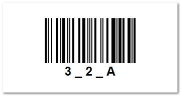

**Отчеты**

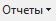

Позволяет создать отчет о движении и наличии товаров на выбранном месте хранения.

**Прочее**

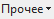

Позволяет **Создать задание на инвентаризацию**, для выбранного места хранения, а так же **Открыть задание на инвентаризацию в работе**, при его наличии.

**Править**

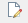

Позволяет открыть инспектор редактирования торговой точки, который позволяет изменить ее параметры.

::: warning Внимание!

После изменения **Названия** места хранения для обновления значения в колонке **Полный путь** доступна команда **Прочее ► Обновить полный путь склада/торговой точки**.

:::

**Действие**

При помощи кнопки **Открыть мастер заказов на склад**, позволяет осуществить вызов **Мастера заказов** на склад для торговых точек и складов.

::: note Замечание

Помимо складов фирмы, можно создать склады клиента (клиент или партнер в данном случае занимается реализацией товара).

:::
