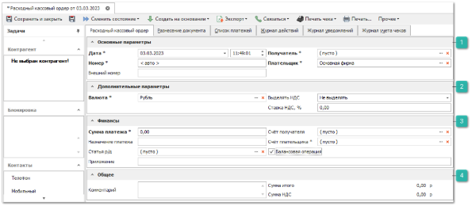
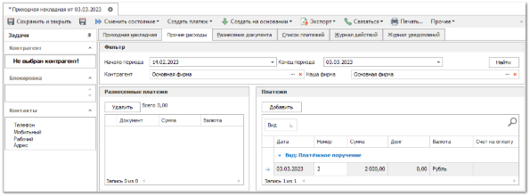
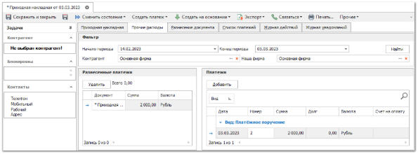
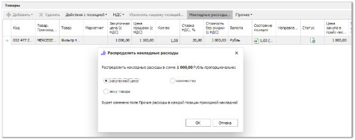

После добавления позиций в документ **Приходная накладная** можно учесть дополнительные накладные расходы на товар (данная возможность присутствует как до проведения документа, так и после). Дополнительные расходы учитываются при расчете **Себестоимости** товара, которая может использоваться в качестве **Цены закупа** в **Прайс-листе наличия** (если активна опция **Использовать себестоимость товара в прайс-листе наличия** в меню **Управление ► Настройки программы ► Настройки ►** группа **Товары и цены ► Прайс-листы и ценообразование**).

::: info Примечание

**Цена закупа** в **Прайс-листе наличия** обновляется в соответствии со значением **Себестоимости** только после проводки документа **Приходная накладная**.

:::

Для учета дополнительных расходов выполните следующие действия:

**»** Создайте и проведите **Расходный кассовый ордер** или **Платежное поручение** на сумму расходов по накладной. В платеже обязательно снимите флаг **Балансовая операция** и укажите **Статью р/д** для фиксации данной операции в отчетности по статьям.

Для создания документа **Платежное поручение** выполните следующие действия:

**»** В **Главном меню** выберите пункт **Финансы** ► **Выплаты контрагентам** ► **Платежные поручения**. Отобразятся элементы выбранного пункта, описанные в **Платежные поручения**.

**»** Для добавления нового документа **Платежное поручение** нажмите кнопку **Новый** на панели управления. Отобразится окно инспектора для добавления нового платежа, в котором необходимо заполнить поля:

**Основные параметры**

Блок содержит поля для задания параметров:

- **Дата** – дата и время создания документа;

- **Номер** – номер документа;

- **Плательщик** – выбор фирмы, которая оплачивает платеж;

- **Получатель** – контрагент, который получает платеж.

**Дополнительные параметры**

Блок содержит поля для задания параметров:

- **Валюта** – валюта, в которой считать цены по данному документу;

- **Выделять НДС** – выделять НДС или нет;

- **Ставка НДС** – процент ставки НДС.

**Финансы**

Блок содержит поля для задания параметров:

- **Сумма платежа** – сумма, которая подлежит к оплате;

- **Назначение платежа** – описание назначения платежа;

- **Статья расходов/доходов** – статья расходов фирмы;

- **Приложение** – поле для ввода реквизитов у документов, относящихся к назначению платежа;

- **Счет получателя** – счет получателя платежа;

- **Счет плательщика** – счет выбранной фирмы, которая оплачивает платеж;

- **Балансовая операция** – учитывать или нет платеж в балансовых операциях.

**Общее**

Блок содержит поле:

- **Комментарий** – комментарий к платежу.

**»** Для вступления документа **Платежное поручение** в силу его необходимо провести. Для этого нажмите кнопку **Сменить состояние** и выберите пункт **Провести** (Ctrl+E).

**»** В документе **Приходная накладная** перейдите на вкладку **Прочие расходы** и укажите параметры блока **Фильтр**: **Диапазон дат**, **Контрагента** и **Нашу фирму**, для поиска платежных документов. Нажмите кнопку **Найти**.

**»** На панели **Платежи** отобразятся платежные документы, удовлетворяющие условиям поиска. Выделите созданный ранее платеж и нажмите кнопку **Добавить**, платежный документ должен перенестись в панель **Разнесенные платежи**.

**»** Вернитесь на вкладку **Приходная накладная** и нажмите кнопку **Накладные расходы** на панели действия над позициями документа в блоке **Товары**. В появившемся диалоговом окне выберите способ распределения суммы расходов по позициям документа: по закупочной цене, по весу товара, по количеству. Нажмите кнопку **Ок**.

Сумма расходов по позициям отобразится в колонке **Прочие расходы**.

**»** Для вступления документа **Приходная накладная** в силу, его необходимо провести. Для этого нажмите кнопку **Сменить состояние** и выберите пункт **Провести** (Ctrl+E).

**»** Для того, чтобы сохранить и закрыть документ (доступно также без проведения), воспользуйтесь кнопкой **Сохранить и закрыть** (F2).

::: info Примечание

Проведение документа прихода может быть заблокировано программой при наличии одного или нескольких ограничений:

- **Склад/торговая точка**, на который оформляется приход, находится в данный момент на инвентаризации;

- **Склад/торговая точка**, выбранный в параметрах документа, отсутствует в **Списке складов/ТТ, на которые доступно оприходование товара** в разрешениях пользователя;

- Установлены иные ограничения для пользователя в разделе главного меню **Управление ►** **Настройки программы ► Роли пользователей ► Разрешения для роли пользователей ► Документы ► Приходные накладные**.

:::
После проведения документа прихода товара будет числиться в наличии на складе. 

