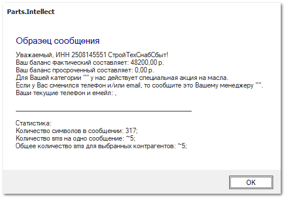

Для отправки сообщений на командных панелях справочников **Контрагенты** и **Сотрудники**, а также в журналах документов пользователю доступны команды: **Отправить сообщение** и **Отправить** **email** из пункта **Связаться**. Обе команды работают с выделенными контрагентами и при вызове открывают специальные редакторы.

 **Открыть чат**

Команда позволяет открыть чат с клиентами, подписанными на Telegram-бота.

::: info Примечание

Для работы сервиса отправки уведомлений и сообщений через Telegram-бот необходимо:

- подключение дополнительной услуги. За подключением услуги обратитесь в отдел продаж Компании Tradesoft;

- созданный и настроенный Telegram-бот;

- установленный и подключенный **Сервер Parts.Intellect**.

Подробнее о работе модуля читайте в [руководстве пользователя](https://product-doc.tradesoft.ru/ai/telegram/index.htm)

:::

 **Отправить сообщение**

Позволяет отправить SMS-сообщения выбранному контрагенту на номер телефона, указанный в карточке. По нажатию на команду открывается форма для ввода текста сообщения.

 **Отправить email**

Позволяет отправить email выбранному контрагенту на почту, указанную в карточке. По нажатию на команду открывается форма для ввода текста сообщения.

**»** В открывшемся редакторе выполните подготовку текста сообщения. 

Доступна возможность:

- вставки изображений (из буфера обмена);

- использования макросов. Команда **Загрузить** позволяет посмотреть доступные макросы;

- использовать html-теги:

    - `<b></b>` – жирный шрифт;

    - `<i></i>` – курсивный шрифт;

    - `<s></s>` – зачеркнутый шрифт;

    - `<u></u>` – подчеркнутый шрифт;

    - `` – гиперссылка, где href – атрибут, в котором в двойных кавычках указывается адрес для перехода.

- Редактор электронных писем;

 **Загрузить**

Позволяет загрузить шаблоны писем из файла.

 **Сохранить**

Позволяет сохранить текущий шаблон в файл для дальнейшего использования.

 **Просмотр**

Позволяет посмотреть письмо с учетом заданных макросов и html-тегов.

 **Отправить**

Позволяет отправить электронное письмо выбранным контрагентам.

 **Параметры письма**

Блок содержит:

- **Кому** – отображает список контрагентов которым будут отправлены электронные письма, кнопка **Выбрать...** позволяет добавить контрагентов в список; 

- **Тема** – позволяет указать тему письма.

 **Поле ввода**

Позволяет ввести текст сообщения.

Редактор SMS-сообщений.

 **Загрузить**

Позволяет загрузить шаблоны писем из файла.

 **Сохранить**

Позволяет сохранить текущий шаблон в файл для дальнейшего использования.

 **Просмотр**

Позволяет посмотреть письмо с учетом заданных макросов и html-тегов, а так же статистику по сообщению: 

- **Количество символов в сообщении** –  общее количество символов в сообщении, в том числе пробелы;

- **Количество SMS на одно сообщение** – количество SMS которыми будет отправлено сообщение;

::: info Примечание

Если в SMS-сообщении есть хотя бы один кириллический символ, то все сообщение считается кириллическим, в одном SMS на кириллице содержится 70 символов.

:::

- **Общее количество SMS для выбранных контрагентов** – общее количество SMS которыми будут отправлены сообщения всем контрагентам.

 **Отправить**

Позволяет отправить электронное письмо выбранным контрагентам.

 **Параметры сообщения**

Блок содержит:

- **Кому** – отображает список контрагентов которым будут отправлены электронные письма, кнопка **Выбрать...** позволяет добавить контрагентов в список.

 **Информация**

Блок содержит статистику по сообщению:

- **Количество символов в сообщении** –  общее количество символов в сообщении, в том числе пробелы;

- **Количество SMS на одно сообщение** – количество SMS которыми будет отправлено сообщение;

::: info Примечание

Если в SMS-сообщении есть хотя бы один кириллический символ, то все сообщение считается кириллическим, в одном SMS на кириллице содержится 70 символов.

:::

- **Общее количество SMS для выбранных контрагентов** – общее количество SMS которыми будут отправлены сообщения всем контрагентам.

 **Поле ввода**

Позволяет ввести текст сообщения.

**»** Закончив подготовку сообщения, нажмите кнопку **Отправить** на командной панели. Подготовленное сообщение отправляется каждому получателю индивидуально, чтобы не показывать адреса других клиентов.

После завершения отправки выдается статистика доставки.

::: info Примечание

Для отправки сообщений по email и SMS необходимо для каждого источника активировать настройку **Использовать отправку сообщений**  в разделе **Управление ► Настройки программы ► Настройки ►** группа **CRM ► Уведомления** и заполнить все настройки для отправки.

Также доступна отправка уведомлений через Telegram-бот. Настройка отправки уведомлений выполняется в разделе **Управление ► Настройки программы ► Настройки ►** группа **CRM ► Уведомления**.

Для подключения рассылки по SMS и отправки уведомлений через приложение Telegram необходимо обратиться в отдел продаж Компании Tradesoft.

Подробнее о работе с модулем Telegram-бот читайте в [руководстве пользователя](https://product-doc.tradesoft.ru/ai/telegram/index.htm).

:::

::: info Примечание

Отправку уведомлений по email, SMS и Telegram можно перенести на **Сервер** **Parts.Intellect**. Это позволит продолжать работу в программе Parts.Intellect без ожидания результата отправки сообщений.

Для работы автоматической отправки уведомлений по Email, SMS и Telegram по настроенным событиям, шаблоны сообщений должны быть выбраны в разделе **Управление ► Настройки программы ► Настройки**, группа настроек **CRM ► Уведомления**.

:::

::: info Примечание

По завершении массовой рассылки отображается диалоговое окно с результатами рассылки.

Если во время рассылки произошли ошибки, помимо диалогового окна открывается текстовый файл с результатами рассылки и со списком ошибок. В списке для каждой ошибки указаны способ отправки, контрагент, при отправке которому возникла ошибка, а также сама ошибки.

:::

::: details Читайте также

- [Справочник Контрагенты](../../specification/crm/klienty/README.md)

- [Справочник Сотрудники](../../specification/upravlenie/spravochniki/sotrudniki.md)

- [Журнал уведомлений](../../specification/crm/zhurnal_uvedomlenij.md)

- [Настройки программы ► Настройки ► CRM ► Уведомления. Электронная почта](../../specification/upravlenie/nastrojki_programmy/nastrojki/crm/uvedomleniya_elektronnaya_pochta.md)

- [Настройки программы ► Настройки ► CRM ► Уведомления. Сервис отправки SMS](../../specification/upravlenie/nastrojki_programmy/nastrojki/crm/uvedomleniya_servis_otpravki_sms.md)

:::